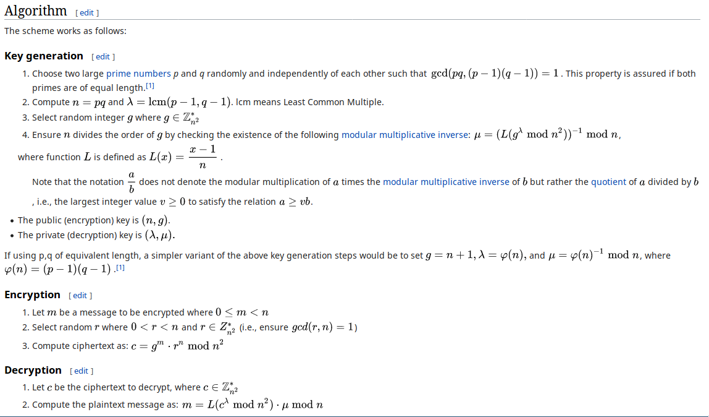
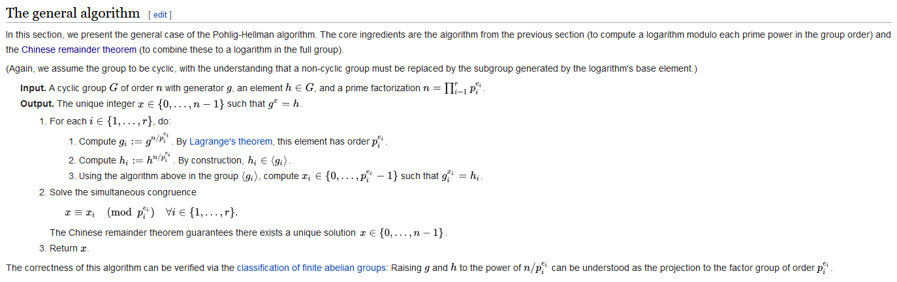
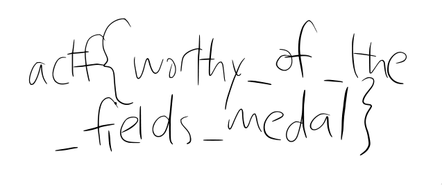

- Writeups
  - crypto
      - classy-cipher
      - really-secure-algorithm
      - half-and-half
      - runes
      - paint
      - wall-e
  - web
      - no-sequels
      - no-sequels-2
      - dom-validator
  - misc
      - paper-trail
      - scratch-it-out
      - paper-cut

---

# Crypto

## Classy Cipher

### Crypto - 20 points (solved)

> Every CTF starts off with a Caesar cipher, but we're more classy.
>
> Author: defund

```python
from secret import flag, shift

def encrypt(d, s):
	e = ''
	for c in d:
		e += chr((ord(c)+s) % 0xff)
	return e

assert encrypt(flag, shift) == ':<M?TLH8<A:KFBG@V'
```

---

## Solution

The cipher algorithm is essentially a caeser shift cipher. We can write a simple python script that decrypts the ciphertext.

```python
def decrypt(e, s):
    d = ''
    for c in e:
        d += chr((ord(c)-s) % 0xff)
    return d

for i in range(1, 300):
    f = decrypt(':<M?TLH8<A:KFBG@V', i)
    if 'actf' in f:
        print(f)
        exit()
```

```python
> python ./classy_decrypt.py
actf{so_charming}
```

---

# Half and Half

## Crypto - 50 points (solved)

> Mm, coffee. Best served with half and half!
>
> Author: defund

```python
from secret import flag

def xor(x, y):
	o = ''
	for i in range(len(x)):
		o += chr(ord(x[i])^ord(y[i]))
	return o

assert len(flag) % 2 == 0

half = len(flag)//2
milk = flag[:half]
cream = flag[half:]

assert xor(milk, cream) == '\x15\x02\x07\x12\x1e\x100\x01\t\n\x01"'
```

---

## Solution

The given script takes the flag, splits it in half and gives us the result of xoring these two halves. The length of this result is 12, so we know the length of the flag should be 24. Since we know the flag is in the format `actf{[A-Za-z0-9]}` we can get the first 5, 12th to 17th and last characters of the flag.
In a python shell:

```python
>>> from pwn import xor
>>> c = '\x15\x02\x07\x12\x1e\x100\x01\t\n\x01"'
>>> xor(c[:5], 'actf{').decode()
'taste'
>>> xor(c[-1], '}').decode()
'_'
```

So we know the flag looks something like `actf{??????_taste??????}`. Now, to get the rest of the flag, we could try and write a script to bruteforce the remaining 12 characters (6 values), but given that part of the flag uses an English word, we are probably better off using some educated guessing techniques here. We see that an underscore precedes `taste`, indicating that the 6 characters before the underscore probably form a noun. The word `taste` doesn't often appear in an English sentence with only 2 or 3 words, so we can probably guess that it should be `tastes`. xoring `s` with `\x10` gives us `c`, so if we're correct about this guess, then the first part of the flag text starts with `c`. So the first part of the flag text is a 6 letter noun that starts with `c`. If we look at the challenge description, we see a word that happens to fit that description and also makes sense being used before the word `tastes`! To confirm our suspicions:

```python
>>> xor(c[:12], 'actf{coffee_').decode()
'tastes_good}'
```

Our flag is `actf{coffee_tastes_good}`

---

## Really Secure Algorithm

### Crypto - 30 points (solved)

> I found this flag somewhere when I was taking a walk, but it seems to have been encrypted with this Really Secure Algorithm!
>
> Author: lamchcl

```python
p = 8337989838551614633430029371803892077156162494012474856684174381868510024755832450406936717727195184311114937042673575494843631977970586746618123352329889
q = 7755060911995462151580541927524289685569492828780752345560845093073545403776129013139174889414744570087561926915046519199304042166351530778365529171009493
e = 65537
c = 7022848098469230958320047471938217952907600532361296142412318653611729265921488278588086423574875352145477376594391159805651080223698576708934993951618464460109422377329972737876060167903857613763294932326619266281725900497427458047861973153012506595691389361443123047595975834017549312356282859235890330349
```


---

## Solution

This is a standard RSA problem. We are given the two primes `p` and `q`, the public exponent `e` and the ciphertext `c`.

Pop up open a python shell:

```python
> p = 8337989838551614633430029371803892077156162494012474856684174381868510024755832450406936717727195184311114937042673575494843631977970586746618123352329889
> q = 7755060911995462151580541927524289685569492828780752345560845093073545403776129013139174889414744570087561926915046519199304042166351530778365529171009493
> e = 65537
> c = 7022848098469230958320047471938217952907600532361296142412318653611729265921488278588086423574875352145477376594391159805651080223698576708934993951618464460109422377329972737876060167903857613763294932326619266281725900497427458047861973153012506595691389361443123047595975834017549312356282859235890330349
> from gmpy2 import invert
> from Crypto.Util.number import long_to_bytes
> phi = (p-1)*(q-1)
> d = invert(e, phi)
> message = pow(c, d, p*q)
> long_to_bytes(message).decode()
'actf{really_securent_algorithm}'
```

---

## Runes

### Crypto - 70 points (solved)

> The year is 20XX. ångstromCTF only has pwn challenges, and the winner is solely determined by who can establish a socket connection first. In the data remnants of an ancient hard disk, we've recovered a string of letters and digits. The only clue is the etching on the disk's surface: Paillier.
> 
> Author: defund

```python
n: 99157116611790833573985267443453374677300242114595736901854871276546481648883
g: 99157116611790833573985267443453374677300242114595736901854871276546481648884
c: 2433283484328067719826123652791700922735828879195114568755579061061723786565164234075183183699826399799223318790711772573290060335232568738641793425546869
```

---

## Solution

The txt file given gives us three numbers, `n`, `g` and `c`. The clue given is Paillier, which turns out to be a cryptosystem after searching it up on [wikipedia](https://en.wikipedia.org/wiki/Paillier_cryptosystem).
From wikipedia:



We require the private key (lambda, myu) to decrypt the ciphertext. `n` looks quite small, so we chuck it into factordb and find its two factors `310013024566643256138761337388255591613` and `319848228152346890121384041219876391791`.
Open up a Python shell and proceed to decrypt the ciphertext:

```python
>>> p = 310013024566643256138761337388255591613
>>> q = 319848228152346890121384041219876391791
>>> n = p*q
>>> g = n+1
>>> c = 2433283484328067719826123652791700922735828879195114568755579061061723786565164234075183183699826399799223318790711772573290060335232568738641793425546869
>>> phi = (p-1)*(q-1)
>>> lam = phi
>>> from gmpy2 import invert
>>> myu = invert(phi, n)
>>> L = lambda x: (x-1)//n
>>> m = L(pow(c, lam, n*n))*myu % n
>>> from Crypto.Util.number import *
>>> long_to_bytes(m).decode()
'actf{crypto_lives}'
```

---

## Paint

### Crypto - 100 points (solved)

> This amazing new paint protocol lets artists share secret paintings with each other! Good thing U.S. Patent 4200770 is expired.
>
> Author: defund

```python
import binascii
import random

from secret import flag

image = int(binascii.hexlify(flag), 16)

palette = 1 << 2048
base = random.randint(0, palette) | 1
secret = random.randint(0, palette)
my_mix = pow(base, secret, palette)

print('palette: {}'.format(palette))
print('base: {}'.format(base))
print('my mix: {}'.format(my_mix))

your_mix = int(input('your mix: '))

shared_mix = pow(your_mix, secret, palette)
painting = image ^ shared_mix
print('painting: {}'.format(painting))
```

```python
palette: 32317006071311007300714876688669951960444102669715484032130345427524655138867890893197201411522913463688717960921898019494119559150490921095088152386448283120630877367300996091750197750389652106796057638384067568276792218642619756161838094338476170470581645852036305042887575891541065808607552399123930385521914333389668342420684974786564569494856176035326322058077805659331026192708460314150258592864177116725943603718461857357598351152301645904403697613233287231227125684710820209725157101726931323469678542580656697935045997268352998638215525166389437335543602135433229604645318478604952148193555853611059596230656
base: 13489305024865487703110255658234329747698118206959778644688156332043783846078839120693894255527894489531905012244713117142764166452312133019772171674466933769775907460046497284522592167536594047800489828714315435570429416637425443402332599055774982796405757075108551322778712959943658831605397635195107786224617525627358659165255604556424206194207190437525742567525338826878962081515333896433312311548844614323540250054093970082337500580573165008440265840792908334486258260848163001490152587781983042546491301026074736907693887630347258892882871059741621049169714319440564952700454580681894452760215968494428411686329
my mix: 6870295205307030503255600311283969014496436297715066273709495591567561187646528069669895230912327862244474990612611625088862250315706633708998214109152824455738719595737772769297517386968692628228327225922261219083693899105983726637012353264168761696183327692619506267951701511870035935612090359086376808592001973358166067468618577312983514388332736591060901174314042634365304017788649960016991442596975922402288221898367955532116456798868804571091463566329706023967280838744359633963847966790121312196824818606244189274966061324393424041211903396020720341163472399763951106703068172772579049891895580785347369093113
your mix: 14317253516668543276504878316838097235650210449758621543536146016892160048656997634541093315774403078357942150970695487937570449270120625898199254439189104072891595263513437420116930684308702803055295267600790477195902538538739117809573391251939794413361184343367694928615752045687223262368136262534778688889202144260002584306527206705616186699377315031757095455954292951059462279988296369935635246644221722025457496936215039008069820514166063271894671978845634968761626636993374291118230179892722513818307254406450607168911057458141649111515924404215975886422961651958216688209696158879621701708955382424640000048217
painting: 17665922529512695488143524113273224470194093921285273353477875204196603230641896039854934719468650093602325707751566466034447988065494130102242572713515917910688574332104680867377750329904425039785453961697828887505197701127086732126907914324992806733394244034438537271953062873710421922341053639880387051921552573241651939698279628619278357238684137922164483956735128373164911380749908774512869223017256152942356111845682044048514917460601214157119487675633689081081818805777951203838578632029105960085810547586385599419736400861419214277678792284994133722491622512615732083564207280344459191773058670866354126043620
```

---

## Solution

The given script chooses some random big numbers and creates some `shared_mix` from them and xors this with the flag. If we can find `shared_mix`, we can simply xor this with the `painting` and retrieve the flag. `shared_mix` is equal to `(your_mix ^ secret) mod palette` of which we know `your_mix` and `palette`, so the task becomes determining `secret`.

The challenge description mentions US Patent 4200770, which is the Diffie-Hellman key exchange system. This is a fairly common method so we could have figured that out just by looking at the script. Anyway, we learn from the [wikipedia page](https://en.wikipedia.org/wiki/Diffie%E2%80%93Hellman_key_exchange) that Diffie-Hellman works by the two parties agreeing on a public modulus `p = palette` and base `g = base`. Each party then chooses their own secret values which they don't transmit. Using their own secret values, they can securely create a key together. In the context of the challenge, `shared_mix` is this key. `your_mix` is given to us but we don't know the corresponding secret, so we can't simply figure out `shared_mix` from it. 

The problem we are trying to solve is the [discrete log problem](https://en.wikipedia.org/wiki/Discrete_logarithm). Normally this would be quite difficult, but on further inspection of the given script, we notice something that will make solving this problem much easier. In particular, `palette = 1 << 2048`. In other words, `palette = 2^2048`.
Looking around on wikipedia again for ways to solve the discrete log problem, we come across the [Pohlig-Hellman algorithm](https://en.wikipedia.org/wiki/Pohlig%E2%80%93Hellman_algorithm).



Following the steps, with $g =$`base`, $h =$ `my_mix` and $n =$ `pallete` $= 2^{2048}$:

1. $n$ has only one prime factor: $p_i = 2$, $e_i = 2048$ 
	1. Since $n = p_i^{e_i}$, it follows that $g_i = g$ and
	2. $h_i = h$
	3. $g_i^{x_i} = h_i$ implies that $x_i = \frac{\log(h_i)}{\log(g_i)}$
2. The only equation to solve is $x \equiv x_i \pmod{2^{2048}}$

However, we know that $x$ is an integer from $0$ to $n-1$, hence `% 2^2048` is a no-op, giving us the final result: $x_i = x$.

Thus, we find our secret by computing `log(my_mix, base)`. We should also note that `my_mix` must be an element of a cyclic group of order `palette`. Using SageMath to help us with these calculations:

```python
>>> palette=32317006071311007300714876688669951960444102669715484032130345427524655138867890893197201411522913463688717960921898019494119559150490921095088152386448283120630877367300996091750197750389652106796057638384067568276792218642619756161838094338476170470581645852036305042887575891541065808607552399123930385521914333389668342420684974786564569494856176035326322058077805659331026192708460314150258592864177116725943603718461857357598351152301645904403697613233287231227125684710820209725157101726931323469678542580656697935045997268352998638215525166389437335543602135433229604645318478604952148193555853611059596230656
>>> base=13489305024865487703110255658234329747698118206959778644688156332043783846078839120693894255527894489531905012244713117142764166452312133019772171674466933769775907460046497284522592167536594047800489828714315435570429416637425443402332599055774982796405757075108551322778712959943658831605397635195107786224617525627358659165255604556424206194207190437525742567525338826878962081515333896433312311548844614323540250054093970082337500580573165008440265840792908334486258260848163001490152587781983042546491301026074736907693887630347258892882871059741621049169714319440564952700454580681894452760215968494428411686329
>>> my_mix=6870295205307030503255600311283969014496436297715066273709495591567561187646528069669895230912327862244474990612611625088862250315706633708998214109152824455738719595737772769297517386968692628228327225922261219083693899105983726637012353264168761696183327692619506267951701511870035935612090359086376808592001973358166067468618577312983514388332736591060901174314042634365304017788649960016991442596975922402288221898367955532116456798868804571091463566329706023967280838744359633963847966790121312196824818606244189274966061324393424041211903396020720341163472399763951106703068172772579049891895580785347369093113
>>> F = IntegerModRing(palette)
>>> secret = log(F(my_mix), base)
>>> secret
629921607003244034334739296597900783683872903809471621783318441724296155260647861566002145401774841786965516424821133148061140507283116747339148975177513485103967011207217568924993463569559551429141756952018711071204949930416859383037306197953684591391066287527469114753495090054370608519379326915615068308557735119497576999275516623932355604742058855833591651141407379343873413310424307672368844204423176033536465560324264458606570832918771689488513626547477988015235832957445514499444921298913651835294484177694907540420778298030233425343791552742606481998105977335541679798111463675261162481691943108104757462361
```

Now using our secret value, we can determine `shared_mix` and hence the flag!

```python
>>> your_mix = 14317253516668543276504878316838097235650210449758621543536146016892160048656997634541093315774403078357942150970695487937570449270120625898199254439189104072891595263513437420116930684308702803055295267600790477195902538538739117809573391251939794413361184343367694928615752045687223262368136262534778688889202144260002584306527206705616186699377315031757095455954292951059462279988296369935635246644221722025457496936215039008069820514166063271894671978845634968761626636993374291118230179892722513818307254406450607168911057458141649111515924404215975886422961651958216688209696158879621701708955382424640000048217
>>> painting = 17665922529512695488143524113273224470194093921285273353477875204196603230641896039854934719468650093602325707751566466034447988065494130102242572713515917910688574332104680867377750329904425039785453961697828887505197701127086732126907914324992806733394244034438537271953062873710421922341053639880387051921552573241651939698279628619278357238684137922164483956735128373164911380749908774512869223017256152942356111845682044048514917460601214157119487675633689081081818805777951203838578632029105960085810547586385599419736400861419214277678792284994133722491622512615732083564207280344459191773058670866354126043620
>>> shared_mix = pow(your_mix, secret, palette)
>>> flag = painting ^ shared_mix
>>> from Crypto.Util.number import long_to_bytes
>>> long_to_bytes(flag)
'actf{powers_of_two_are_not_two_powerful}'
```

### Notes

SageMath also has a `discrete_log` function which could have easily found the secret:
```python
>>> F = IntegerModRing(palette)
>>> secret = discrete_log(F(my_mix), F(base))
```

---

## Wall-E

### Crypto - 130 points (didn't solve)

> My friend and I have been encrypting our messages using RSA, but someone keeps intercepting and decrypting them! Maybe you can figure out what's happening?
>
> Author: lamchcl

```python
from Crypto.Util.number import getPrime, bytes_to_long, inverse
from secret import flag

assert(len(flag) < 87) # leave space for padding since padding is secure

p = getPrime(1024)
q = getPrime(1024)
n = p*q
e = 3
d = inverse(e,(p-1)*(q-1))
m = bytes_to_long(flag.center(255,"\x00")) # pad on both sides for extra security
c = pow(m,e,n)
print("n = {}".format(n))
print("e = {}".format(e))
print("c = {}".format(c))
```

```python
n = 16930533490098193592341875268338741038205464836112117606904075086009220456281348541825239348922340771982668304609839919714900815429989903238980995651506801223966153299092163805895061846586943843402382398048697158458017696120659704031304155071717980681280735059759239823752407134078600922884956042774012460082427687595370305553669279649079979451317522908818275946004224509637278839696644435502488800296253302309479834551923862247827826150368412526870932677430329200284984145938907415715817446807045958350179492654072137889859861558737138356897740471740801040559205563042789209526133114839452676031855075611266153108409
e = 3
c = 11517346521350511968078082236628354270939363562359338628104189053516869171468429130280219507678669249746227256625771360798579618712012428887882896227522052222656646536694635021145269394726332158046739239080891813226092060005024523599517854343024406506186025829868533799026231811239816891319566880015622494533461653189752596749235331065273556793035000698955959016688177480102004337980417906733597189524580640648702223430440368954613314994218791688337730722144627325417358973332458080507250983131615055175113690064940592354460257487958530863702022217749857014952140922260404696268641696045086730674980684704510707326989
```
---

### Solution

We're given an encryption script and some parameters. `n` is too hard to factor and even though `e` is only 3, the cube root of `c` won't get us the flag because of the padding. However, on further inspection, we notice that the padding's effects can be reversed. A couple things to notice first:
 - The flag is less than 87 characters long and the total length of the plaintext that will be encrypted is 255.
 - If the flag length is odd, there will be one extra padding to the left of the flag.
 - Padding to the left with `b'\x00'` is essentially a no-op, it doesn't do anything when getting the long representation of the bytes.
 - Padding to the right with `b'\x00'` is essentially a left shift of two bits, this is equivalent to multiplying by $16^2 = 256$ for the long representation of the bytes.
Hence, padding by `pad_len` times of `b'\x00'` to the right of the flag is equivalent to multiplying the long representation of the flag by `256 ^ pad_len`. From this, we set up the equation: (letting $f =$ `flag`, $l =$ `pad_len`)

$$
\begin{aligned} (f\times256^l)^e &\equiv c \pmod n \cr \implies f^e\times256^{le} &\equiv c \pmod n \cr \implies f^e &\equiv dc \pmod n \end{aligned}
$$

Where $d$ is the modular inverse of $256^l$ in the integer mod ring of order $n$.

Thus, we get

$$
f^e = kn + (dc \mod n)
$$

For some feasibly brute forceable integer $k$.

Iff the flag is less than or equal to 85 characters long, then $k = 0$ would give us a value which we could take the cube root of to get the flag. Since this isn't the case (which we can easily check), and since the flag's length is less than 87, we conclude that the flag must be 86 characters long.

This theory implemented in Python:

```python

from Crypto.Util.number import *
from gmpy2 import iroot
n = 16930533490098193592341875268338741038205464836112117606904075086009220456281348541825239348922340771982668304609839919714900815429989903238980995651506801223966153299092163805895061846586943843402382398048697158458017696120659704031304155071717980681280735059759239823752407134078600922884956042774012460082427687595370305553669279649079979451317522908818275946004224509637278839696644435502488800296253302309479834551923862247827826150368412526870932677430329200284984145938907415715817446807045958350179492654072137889859861558737138356897740471740801040559205563042789209526133114839452676031855075611266153108409
e = 3
c = 11517346521350511968078082236628354270939363562359338628104189053516869171468429130280219507678669249746227256625771360798579618712012428887882896227522052222656646536694635021145269394726332158046739239080891813226092060005024523599517854343024406506186025829868533799026231811239816891319566880015622494533461653189752596749235331065273556793035000698955959016688177480102004337980417906733597189524580640648702223430440368954613314994218791688337730722144627325417358973332458080507250983131615055175113690064940592354460257487958530863702022217749857014952140922260404696268641696045086730674980684704510707326989

flag_len = 86
pad_len = (255-flag_len)//2
for k in range(100000):
    flag_cubed = (c * inverse(256 ** (pad_len*e), n))%n + k*n
    flag, is_cube = iroot(flag_cubed, e)
    if is_cube:
        flag = long_to_bytes(flag).decode()
        if 'actf{' in flag:
            print(flag)
            exit()
```

```python
> python decrypt.py
actf{bad_padding_makes_u_very_sadding_even_if_u_add_words_just_for_the_sake_of_adding}
```


### Notes

I wasn't able to complete this challenge during the CTF :(
I learnt and referenced a lot from [this writeup](https://github.com/p4-team/ctf/tree/master/2018-12-08-hxp/crypto_daring).

---

# Web

## No Sequels

### Web - 50 points (solved)

> The prequels sucked, and the sequels aren't much better, but at least we always have the [original trilogy](https://nosequels.2019.chall.actf.co/).
>
> Author: SirIan

```javascript
app.use(bodyParser.json());
app.use(bodyParser.urlencoded({ extended: false }));

...

router.post('/login', verifyJwt, function (req, res) {
    // monk instance
    var db = req.db;

    var user = req.body.username;
    var pass = req.body.password;

    if (!user || !pass){
        res.send("One or more fields were not provided.");
    }
    var query = {
        username: user,
        password: pass
    }

    db.collection('users').findOne(query, function (err, user) {
        if (!user){
            res.send("Wrong username or password");
            return
        }

        res.cookie('token', jwt.sign({name: user.username, authenticated: true}, secret));
        res.redirect("/site");
    });
});
```

---

## Solution

The website presents a username and password login form with the source code below it. Looking at the source code, we spot a standard query injection vulnerability. Essentially, we are trying to do the NoSQL equivalent of an SQL `' or 1=1` attack. [This post](https://zanon.io/posts/nosql-injection-in-mongodb) gives a good overview of simple NoSQL injection vulnerabilities. All we need to do is pass a query through as input fields such that it will return at least one piece of data.
If we try and put something like `{ "$gt": "" }` for the username and password, we won't get any results. This is because these inputs are interpreted as strings and not deserialized json for the query interpreter to execute.
To help us post actual json, we can use something like [Burp Suite](https://portswigger.net/burp) or [HTTPie](https://httpie.org/) (I much prefer the latter 😋).

```bash
> http --session=actf --follow https//nosequels.2019.chall.actf.co/login username:='{ "$gt": "" }' password:='{ "$gt": "" }'
...
<!DOCTYPE html><html lang="en"><head><meta charset="UTF-8"><title>Application Access Page</title></head><body><h2>Here's your first flag: actf{no_sql_doesn't_mean_no_vuln}
...
```

### Notes

The challenge website uses jwt and doesn't allow any submissions without a token, hence the use of `--session`

---

## No Sequels 2

### Web - 80 points (solved)

> This is the sequel to No Sequels. You'll see the challenge page once you solve the first one.
>
> Author: SirIan

```javascript
<!DOCTYPE html><html lang="en"><head><meta charset="UTF-8"><title>Application Access Page</title></head><body><h2>Here's your first flag: actf{no_sql_doesn't_mean_no_vuln}<br>Access granted, however suspicious activity detected. Please enter password for user<b> 'admin' </b>again, but there will be no database query.</h2><form method="post"><label>Enter Password:</label><input type="text" name="pass2"><br><input type="submit"></form><h4 style="color:red;"></h4><pre>router.post('/site', verifyJwt, function (req, res) {
    // req.user is assigned from verifyJwt
    if (!req.user.authenticated || !req.body.pass2) {
        res.send("bad");
    }
 
    var query = {
        username: req.user.name,
    }
 
    var db = req.db;
    db.collection('users').findOne(query, function (err, user) {
        console.log(user);
        if (!user){
            res.render('access', {username:' \''+req.user.name+'\' ', message:"Only user 'admin' can log in with this form!"});
        }
        var pass = user.password;
        var message = "";
        if (pass === req.body.pass2){
            res.render('final');
        } else {
            res.render('access', {username:' \''+req.user.name+'\' ', message:"Wrong LOL!"});
        }
 
    });
 
});</pre></body></html>
```
---

## Solution

The sequel to No Sequels is presented after completing the first part of the challenge. This challenge requires us to find the plaintext password for the admin account. The input form on this second page doesn't look like it will help us at all with finding the admin's password. Instead, we go back to the first challenge and realise that we can get the password there by bruteforcing the password field.
If we use the same command as the last challenge, but instead query about the password, we can slowly build the password.

```bash
> http --session=actf --follow https//nosequels.2019.chall.actf.co/login username=admin password:='{ "$gt": "m" }'

(does not give us the flag for chall 1)
```

So by asking if the password is greater than `'m'` and getting the 'wrong password' response, we know that the password must be less than `'m'`. So we try with the letter `'g'`, and it turns out that's incorrect too. We lower our guess to `'d'` which is also incorrect, meaning the password must start with something that is less than`'d'`. If we tried `'b'`, we get the flag, but this doesn't confirm that the password starts with `'b'`. Trying with `'c'` also gives us the flag and confirms that the password starts with `'c'` as the next letter after `'c'` doesn't get us the flag.

We then follow a similar process to get the next letter.

Essentially, we binary search for each letter until we get something that seems like the password. We could write a script to do this, but due to the nature of binary search, it won't take very long to do it manually.

The admin's password is `congratsyouwin`

Entering this into the form gives us the flag: `actf{still_no_sql_in_the_sequel}`


### Notes

This challenge can also be solved using [`"$regex"`](https://docs.mongodb.com/manual/reference/operator/query/regex/).

---

## DOM Validator

### Web - 130 points (solved)

> Always remember to validate your DOMs before you [render them](https://dom.2019.chall.actf.co/).
>
> Author: kmh11

```javascript
var express = require('express')
var app = express()

app.use(express.urlencoded({ extended: false }))
app.use(express.static('public'))

app.get('/', function (req, res) {
	res.send(`<!doctype html>
<html>
<head>
<link rel="stylesheet" href="https://cdnjs.cloudflare.com/ajax/libs/skeleton/2.0.4/skeleton.min.css">
</head>
<body style="background-color: black; text-align: center;">
<h1 style="color: white; margin-top: 2em;">Create Post</h1>
<form action='/posts' method='POST'>
<input name='title' placeholder='Post title'><br>
<textarea name='content' placeholder='Post content'></textarea><br>
<button type='submit' style="color: white">Create Post</button>
</form>
<h1 style="color: white">Report Post</h1>
<form action='/report' method='POST'>
<input name='url' placeholder='Post URL'><br>
<button type='submit' style="color: white">Report Post</button>
</form>
</body>
</html>`)
})

var fs = require('fs')
app.post('/posts', function (req, res) {
	// title must be a valid filename
	if (!(/^[\w\-. ]+$/.test(req.body.title)) || req.body.title.indexOf('..') !== -1) return res.sendStatus(400)
	if (fs.existsSync('public/posts/' + req.body.title + '.html')) return res.sendStatus(409)
	fs.writeFileSync('public/posts/' + req.body.title + '.html', `<!DOCTYPE html SYSTEM "3b16c602b53a3e4fc22f0d25cddb0fc4d1478e0233c83172c36d0a6cf46c171ed5811fbffc3cb9c3705b7258179ef11362760d105fb483937607dd46a6abcffc">
<html>
	<head>
		<link rel="stylesheet" href="https://cdnjs.cloudflare.com/ajax/libs/skeleton/2.0.4/skeleton.min.css">
		<script src="https://cdnjs.cloudflare.com/ajax/libs/crypto-js/3.1.2/rollups/sha512.js"></script>
		<script src="../scripts/DOMValidator.js"></script>
	</head>
	<body>
		<h1>${req.body.title}</h1>
		<p>${req.body.content}</p>
	</body>
</html>`)
	res.redirect('/posts/' + req.body.title + '.html')
})

// admin visiting page
var puppeteer = require('puppeteer')
app.post('/report', async function (req, res) {
	res.sendStatus(200)
	try {
		var browser = await puppeteer.launch({
			args: ['--no-sandbox']
		})
		var page = await browser.newPage()
		await page.setCookie({
			name: 'flag',
			value: process.env.FLAG,
			domain: req.get('host')
		})
		await page.goto(req.body.url, {'waitUntil': 'networkidle0'})
	} catch (e) {
		console.log(e)
	}
})

app.listen(3002)
```

---

## Solution

We are given a website and its source code. The website lets the user create posts with a title and a body, saves that post to a html file on the server and lets people view these posts if they have the url. The website also lets the user report posts to the admin which will prompt the server to visit the post url (using puppeteer). We also notice in the source code that the browser being used to visit the url we report gets a cookie set to the domain which contains the flag. So our task is to somehow retrieve this cookie.

The first thing that comes to mind is some sort of XSS attack, but typing in `<script>alert(1)</script>` as the body for our post doesn't produce any alerts. We take a look at how the posts are being validated. In the given source code we see there is a client side script being used to validate the post.

```javascript
// ../scripts/DOMValidator.js
function checksum (element) {
	var string = ''
	string += (element.attributes ? element.attributes.length : 0) + '|'
	for (var i = 0; i < (element.attributes ? element.attributes.length : 0); i++) {
		string += element.attributes[i].name + ':' + element.attributes[i].value + '|'
	}
	string += (element.childNodes ? element.childNodes.length : 0) + '|'
	for (var i = 0; i < (element.childNodes ? element.childNodes.length : 0); i++) {
		string += checksum(element.childNodes[i]) + '|'
	}
	return CryptoJS.SHA512(string).toString(CryptoJS.enc.Hex)
}
var request = new XMLHttpRequest()
request.open('GET', location.href, false)
request.send(null)
if (checksum((new DOMParser()).parseFromString(request.responseText, 'text/html')) !== document.doctype.systemId) {
	document.documentElement.remove()
}
```

We aren't really required to understand this code completely. In fact, just experimenting with the website a bit, we come to the conclusion that the validation removes the entire document if there are any extra open HTML tags, so even doing `<b>hi</b>` triggers the removal of the entire document but interestingly, `</b>hi` doesn't. So if we can find a way to get some XSS going without using `<script></script>`, we should be able to get the flag. Checking the [XSS Filter Evasion Cheat Sheet](https://www.owasp.org/index.php/XSS_Filter_Evasion_Cheat_Sheet) and browsing through some attacks, we settle on ``.
We can test that this works by trying `` and seeing that an alert pops up when we view the post page.
Now that we have a working XSS attack, we need to get the flag. We know the flag is stored as a cookie, so if we can somehow read the cookie from the admin's browser, we get the flag. Since the post website is on the same domain as the domain that the cookie is set for, `document.cookie` will return a string containing the flag. So the idea is to write a script that will get this value and send it to us. We can use a simple [request bin](https://pipedream.com/) to capture the requests. Our XSS attack should look something like this: ``. We create the post, report it to the admin and check our request bin for the flag.


### Notes

I spent a bit of time trying to work with an XSS attack that should have worked but didn't. The issue was that I was testing with Firefox, but the server is using Chrome, which has some extra XSS protection features!

---

# Misc

## Paper Trail

### Misc - 50 points (solved)

> Something is suspicious about defund's math papers. See if you can find anything in the network packets we've intercepted from his computer. 
> 
> Author: defund

---

## Solution

We are given a packet capture file. You could open this in wireshark and analyse it there, but I decided to run `strings` on it first.

```bash
> strings paper_trail.pcapng
Intel(R) Xeon(R) CPU E5-2676 v3 @ 2.40GHz (with SSE4.2)
Linux 4.15.0-1032-aws
Dumpcap (Wireshark) 2.6.6 (Git v2.6.6 packaged as 2.6.6-1~ubuntu18.04.0)
eth0
Linux 4.15.0-1032-aws
PRIVMSG defund :I have to confide in someone, even if it's myself
:defund!~defund@ec2-18-209-123-192.compute-1.amazonaws.com PRIVMSG defund :I have to confide in someone, even if it's myself
#i=)
PRIVMSG defund :my publications are all randomly generated :(
F:defund!~defund@ec2-18-209-123-192.compute-1.amazonaws.com PRIVMSG defund :my publications are all randomly generated :(
N6qB
PRIVMSG defund :a
:defund!~defund@ec2-18-209-123-192.compute-1.amazonaws.com PRIVMSG defund :a
PRIVMSG defund :c
:defund!~defund@ec2-18-209-123-192.compute-1.amazonaws.com PRIVMSG defund :c
PRIVMSG defund :t
:defund!~defund@ec2-18-209-123-192.compute-1.amazonaws.com PRIVMSG defund :t
PRIVMSG defund :f
Z:defund!~defund@ec2-18-209-123-192.compute-1.amazonaws.com PRIVMSG defund :f
PRIVMSG defund :{
*:defund!~defund@ec2-18-209-123-192.compute-1.amazonaws.com PRIVMSG defund :{
PRIVMSG defund :f
:defund!~defund@ec2-18-209-123-192.compute-1.amazonaws.com PRIVMSG defund :f
PRIVMSG defund :a
:defund!~defund@ec2-18-209-123-192.compute-1.amazonaws.com PRIVMSG defund :a
PRIVMSG defund :k
:defund!~defund@ec2-18-209-123-192.compute-1.amazonaws.com PRIVMSG defund :k
PRIVMSG defund :e
R:defund!~defund@ec2-18-209-123-192.compute-1.amazonaws.com PRIVMSG defund :e
j+\U
u{PRIVMSG defund :_
!:defund!~defund@ec2-18-209-123-192.compute-1.amazonaws.com PRIVMSG defund :_
woPING chat.freenode.net
z:y@
:barjavel.freenode.net PONG barjavel.freenode.net :chat.freenode.net
xiPRIVMSG defund :m
:defund!~defund@ec2-18-209-123-192.compute-1.amazonaws.com PRIVMSG defund :m
ycPRIVMSG defund :a
:defund!~defund@ec2-18-209-123-192.compute-1.amazonaws.com PRIVMSG defund :a
{WPRIVMSG defund :t
:defund!~defund@ec2-18-209-123-192.compute-1.amazonaws.com PRIVMSG defund :t
}KPRIVMSG defund :h
 ,R>
a:defund!~defund@ec2-18-209-123-192.compute-1.amazonaws.com PRIVMSG defund :h
?PRIVMSG defund :_
1:defund!~defund@ec2-18-209-123-192.compute-1.amazonaws.com PRIVMSG defund :_
3PRIVMSG defund :p
:defund!~defund@ec2-18-209-123-192.compute-1.amazonaws.com PRIVMSG defund :p
'PRIVMSG defund :a
:defund!~defund@ec2-18-209-123-192.compute-1.amazonaws.com PRIVMSG defund :a
PRIVMSG defund :p
:defund!~defund@ec2-18-209-123-192.compute-1.amazonaws.com PRIVMSG defund :p
$,q)
PRIVMSG defund :e
$,q:defund!~defund@ec2-18-209-123-192.compute-1.amazonaws.com PRIVMSG defund :e
$4B)
PRIVMSG defund :r
$4B:defund!~defund@ec2-18-209-123-192.compute-1.amazonaws.com PRIVMSG defund :r
PRIVMSG defund :s
:defund!~defund@ec2-18-209-123-192.compute-1.amazonaws.com PRIVMSG defund :s
$<j)
PRIVMSG defund :}
:defund!~defund@ec2-18-209-123-192.compute-1.amazonaws.com PRIVMSG defund :}
$D;)
Counters provided by dumpcap
```

We can see something that looks like the flag by reading the last character of some of the lines. We can read it manually or use some simple commands to get the flag.

```bash
> strings paper_trail.pcapng -n 70 | grep -o '.$' | tr -d '\n' | cut -b 4-
actf{fake_math_papers}
```

---

## Scratch It Out

### Misc - 60 points (solved)

> An oddly yellow cat handed me this message - what could it mean?
>
> Author: innoviox

---

## Solution

We are given a json file named `project.json`.
Reading the title and challenge description, we are reminded of [MIT's Scratch](https://scratch.mit.edu/) from when we were little.
After googling about Scratch's project structure and how to [import and export](https://en.scratch-wiki.info/wiki/Exporting_and_Importing) projects, we import the given project into Scratch and run it to get the flag.


---

## Paper Cut

### Misc - 190 points (solved)

> defund submitted a math paper to a research conference and received a few comments from the editors. Unfortunately, we only have a [fragment](paper_cut.pdf) of the returned paper.
>
> Author: defund

---

## Solution

We are given a pdf file that doesn't seem to open as it is corrupted. Guessing from the title and description of the challenge, our task is probably to repair this pdf. We could look up the [structure of a pdf file](https://resources.infosecinstitute.com/pdf-file-format-basic-structure/) to learn more about what our file should look like.


So viewing the plaintext of the pdf file, it looks like we've been given the header and the body parts of the pdf. We can use [ghostscript](https://www.ghostscript.com/) to see if it can automatically repair the pdf for us.

```bash
> gs -o repaired.pdf -sDEVICE=pdfwrite paper_cut.pdf
stscript 9.27 (2019-04-04)
Copyright (C) 2018 Artifex Software, Inc.  All rights reserved.
This software is supplied under the GNU AGPLv3 and comes with NO WARRANTY:
see the file COPYING for details.
   **** Error: Cannot find a 'startxref' anywhere in the file.
               Output may be incorrect.
   **** Error:  An error occurred while reading an XREF table.
   **** The file has been damaged.  This may have been caused
   **** by a problem while converting or transfering the file.
   **** Ghostscript will attempt to recover the data.
   **** However, the output may be incorrect.
   **** Error:  Trailer dictionary not found.
                Output may be incorrect.
   No pages will be processed (FirstPage > LastPage).

   **** This file had errors that were repaired or ignored.
   **** Please notify the author of the software that produced this
   **** file that it does not conform to Adobe's published PDF
   **** specification.

   **** The rendered output from this file may be incorrect.
```

So ghostscript couldn't fully repair it for us, but we are now able to open the pdf which seems like a good thing. If we take a look at the file ghostscript has made for us, we notice that the data within the `stream/endstream` block is very small. So we take the stream contents from the original file and place them into the stream block of this new file with proper structure, and then we're able to open the file and view the flag.


### Notes

Online tool to repair pdfs (uses ghostscript) - [pdfresizer](https://pdfresizer.com/repair)

---
