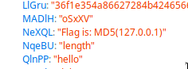

#### Challenges:
  - Web
    - Bad JS
    - Old CTF
  - Misc
    - The Trouble Maker
  - Forensics
    - Now You See Me #1

# Web

## Bad JS

### Web - 100 points (solved)

> There is a bad JS which hides flag inside. Capture it.

---

## Solution

We are given a html and javascript file that make up a simple flag checking page. The javascript is obfuscated so we can't easily work through it by hand to retrieve the flag. Instead, we open the index.html file in Chrome or Firefox and use the browser's debugger tool to view variable values. Checking through the values after a short while, we find the flag.



Performing the hashing, we get the flag: `UUTCTF{f528764d624db129b32c21fbca0cb8d6}`

---

## Old CTF

### Web - 212 points (solved)

> There is an old page of UUTCTF at:
>
> http://188.40.189.2:8004/
>
> Simple, find the flag.

---

## Solution

The URL links to a local version of the ctftime wtf-ctf page. All links on the page link to the real ctftime page. Checking source code and cookies don't reveal anything interesting either. Checking `robots.txt`, we see that the page has a `login.php` page. The `login.php` page has a member login form. Assuming the website is using SQL, we try the standing SQL injection attack, entering in `' or 1=1 or username='` for the username field and `' or 1=1 or password='` for the password field. We get the message:

> Sorry, You must be admin to find the flag! Are you tired? Eat some cookies ;) 

This prompts us to check our cookies and we find a cookie named `AdminToken` with some hash. If we look at the request that is being sent when we try to login, we see there is a `token` field that is also being sent which is different to the `AdminToken` cookie. Sending the form with the initial query and the new `AdminToken` gives us the flag: `1f29322531f03627428a73f70664c8e9`

---

# Misc

## The Trouble Maker

### Misc - 220 points (solved)

> Linus Torvalds is a trouble maker! He made a web page which hides the flag. Find and capture it!
>
> Webpage is at: http://188.40.189.2:8001

---

## Solution

The website is a single page that says:

> Linus has made awesome tools!
> Why don't you use them?!

So our first instinct would be to check for a `.git` folder. Sure enough, it's there. Dumping it using [gitdumper.sh](https://github.com/internetwache/GitTools/blob/master/Dumper/gitdumper.sh) and checking the commit log, we get the following:

```bash
> git log

commit 89df7cb11d670308abe21dc7dd82294360fde129 (HEAD -> master)
Author: Linus <linus@ctf.uut.ac.ir>
Date:   Fri Apr 26 14:37:39 2019 +0430

    this still needs purging!

commit 24ad3f97738d5669e171ea4c3f280c62797dd21d
Author: Linus <linus@ctf.uut.ac.ir>
Date:   Fri Apr 26 14:23:12 2019 +0430

    this may help

commit a0e95d9e42265faa38c5caa10965d6e2c5f1e47b
Author: Linus <linus@ctf.uut.ac.ir>
Date:   Sun Apr 14 01:24:53 2019 +0430

    editting views!

commit 6be73c9495f15c7379f362f7017eb1d5d23ea62a
Author: Linus <linus@ctf.uut.ac.ir>
Date:   Sun Apr 14 01:19:14 2019 +0430

    purging some file!

...
```

Looking at the difference between the commit with the `this may help` message, we see:

```bash
> git diff 24ad3f

diff --git a/resources/js/front.js b/resources/js/front.js
deleted file mode 100644
index d157bbd..0000000
--- a/resources/js/front.js
+++ /dev/null
@@ -1 +0,0 @@
-var string = "RmxhZyBpczogVVVUQ1RGe1ZWZV8gfF8wVmVfTCFuKF8pJH0=";
```

Base64 decoding the string variable:

```bash
> echo 'RmxhZyBpczogVVVUQ1RGe1ZWZV8gfF8wVmVfTCFuKF8pJH0=' | base64 -d
Flag is: UUTCTF{VVe_ |_0Ve_L!n(_)$}
```

---

# Forensics

## Now You See Me #1

### Forensics - 200 points (solved)

> Find the flag inside the BMP.

---

## Solution

Opening the image in stegsolve doesn't give us any good results. As is usual for stego challenges, we try lsb. Our bitmap image is made up of bytes (8 bits) that represent the red, green and blue 'amounts' in each pixel. Using the 8th bit of each point to transmit hidden messages is a common steganography technique as the change is so insignificant that the human eye will barely notice any difference. This is exemplified in the follow image from wikipedia (although this image modifies the last two bits):


So if we assume a message is stored using the last bit in each byte of the image file, we can write a script to extract the data. We should be careful though. The following script won't find the flag for us:

```python
from binascii import unhexlify
image = open('LAND2.BMP', 'rb').read()
lsbs = ''.join([str(ord(c)&1) for c in image])
flag = unhexlify('%x' % int(lsbs, 2))
if 'uutctf' in flag:
    print flag[flag.find('uutctf'):flag.find('}')+1]
```

This is because when hiding messages in the least significant bits, there needs to be a way of telling when the message has ended. This is done by making all the least significant bits after the message has ended a 0. However, our script will add that 0 on to our `lsbs` string which is essentially a left shift and completely changes the 'message'. To figure out where the message ends, we have to look from the last byte of the bmp file and search backwards, finding where the last bit stops being 0. We can use `xxd` to help us with this:

```bash
> xxd LAND2.BMP | tail

000c03a0: cccc cccc cccc cccc cccc cccc cccc cccc  ................
000c03b0: cccc cccc cccc cccc cccc cccc cccc cccc  ................
000c03c0: cccc cccc cccc cccc cccc cccc cccc cccc  ................
000c03d0: cccc cccc cccc cccc cccc cccc cccc cccc  ................
000c03e0: cccc cccc cccc cccc cccc cccc cccc cccc  ................
000c03f0: cccc cccc cccc cccc cccc cccc cccc cccc  ................
000c0400: cccc cccc cccc cccc cccc cccc cccc cccc  ................
000c0410: cccc cccc ccd0 ccd0 ccd0 ccd0 ccd0 ccd0  ................
000c0420: ccd0 ccd0 ccd0 ccee ccd0 d0d0 ccd0 ccd0  ................
000c0430: ccd0 ccd0 ccd0                           ......
```

Counting from `ccd0` (inclusive) to `ccee` (exclusive), we get a total of 7 bytes. We could edit the bmp and remove these bytes manually, or we could just modify our script:

```python
from binascii import unhexlify
image = open('LAND2.BMP', 'rb').read()
lsbs = ''.join([str(ord(c)&1) for c in image[:-7]])
flag = unhexlify('%x' % int(lsbs, 2))
if 'uutctf' in flag:
    print flag[flag.find('uutctf'):flag.find('}')+1]
```

Running our script (python2):

```bash
> python2 ./solve.py
uutctf{good_for_you}
```

---
