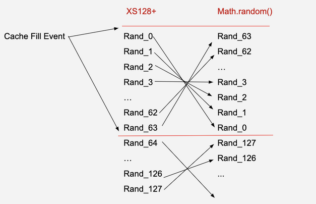

This was the most solved crypto challenge, but was still pretty difficult. It had 8 solves by the end of the CTF. I couldn't have solved it without the help of my teammates.

# 100 Pins (HITCON CTF 2020)

> 4 digits pin are too weak... How about 100 of them?
>
> `nc 18.183.134.249 1234`

```js
#!/usr/bin/env node

const rl = require("readline").createInterface({
  input: process.stdin,
  output: process.stdout,
});
rl.on("close", () => {
  yellow("Bye");
  process.exit(1);
});

const ask = (q) => new Promise((resolve) => rl.question(q, (s) => resolve(s)));

const colorLog = (c) => (...args) =>
  console.log(`\x1b[1;${c}m` + args.join(" ") + "\x1b[0m");
const red = colorLog(31);
const green = colorLog(32);
const yellow = colorLog(33);
const info = colorLog(0);

const flag = process.env["FLAG"];
if (flag === undefined || !flag.startsWith("hitcon")) {
  red("Oops... missing flag, please contact admin");
  process.exit(2);
}

setTimeout(() => {
  red("Too sloooooooooooow :(");
  process.exit(3);
}, 180 * 1000);

const N = 100;
const candidates = Array.from({ length: 10000 }, (_, i) =>
  i.toString().padStart(4, "0")
).filter((x) => new Set(x).size === 4);
const pins = Array.from(
  { length: N },
  () => candidates[Math.floor(Math.random() * candidates.length)]
);

const match = (pin, s) => {
  let a = 0;
  let b = 0;
  for (let i = 0; i < s.length; i++) {
    const j = pin.indexOf(s[i]);
    if (j === i) a++;
    else if (j !== -1) b++;
  }
  return [a, b];
};

const sha256 = (s) =>
  require("crypto").createHash("sha256").update(s).digest("hex");

const pow = async () => {
  const nonce = Math.random().toString(36).slice(-10);
  const s = await ask(`Show me sha256("${nonce}" + s) ends with "00000": `);
  const hash = sha256(nonce + s);
  if (!hash.endsWith("00000")) {
    red("Huh?");
    process.exit(4);
  }
};

const main = async () => {
  green(`Welcome to FLAG locker ${process.version}`);
  await pow();
  info(`=== FLAG is locked with ${N} pins ===`);
  let rem = 128;
  for (let i = 0; i < N; i++) {
    if (--rem < 0) {
      red("Too many errors! Device is wiped and the flag is gone ¯\\_(ツ)_/¯");
      process.exit(5);
    }

    const pin = pins[i];
    const s = await ask(`Pin ${i + 1}? `);
    const [a, b] = match(pin, s);
    if (a === 4) {
      green("OK");
      continue;
    }

    yellow(`Hmm... hint: ${a}A${b}B`);
    i--;
  }

  green("FLAG Unlocked:", flag);
  process.exit(0);
};

main().finally(() => process.exit(6));
```

## Solution

### Challenge Overview

The server challenges us to guess 100 four digit pins with 128 attempts. The pins have no repeating digits, so there is a total of 5040 possible pins (still impossible to guess).

When we submit an incorrect pin attempt the server gives us a hint:

```
Pin 1? 1337
Hmm... hint: 0A2B
```

In general, the hint is of the form `aAbB` where

- `a` is the number of exactly matching digits in our guess and in the pin
- `b` is the number of digits in the pin that is in our guess, but not in the correct position

For example, if the pin is `2481` and our guess is `2984`, then `a` is `2` and `b` is `1`.

### Analysis

The hint given to us each time we submit an attempt is pretty useful, but it should be quite clear that there's no way we'll be able to guess 100 pins with 128 attempts using the hint alone.

Some peculiar things we noticed was that the script is written in JavaScript and we are given the Node.js version that the server is running. Looking at the generation of the pins:

```js
const N = 100;
const candidates = Array.from({ length: 10000 }, (_, i) =>
  i.toString().padStart(4, "0")
).filter((x) => new Set(x).size === 4);
const pins = Array.from(
  { length: N },
  () => candidates[Math.floor(Math.random() * candidates.length)]
);
```

we see that `Math.random()` is being used. This uses Xorshift128+ under the hood which is not cryptographically secure. At this point, the solution became quite clear; use the hints to somehow guess a few pins, then use this information to recover the state of the Xorshift128+ PRNG, then predict future outputs.

Seems pretty straightforward... but we came across many issues when implementing, mostly due to the additional constraints (time limit and number of guesses) in the challenge.

### Part 1: Guessing Pins

To recover the state of the PRNG, we need some sample outputs. And to get some sample outputs, we need to determine some of the pins. We can determine the output of the PRNG from the pin by taking the index of the pin in the `candidates` array.

This is the function used to generate the hint `aAbB`:

```js
const match = (pin, s) => {
  let a = 0;
  let b = 0;
  for (let i = 0; i < s.length; i++) {
    const j = pin.indexOf(s[i]);
    if (j === i) a++;
    else if (j !== -1) b++;
  }
  return [a, b];
};
```

Here, `s` is our input as a string. Notice that _all_ characters of our input is iterated over in the for loop. This means we aren't limited to just a 4 digit guess, and this allows us to learn some additional information about the pin. Specifically, if we send the guess

```
011222233333333(16 times "4")(32 times "5")(64 times "6")(128 times "7")(256 times "8")(512 times "9")
```

then the server will give us the hint `aAbB`. If we look at the binary representation of `a+b` we will notice that the `1` bits correspond exactly to the digits in the pin! As an example, if the pin was `0394`, then the hint given by the server will be `1A535B`. And

```
bin(536) == '0b1000011001'
```

so we can deduce that the pin contains the digits `0`, `3`, `4` and `9`.

Knowing the digits of the pin reduces the possibilities from 5040 to 24. This is a major improvement, but still way too expensive to naively bruteforce. It turns out (from empirical testing) that we need 11 pins to recover the state of the PRNG. So to be able to complete the challenge and submit all 100 pins, we will need to gather the first 11 pins using **no more than 39** attempts (since we will need to use the remaining 89 attempts to submit the rest of the pins).

This turned out to be the hardest part of the challenge (imo) and it was solved by a teammate. We started out with an average of 50 attempts to recover the 11 pins and spent hours trying to reduce it as much as we could. The following code (written by hashkitten) is used to recover the pin using approximately `3.81567` attempts on average, so about 42 attempts to recover the 11 pins. This was just enough for the challenge constraints.

```python
from itertools import permutations, product
from math import log2

def match(a, b):
    return sum(x==y for x,y in zip(a,b))

def check(guess, possibilities):
    l = {}
    for x in possibilities:
        l[''.join(x)] = match(guess, x)
    nl = {}
    for i in range(0,5):
        nl[i] = [v for v in l if l[v] == i]
    return nl

def entropy(nl):
    tot = sum(len(x) for x in nl.values())
    ent = sum(-(len(x)/tot)*log2(len(x)/tot) if len(x) else 0 for x in nl.values())
    return ent

def check_entropy(guess, possibilities):
    return entropy(check(guess, possibilities))

def get_pin(digit_string, blackbox, fnum):
    first_guess = '1234'
    possibilities = list(permutations(digit_string))
    possibilities = check(first_guess, possibilities)[fnum]
    while True:
        lls = {}
        for possible_guess in product(digit_string, repeat=4):
            possible_guess = ''.join(possible_guess)
            lls[possible_guess] = check_entropy(possible_guess, possibilities)
        best_guess, ent = max(lls.items(), key=lambda x:x[1]+100*(x[0] in possibilities))
        # print('Guessing {} with entropy {}'.format(best_guess, ent))
        num = blackbox(best_guess)
        if num == 4:
            return best_guess
        possibilities = check(best_guess, possibilities)[num]
        # print('Remaining possibilities: {}'.format(possibilities))
        if len(possibilities) <= 1:
            assert blackbox(possibilities[0]) == 4
            return possibilities[0]

perf_count = 0
def get_avg():
    for p in permutations('0123456789', 4):

        def test_blackbox(guess):
            global perf_count
            perf_count += 1
            return match(guess, p)

        digit_string = sorted(p)
        fnum = test_blackbox('1234')
        get_pin(digit_string, test_blackbox, fnum)

    global perf_count
    return perf_count/5040

# for checking average requests per pin
print(get_avg()) # 3.815674603174603
```

To summarise the algorithm, we consider all possible guesses that can be made and for each guess, we look at the number of matches between the guess and the 24 possible pins. To narrow down the possibilities, we take the guess that yields the highest entropy (of the number of possibilities that have a certain number of matches between the guess and the remaining possible pins).

Before we arrived at this solution, we used the first attempt to figure out the digits in the pin and nothing else (as described at the beginning of this section). We weren't able to get the total number of attempts low enough by doing this. By using `"1234"+"01222..."` as the first guess, we were able to get a bit more information about the positions of the digits (some of the time), as well as which digits are in the pin. This helped just enough to reduce the total number of attempts required to recover all 11 pins.

### Part 2: Recovering Xorshift128+ State

After some searching, we quickly found [this stackexchange post](https://security.stackexchange.com/questions/84906/predicting-math-random-numbers) which asks pretty much what we need for the challenge. In particular, we can use [this](https://github.com/d0nutptr/v8_rand_buster) to recover the state of the PRNG and get previous and future outputs. The author of this also made [a video](https://www.youtube.com/watch?v=_Iv6fBrcbAM) which clearly explains how it works.

An issue we ran into with this was that, in the script linked above, a lot of slow symbolic execution was being used to recover previous outputs of the PRNG once the state has been recovered. It took about ~20s to recover one output so this wouldn't work as the server times out after 180s. Fortunately, it turns out that there is an easy way to reverse the Xorshift128+ algorithm and get previous states, without the slow symbolic execution. This is detailed [here](https://blog.securityevaluators.com/xorshift128-backward-ff3365dc0c17) and the relevant code can be found [here](https://github.com/TACIXAT/XorShift128Plus/blob/master/xs128p.py#L57).

### Part 3: Predicting Next Pins

The way `Math.random()` works is a bit different to what one might expect. When a call to `Math.random()` is made, V8 checks its "random cache". If the cache is populated, it pops a value from it and returns that. Otherwise, it fills the cache with 64 outputs of Xorshift128+. This mechanism allows for faster successive calls to `Math.random()`. But because the values are popped from the cache, the outputs of `Math.random()` are in the opposite order of the outputs of the Xorshift128+ PRNG. The image below (taken from [here](https://docs.google.com/presentation/d/1f7yHnskJIl3O9GoZ4u_PHAnISRVaKoDb4V0CMRtNVRI/edit#slide=id.g7c8b89e9a2_0_247)) shows this:



Since we've recovered the first 11 outputs of `Math.random()`, we have `Rand_63`, `Rand_62`, ..., `Rand_53`. So to recover the 12th to 64th outputs of `Math.random()`, we need to reverse the Xorshift128+ output and recover `Rand_52`, `Rand_51`, ..., `Rand_0`. To get the 65th to 100th outputs of `Math.random()` we need to get the next outputs of the underlying Xorshift128+ PRNG. Since we are only interested in the next 36 outputs of `Math.random()`, we'll want to take `Rand_127`, `Rand_126`, ... `Rand_92`. Combining these, we have the indices of all of the remaining pins!

All that's left is to send the pins to the server to get the flag.

Since the number of attempts required to recover each pin depends on the pin, we aren't guaranteed to recover the 11 pins in less than 40 attempts every time. However, it happens often enough that we can just manually rerun the script if it fails, and eventually it will work.

### Solution Scripts

`solv.py`:

```python
import xs128p
from pwn import remote, process, context
import hashlib
from itertools import permutations
import string
from Crypto.Util.number import bytes_to_long
from strip_ansi import strip_ansi
from get_pin import get_pin

context.log_level = 'debug'

BIN_DIGITS = '1234' + '2'*(4-1) + '0' + '1'*(2-1) + '3'*(8-1) + '4'*(16-1) + '5'*32 + '6'*64 + '7'*128 + '8'*256 + '9'*512
candidates = [str(i).zfill(4) for i in range(10000)]
candidates = [c for c in candidates if len(set(c)) == 4]
ATTEMPTS = 0

def connect():
    return remote('18.183.134.249', 1234)
    # return process('./100pins.js')

def get_remaining_idxs(known_idxs):
    out1 = xs128p.recover_lead(known_idxs, 5040, 64-12)
    out2 = xs128p.recover_next(known_idxs, 5040, 75)[-36:][::-1]
    return out1 + out2

def solve_pow(conn):
    goal = conn.recvuntil("ends with \"00000\":").split(b'sha256("')[1].split(b'" +')[0]

    for s in permutations(string.ascii_lowercase, 6):
        a = bytes_to_long(hashlib.sha256(goal + ''.join(s).encode('utf-8')).digest()) & 0xfffff
        if a == 0:
            conn.sendline(''.join(s).encode('utf-8'))
            break

def send_pin_guess(conn, guess):
    global ATTEMPTS
    ATTEMPTS += 1
    conn.recvuntil(b'? ')
    conn.sendline(str(guess))
    # conn.recvline()
    o = strip_ansi(conn.recvline().decode()).strip()
    if 'hint' in o:
        x = o.split()[-1]
        a = int(x.split('A')[0])
        b = int(x.split('A')[1].split('B')[0])
        return a, b
    print('[+] correct pin!')
    return True

def get_digits(conn):
    a,b = send_pin_guess(conn, BIN_DIGITS)
    B = a+b 
    digits = []
    for i in range(10):
        if B & 1:
            digits.append(i)
        B >>= 1
    return ''.join(str(x) for x in digits), a

def recover_pin(conn):
    def blackbox(guess):
        x = send_pin_guess(conn, guess)
        return 4 if x == True else x[0]
    digitstr, fnum = get_digits(conn)
    return get_pin(digitstr, blackbox, fnum)
    
def pin_to_idx(pin):
    return candidates.index(pin)

conn = connect()
solve_pow(conn)
print('[+] pow solved')

known_idxs = [pin_to_idx(recover_pin(conn)) for _ in range(11)]
print(known_idxs)
print('[!]', ATTEMPTS, 'attempts used to recover state')
if ATTEMPTS >= 40:
    print('fail :<')
    exit()
next_pins = [candidates[i] for i in get_remaining_idxs(known_idxs[::-1])]
for i, pin in enumerate(next_pins):
    send_pin_guess(conn, pin)
print(strip_ansi(conn.recvline().decode()))
```

`get_pin.py`:

```python
# written by hashkitten
from itertools import permutations, product
from math import log2

def match(a, b):
    return sum(x==y for x,y in zip(a,b))

def check(guess, possibilities):
    l = {}
    for x in possibilities:
        l[''.join(x)] = match(guess, x)
    nl = {}
    for i in range(0,5):
        nl[i] = [v for v in l if l[v] == i]
    return nl

def entropy(nl):
    tot = sum(len(x) for x in nl.values())
    ent = sum(-(len(x)/tot)*log2(len(x)/tot) if len(x) else 0 for x in nl.values())
    return ent

def check_entropy(guess, possibilities):
    return entropy(check(guess, possibilities))

def get_pin(digit_string, blackbox, fnum):
    first_guess = '1234'
    possibilities = list(permutations(digit_string))
    possibilities = check(first_guess, possibilities)[fnum]
    while True:
        lls = {}
        for possible_guess in product(digit_string, repeat=4):
            possible_guess = ''.join(possible_guess)
            lls[possible_guess] = check_entropy(possible_guess, possibilities)
        best_guess, ent = max(lls.items(), key=lambda x:x[1]+100*(x[0] in possibilities))
        # print('Guessing {} with entropy {}'.format(best_guess, ent))
        num = blackbox(best_guess)
        if num == 4:
            return best_guess
        possibilities = check(best_guess, possibilities)[num]
        # print('Remaining possibilities: {}'.format(possibilities))
        if len(possibilities) <= 1:
            assert blackbox(possibilities[0]) == 4
            return possibilities[0]

perf_count = 0
def get_avg():
    for p in permutations('0123456789', 4):

        def test_blackbox(guess):
            global perf_count
            perf_count += 1
            return match(guess, p)

        digit_string = sorted(p)
        fnum = test_blackbox('1234')
        get_pin(digit_string, test_blackbox, fnum)

    global perf_count
    return perf_count/5040

# for checking average requests per pin
# print(get_avg()) # 3.815674603174603
```

`xs128p.py`:

```python
import argparse
import struct
from decimal import *
import os
from z3 import *

# most code from https://github.com/d0nutptr/v8_rand_buster/blob/master/xs128p.py

MAX_UNUSED_THREADS = 2

# Calculates xs128p (XorShift128Plus)
def xs128p(state0, state1):
    s1 = state0 & 0xFFFFFFFFFFFFFFFF
    s0 = state1 & 0xFFFFFFFFFFFFFFFF
    s1 ^= (s1 << 23) & 0xFFFFFFFFFFFFFFFF
    s1 ^= (s1 >> 17) & 0xFFFFFFFFFFFFFFFF
    s1 ^= s0 & 0xFFFFFFFFFFFFFFFF
    s1 ^= (s0 >> 26) & 0xFFFFFFFFFFFFFFFF
    state0 = state1 & 0xFFFFFFFFFFFFFFFF
    state1 = s1 & 0xFFFFFFFFFFFFFFFF
    generated = state0 & 0xFFFFFFFFFFFFFFFF
    return state0, state1, generated

def sym_xs128p(sym_state0, sym_state1):
    # Symbolically represent xs128p
    s1 = sym_state0
    s0 = sym_state1
    s1 ^= (s1 << 23)
    s1 ^= LShR(s1, 17)
    s1 ^= s0
    s1 ^= LShR(s0, 26)
    sym_state0 = sym_state1
    sym_state1 = s1
    # end symbolic execution

    return sym_state0, sym_state1

# from https://github.com/TACIXAT/XorShift128Plus/blob/master/xs128p.py
def reverse17(val):
    return val ^ (val >> 17) ^ (val >> 34) ^ (val >> 51)

def reverse23(val):
    MASK = 0xFFFFFFFFFFFFFFFF
    return (val ^ (val << 23) ^ (val << 46)) & MASK

def xs128p_backward(state0, state1):
    prev_state1 = state0
    prev_state0 = state1 ^ (state0 >> 26)
    prev_state0 = prev_state0 ^ state0
    prev_state0 = reverse17(prev_state0)
    prev_state0 = reverse23(prev_state0)
    generated = prev_state0
    return prev_state0, prev_state1, generated

# Symbolic execution of xs128p
def sym_floor_random(slvr, sym_state0, sym_state1, generated, multiple):
    sym_state0, sym_state1 = sym_xs128p(sym_state0, sym_state1)

    # "::ToDouble"
    calc = LShR(sym_state0, 12)
    lower = from_double(Decimal(generated) / Decimal(multiple))
    upper = from_double((Decimal(generated) + 1) / Decimal(multiple))

    lower_mantissa = (lower & 0x000FFFFFFFFFFFFF)
    upper_mantissa = (upper & 0x000FFFFFFFFFFFFF)
    upper_expr = (upper >> 52) & 0x7FF

    slvr.add(And(lower_mantissa <= calc, Or(upper_mantissa >= calc, upper_expr == 1024)))
    return sym_state0, sym_state1

def solve_instance(points, multiple):
    # setup symbolic state for xorshift128+
    ostate0, ostate1 = BitVecs('ostate0 ostate1', 64)
    sym_state0 = ostate0
    sym_state1 = ostate1
    set_option("parallel.enable", True)
    set_option("parallel.threads.max", (max(os.cpu_count() - MAX_UNUSED_THREADS, 1)))
    slvr = SolverFor("QF_BV")

    for point in points:
        sym_state0, sym_state1 = sym_floor_random(slvr, sym_state0, sym_state1, point, multiple)

    if slvr.check() == sat:
        # get a solved state
        m = slvr.model()
        state0 = m[ostate0].as_long()
        state1 = m[ostate1].as_long()

        return state0, state1
    else:
        print("Failed to find a valid solution")
        return None, None

def to_double(value):
    double_bits = (value >> 12) | 0x3FF0000000000000
    return struct.unpack('d', struct.pack('<Q', double_bits))[0] - 1

def from_double(dbl):
    return struct.unpack('<Q', struct.pack('d', dbl + 1))[0] & 0x7FFFFFFFFFFFFFFF

def recover_lead(points, multiple, lead=0):
    state0, state1 = solve_instance(points, multiple)
    o = [math.floor(multiple*to_double(state0))]
    for i in range(lead):
        state0, state1, generated = xs128p_backward(state0, state1)
        o.append(math.floor(multiple*to_double(generated)))
    return o

def recover_next(points, multiple, N):
    state0, state1 = solve_instance(points, multiple)
    out = []
    for i in range(N):
        state0, state1, output = xs128p(state0, state1)
        out.append(math.floor(multiple * to_double(output)))
    return out
```

Flag: `hitcon{even_my_c4t_can_s0lve_4_digits_pin_4A999B}`
