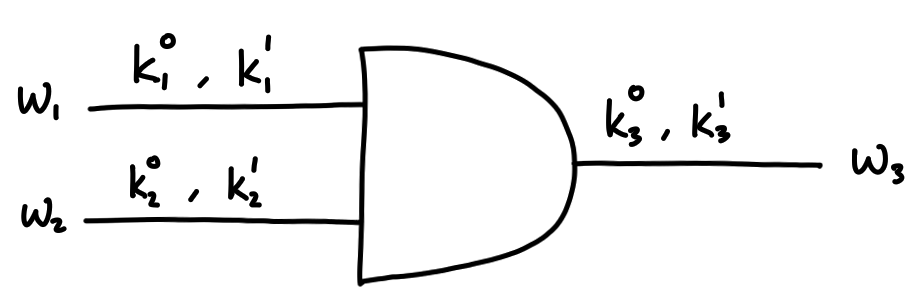

The crypto in this CTF was hard. I was only able to solve garbled in the time I spent playing. It's a relatively straightforward challenge if you have some understanding of garbled circuits, so this writeup will more or less be a very basic introduction.

# Background

Alice and Bob have some private inputs $x$ and $y$ and want to compute a function $f(x,y)$ without revealing to each other their input values. They could both send their inputs to a trusted third party and have that entity compute the function, but garbled circuits provides a way for Alice and Bob to achieve this goal without a trusted third party.

## Oblivious Transfer (OT)

The notion of an [oblivious transfer](https://en.wikipedia.org/wiki/Oblivious_transfer) protocol will be useful later.

Let $S$ be a sender with values $s_0$ and $s_1$. The receiver $R$ wants to obtain the value $s_b$ for some value $b \in \{ 0, 1 \}$. This should happen without $S$ learning the value of $b$ and without $R$ learning the value of $s_{1-b}$.

For some intuition, suppose as a contrived example that an online giftcard shop is the sender and you are the receiver. The shop has two cards to choose from and for whatever reason, you don't want to reveal to the shop which card you want. OT can be used to achieve this.

There exists a few constructions but the details are not important. We'll just assume that OT is possible.

# Yao's Garbled Circuits

The protocol can be summarised as follows:

1. The function that Alice and Bob wish to compute is represented as a Boolean circuit with 2 input gates for Alice's and Bob's inputs.
2. Alice garbles the circuit (generates random labels, and encrypts a truth table for each gate).
3. Alice sends the garbled circuit and and her inputs (which appear as random labels) to Bob.
4. Bob retrieves his input labels from Alice using OT.
5. Bob evaluates the circuit by decrypting the output gate with the keys.
6. Alice and Bob determine the output by comparing the decryption result with Alice's labels.

## Example

The intuition is much easier to grasp with an example. Suppose Alice and Bob have input bits $x$ and $y$ and want to compute the AND of their inputs. Alice will generate random labels which will be used as keys to encrypt values with a symmetric key algorithm.

### Setup

Truth table:

|$x$|$y$|$f(x,y)$|
|---|---|---|
|$0$|$0$|$0$|
|$0$|$1$|$0$|
|$1$|$0$|$0$|
|$1$|$1$|$1$|

Before garbling, the circuit looks like this:

</img>

After garbling, it will look like this:

</img>

The input labels $k_1^0, k_1^1, k_2^0, k_2^1$ are randomly generated by Alice. These correspond to the input bits ($k_1^0$ and $k_1^1$ are Alice's and $k_2^0$ and $k_2^1$ are Bob's). Don't be confused by the notation used, to any observer, the labels look like random values and have no meaning. Alice needs to keep track of the labels she generates to know which corresponds to a $0$ bit and a $1$ bit for each wire.

### Garbling the circuit

The output labels $k_3^0$ and $k_3^1$ are also randomly generated. Before they are sent to Bob, they are encrypted. This is what the garbled truth table looks like ($E_k(m)$ denotes the encryption of $m$ with key $k$):

|$w_1$|$w_2$|$w_3$|
|---|---|---|
|$k_1^0$|$k_2^0$|$E_{k_1^0}(E_{k_2^0}(k_3^0))$|
|$k_1^0$|$k_2^1$|$E_{k_1^0}(E_{k_2^1}(k_3^0))$|
|$k_1^1$|$k_2^0$|$E_{k_1^1}(E_{k_2^0}(k_3^0))$|
|$k_1^1$|$k_2^1$|$E_{k_1^1}(E_{k_2^1}(k_3^1))$|

Notice that it resembles the truth table for AND, but instead of $0$s and $1$s, we have seemingly random values. The idea is that Bob will be able to evaluate the circuit using the two correct input keys to recover the correct output label (either $k_3^0$ or $k_3^1$).

### Sending the circuit

Alice sends Bob the circuit as well as her input label $k_1^x$. She sends the circuit by sending Bob the four ciphertexts corresponding to column $w_3$ in the table above. She randomly permutes these so that Bob can't figure anything out from the ordering.

### Evaluating the circuit

Before Bob can evaluate the circuit, he needs his own input key. He retrieves this from Alice using OT as described before. Now Bob has two keys $k_1^x$ and $k_2^y$ (where $x$ and $y$ are Alice's and Bob's original input bits). Note again that Bob has no idea what $x$ (Alice's bit) is since $k_1^x$ looks like a random value with no meaning to him. Bob will now be able to decrypt the ciphertexts he received from Alice using these keys. An issue we haven't talked about yet is how Bob is able to know which is the correct decryption. One way we could work around this is by having Alice encrypt the output labels with some additional obvious padding, so that when Bob decrypts the correct ciphertext, he'll see it and realise that's the correct one. Another way (and the way used in the challenge) is by sending an additional four ciphertexts, each corresponding to the encryption of some sentinel value (say, $0$) with the two keys. With this, Bob will be able to determine which is the correct ciphertext by decrypting this extra ciphertext and seeing if it corresponds to a plaintext of $0$.

### Retrieving the output

Finally, once Bob has decrypted the correct ciphertext he should have the value $k_3^{x \land y}$. Alice has been keeping track of which of her randomly generated labels correspond to $0$ bits and which correspond to $1$ bits, so she can use that to determine the final output bit.

# garbled (DiceCTF 2021)

> My friend gave me a weird circuit to evaluate, but I forgot to ask her for the input. I know the circuit is supposed to return `true`, but everything's been garbled and I can't make heads or tails of it.

We are given a Python program that implements a simple SPN block cipher and a garbled circuit protocol. There are four input bits and the function being computed is the AND of all four of these values. The task is to recover the input labels so that we can figure out the labels that correspond to $1$ bits which will get us the flag.

The relevant parts of the code:

`block_cipher.py`:

```py
...
def encrypt(data, key1, key2):
    encrypted = encrypt_data(data, key1)
    encrypted = encrypt_data(encrypted, key2)
    return encrypted
...
```

`yao.py`:

```py
...
def generate_random_label():
    return randrange(0, 2**24)


def garble_label(key0, key1, key2):
    """
    key0, key1 = two input labels
    key2 = output label
    """
    gl = encrypt(key2, key0, key1)
    validation = encrypt(0, key0, key1)
    return (gl, validation)
...
```

The first thing we noticed is that the key sizes are only 24 bits. If we could easily bruteforce the keys, we could figure out the labels. Unfortunately, although the block size for the cipher is only 24 bits, the encryption uses two keys, which means we'd effectively need to bruteforce 48 bits, which is too much (given the resources I have at least). However, attacking the cipher is still the way to go. We notice that the protocol sends not only the encryption of the output keys, but an additional `validation` ciphertext which encrypts a sentinel value `0` with the two keys. We can use this ciphertext to perform a [meet-in-the-middle attack](https://en.wikipedia.org/wiki/Meet-in-the-middle_attack) to recover the keys for a specific gate. This will only take about $2^{24}$ operations, so it's feasible for us.

Using this `validation` ciphertext narrows down the possible set of pairs of keys significantly, but we need to do a bit more to determine exactly which keys are correct. We use the fact that 3 out of 4 of the `gl` ciphertexts (the garbled labels) correspond to the same plaintext value. This follows from the truth table of AND. For simplicity, let's just assume we have a candidate $(a_0, b_0)$ which correspond to the keys for $0$ bits of Alice's and Bob's inputs. Suppose that the corresponding ciphertext is $c_1$ and the plaintext label is $p_1$. We know that there are two other ciphertexts $c_2$ and $c_3$ that decrypt to $p_1$ with the keys $(a_0, b_1)$ and $(a_1, b_0)$. We use this to pinpoint the exact values of $a_1$ and $b_1$ which are the inputs that we need.

We used pypy3 to run the solve script which ran in a couple of minutes.

```py
from chall.block_cipher import encrypt_data, decrypt_data, decrypt
from chall.public_data import g_tables
from collections import defaultdict
from tqdm import tqdm

print('[!] generating lookup table...')
ENCRYPTIONS_OF_ZERO = defaultdict(list)
for key in tqdm(range(2**24)):
    ct = encrypt_data(0, key)
    ENCRYPTIONS_OF_ZERO[ct].append(key)

def meet_in_the_middle(ct):
    print('[!] performing meet-in-the-middle attack for', ct)
    possible = defaultdict(list)
    for key in tqdm(range(2**24)):
        dec = decrypt_data(ct, key)
        if dec in ENCRYPTIONS_OF_ZERO:
            possible[key] = ENCRYPTIONS_OF_ZERO[dec]
    return possible

def recover_keys(Z, C):
    print('[!] recovering keys...')
    z1, z2, z3, z4 = Z
    c1, c2, c3, c4 = C
    for b0 in tqdm(z1):
        for a0 in z1[b0]:
            p1 = decrypt(c1, a0, b0)
            for c,z in zip([c2, c3, c4], [z2, z3, z4]):
                for a1 in z[b0]:
                    if p1 == decrypt(c, a1, b0):
                        b1 = recover_keys_part2(Z, C, a0, b0)
                        if b1:
                            print(f'a1 = {a1}, b1 = {b1}')
                            return True
    return False
                
def recover_keys_part2(Z, C, a0, b0):
    z1, z2, z3, z4 = Z
    c1, c2, c3, c4 = C
    for c,z in zip([c2,c3,c4], [z2,z3,z4]):
        for b1 in z:
            if a0 in z[b1] and decrypt(c, a0, b1) == decrypt(c1, a0, b0):
                return b1
    return False

for i in [5, 6]:
    Z = [meet_in_the_middle(g_tables[i][j][1]) for j in range(4)]
    C = [g[0] for g in g_tables[i]]
    for i in range(4):
        if recover_keys([Z[i]] + Z[:i] + Z[i+1:], [C[i]] + C[:i] + C[i+1:]):
            break
```

We find that the inputs are `11693387, 11338704, 7371799, 2815776`.

Flag: `dice{N0w_YoUr3_Th1nkIn6_Wi7H_pR0t0c015}`

---

Garbled Circuits resources:

- https://crypto.stanford.edu/cs355/18sp/lec6.pdf
- http://web.mit.edu/sonka89/www/papers/2017ygc.pdf
- https://en.wikipedia.org/wiki/Garbled_circuit
