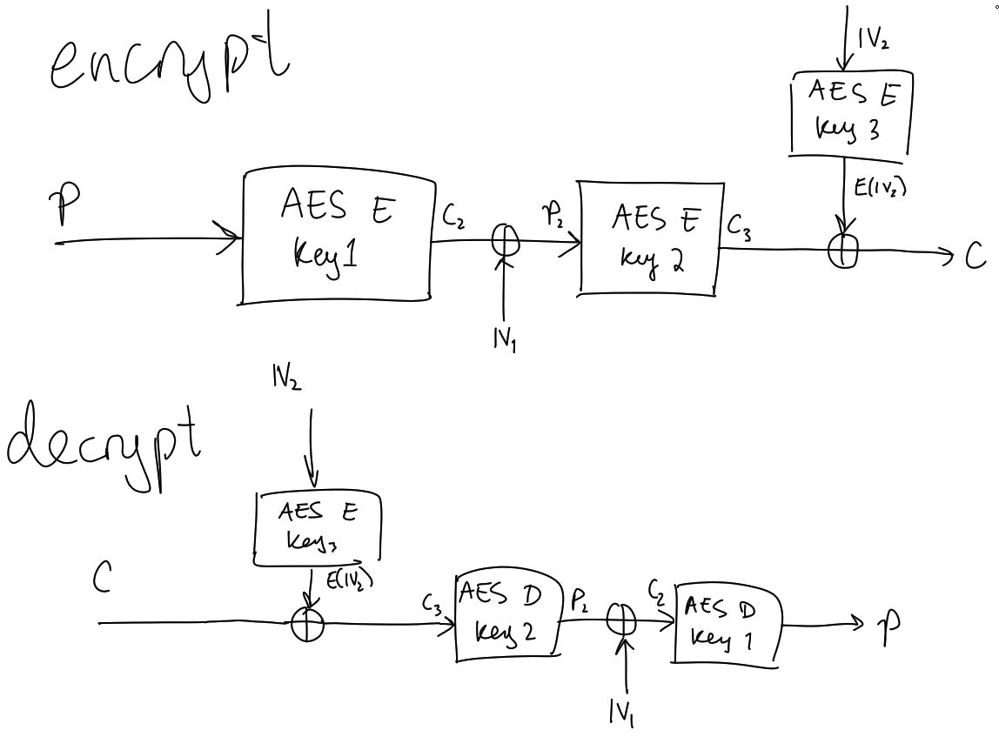

This was a great CTF with great crypto challenges. I managed to solve all of them but `pure division`. I played with `skateboarding dog` and we came 17th.

- [wa(rsa)mup](#warsamup)
- [OT or NOT OT](#ot-or-not-ot)
- [janken vs yoshiking](#janken)
- [easy pseudo random](#easy-pseudo-random)
- [3-AES](#three-aes)
- [NOT Mordell primes](#not-mordell-primes)
- [signme](#signme)

# war(sa)mup <a name="warsamup"></a>

> Do you know RSA? I know.
> 
> author:theoldmoon0602

```py
from Crypto.Util.number import getStrongPrime, GCD
from random import randint
from flag import flag
import os

def pad(m: int, n: int):
  # PKCS#1 v1.5 maybe
  ms = m.to_bytes((m.bit_length() + 7) // 8, "big")
  ns = n.to_bytes((n.bit_length() + 7) // 8, "big")
  assert len(ms) <= len(ns) - 11

  ps = b""
  while len(ps) < len(ns) - len(ms) - 3:
    p = os.urandom(1)
    if p != b"\x00":
      ps += p
  return int.from_bytes(b"\x00\x02" + ps + b"\x00" + ms, "big")


while True:
  p = getStrongPrime(512)
  q = getStrongPrime(512)
  n = p * q
  phi = (p-1)*(q-1)
  e = 1337
  if GCD(phi, e) == 1:
    break

m = pad(int.from_bytes(flag, "big"), n)
c1 = pow(m, e, n)
c2 = pow(m // 2, e, n)

print("n =", n)
print("e =", e)
print("c1=", c1)
print("c2=", c2)
```

```
n = 113135121314210337963205879392132245927891839184264376753001919135175107917692925687745642532400388405294058068119159052072165971868084999879938794441059047830758789602416617241611903275905693635535414333219575299357763227902178212895661490423647330568988131820052060534245914478223222846644042189866538583089
e = 1337
c1= 89077537464844217317838714274752275745737299140754457809311043026310485657525465380612019060271624958745477080123105341040804682893638929826256518881725504468857309066477953222053834586118046524148078925441309323863670353080908506037906892365564379678072687516738199061826782744188465569562164042809701387515
c2= 18316499600532548540200088385321489533551929653850367414045951501351666430044325649693237350325761799191454032916563398349042002392547617043109953849020374952672554986583214658990393359680155263435896743098100256476711085394564818470798155739552647869415576747325109152123993105242982918456613831667423815762
```

## Solution

We are given two related encryptions of the padded flag, and `e` is small enough, so we can apply the [Franklin-Reiter related-message attack](https://en.wikipedia.org/wiki/Coppersmith%27s_attack#Franklin-Reiter_related-message_attack).

We have

$$
\begin{aligned}
    c_1 &\equiv m^e \pmod n \\
    c_2 &\equiv \left \lfloor \frac{m}{2} \right \rfloor ^e \pmod n
\end{aligned}
$$

It turns out that $m$ is odd, so we can replace $\lfloor m/2 \rfloor$ with $(m-1)/2$. Now, let

$$
\begin{aligned}
    f_1 &\equiv x^e - c_1 \pmod n \\
    f_2 &\equiv \left (\frac{m-1}{2} \right )^e - c_2 \pmod n
\end{aligned}
$$

Then $\gcd(f_1, f_2) = x - m$ which reveals $m$.

I had an implementation of the half GCD algorithm (http://web.cs.iastate.edu/~cs577/handouts/polydivide.pdf) from DiceCTF which had an almost identical problem.


```py
from Crypto.Util.number import long_to_bytes
load('polygcd.sage')

n = 113135121314210337963205879392132245927891839184264376753001919135175107917692925687745642532400388405294058068119159052072165971868084999879938794441059047830758789602416617241611903275905693635535414333219575299357763227902178212895661490423647330568988131820052060534245914478223222846644042189866538583089
e = 1337
c1 = 89077537464844217317838714274752275745737299140754457809311043026310485657525465380612019060271624958745477080123105341040804682893638929826256518881725504468857309066477953222053834586118046524148078925441309323863670353080908506037906892365564379678072687516738199061826782744188465569562164042809701387515
c2 = 18316499600532548540200088385321489533551929653850367414045951501351666430044325649693237350325761799191454032916563398349042002392547617043109953849020374952672554986583214658990393359680155263435896743098100256476711085394564818470798155739552647869415576747325109152123993105242982918456613831667423815762

P.<x> = PolynomialRing(Zmod(n))

f = x^e - c1
g = ((x-1)/2)^e - c2

d = PGCD(f, g)

flag = long_to_bytes(int(-d.constant_coefficient()))
print(flag.split(b'\x00')[1].decode())
```

Flag: `zer0pts{y0u_g07_47_13457_0v3r_1_p0in7}`

---

# OT or NOT OT <a name="ot-or-not-ot"></a>

> OT or NOT OT?
>
> `nc crypto.ctf.zer0pts.com 10130`
> 
> author:theoldmoon0602

```py
import os
import signal
import random
from base64 import b64encode
from Crypto.Util.number import getStrongPrime, bytes_to_long
from Crypto.Util.Padding import pad
from Crypto.Cipher import AES
from flag import flag

p = getStrongPrime(1024)

key = os.urandom(32)
iv = os.urandom(AES.block_size)
aes = AES.new(key=key, mode=AES.MODE_CBC, iv=iv)
c = aes.encrypt(pad(flag, AES.block_size))

key = bytes_to_long(key)
print("Encrypted flag: {}".format(b64encode(iv + c).decode()))
print("p = {}".format(p))
print("key.bit_length() = {}".format(key.bit_length()))

signal.alarm(600)
while key > 0:
    r = random.randint(2, p-1)
    s = random.randint(2, p-1)
    t = random.randint(2, p-1)
    print("t = {}".format(t))

    a = int(input("a = ")) % p
    b = int(input("b = ")) % p
    c = int(input("c = ")) % p
    d = int(input("d = ")) % p
    assert all([a > 1 , b > 1 , c > 1 , d > 1])
    assert len(set([a,b,c,d])) == 4

    u = pow(a, r, p) * pow(c, s, p) % p
    v = pow(b, r, p) * pow(c, s, p) % p
    x = u ^ (key & 1)
    y = v ^ ((key >> 1) & 1)
    z = pow(d, r, p) * pow(t, s, p) % p

    key = key >> 2

    print("x = {}".format(x))
    print("y = {}".format(y))
    print("z = {}".format(z))
```

## Solution

The server generates a 1024 bit strong prime $p$ and a 32 byte AES key and gives us the flag encrypted with this key. Then, we are presented with up to 128 interactive rounds which each hide two bits of the key. Each round is as follows.

Let $r, s, t \in [2, p-1]$ be random values. We are given $t$. Next, we are asked to provide unique values $a, b, c, d \in [2, p-1]$. Then, the following values are computed:

$$
\begin{aligned}
    x &\equiv a^r c^s \oplus k_1 \pmod p \\
    y &\equiv b^r c^s \oplus k_2 \pmod p \\
    z &\equiv d^r t^s \pmod p
\end{aligned}
$$

The goal is to recover $k_1$ and $k_2$.

The trick to doing this is to set $(a, b, c, d) = (m, m^{-1}, t, -1)$ (note: these are in $GF(p)$) for some arbitrary $m$. Then we get

$$
\begin{aligned}
    x &\equiv m^r t^s \oplus k_1 \pmod p \\
    y &\equiv m^{-r} t^s \oplus k_2 \pmod p \\
    z &\equiv (-1)^r t^s \pmod p
\end{aligned}
$$

After a bit of basic algebra, we see that

$$
\begin{aligned}
    xy \equiv
    \begin{cases}
        z^2 \pmod p, \qquad &\text{iff } (k_1, k_2) = (0, 0) \\
        z^2 \pm y \pmod p, \qquad &\text{iff } (k_1, k_2) = (1, 0) \\
        z^2 \pm x \pmod p, \qquad &\text{iff } (k_1, k_2) = (0, 1) \\
        
    \end{cases}
\end{aligned}
$$

and if none of the three above cases hold, we can tell that $(k_1, k_2) = (1, 1)$.

We do this for each round and eventually recover the full key to decrypt the flag.

```py
import os
os.environ['PWNLIB_NOTERM'] = 'True'
from pwn import *
from Crypto.Cipher import AES
from Crypto.Util.Padding import unpad
from Crypto.Util.number import long_to_bytes
from base64 import b64decode
from tqdm import tqdm

proof.arithmetic(False)

conn = remote('crypto.ctf.zer0pts.com', 10130)
ciphertext = b64decode(conn.recvline().decode().split('flag: ')[1])
print('[!] ciphertext:', ciphertext)
p = int(conn.recvline().decode().split('p = ')[1])
key_bitlength = int(conn.recvline().decode().split(' = ')[1])
F = GF(p)

m = 2 
a = m
b = F(m)^-1
d = F(-1)
results = []
for i in tqdm(range(ceil(key_bitlength/2))):
    t = F(int(conn.recvline().decode().split('t = ')[1]))
    c = t
    conn.sendlineafter('a = ', str(a))
    conn.sendlineafter('b = ', str(b))
    conn.sendlineafter('c = ', str(c))
    conn.sendlineafter('d = ', str(d))
    x = int(conn.recvline().decode().split('x = ')[1])
    y = int(conn.recvline().decode().split('y = ')[1])
    z = int(conn.recvline().decode().split('z = ')[1])
    results.append((x, y, z))

key = ''
for x,y,z in results:
    xy = F(x*y)
    zz = F(z^2)
    if xy == zz:
        key = '00' + key
    elif xy - zz == y or xy - zz == -y:
        key = '01' + key
    elif xy - zz == x or xy - zz == -x:
        key = '10' + key
    else:
        key = '11' + key

print('[+] key:', key)
key = long_to_bytes(int(key, 2))
aes = AES.new(key=key, mode=AES.MODE_CBC, iv=ciphertext[:16])
flag = aes.decrypt(ciphertext[16:])
print('[*] flag:', flag)
```

Flag: `zer0pts{H41131uj4h_H41131uj4h}`

---

# janken vs yoshiking <a name="janken"></a>

>  Yoshiking knows the flag. He will give the flag to who has gold luck. Let's play the janken with Yoshiking and prove your luck!
> 
> `nc crypto.ctf.zer0pts.com 10463`
> 
> author:theoldmoon0602

```py
import random
import signal
from flag import flag
from Crypto.Util.number import getStrongPrime, inverse

HANDNAMES = {
    1: "Rock",
    2: "Scissors",
    3: "Paper"
}

def commit(m, key):
    (g, p), (x, _) = key
    r = random.randint(2, p-1)
    c1 = pow(g, r, p)
    c2 = m * pow(g, r*x, p) % p
    return (c1, c2)


def decrypt(c, key):
    c1, c2 = c
    _, (x, p)= key

    m = c2 * inverse(pow(c1, x, p), p) % p
    return m


def keygen(size):
    p = getStrongPrime(size)
    g = random.randint(2, p-1)
    x = random.randint(2, p-1)

    return (g, p), (x, p)


signal.alarm(3600)
key = keygen(1024)
(g, p), _ = key
print("[yoshiking]: Hello! Let's play Janken(RPS)")
print("[yoshiking]: Here is g: {}, and p: {}".format(g, p))

round = 0
wins = 0
while True:
    round += 1
    print("[system]: ROUND {}".format(round))

    yoshiking_hand = random.randint(1, 3)
    c = commit(yoshiking_hand, key)
    print("[yoshiking]: my commitment is={}".format(c))

    hand = input("[system]: your hand(1-3): ")
    print("")
    try:
        hand = int(hand)
        if not (1 <= hand <= 3):
            raise ValueError()
    except ValueError:
        print("[yoshiking]: Ohhhhhhhhhhhhhhhh no! :(")
        exit()

    yoshiking_hand = decrypt(c, key)
    print("[yoshiking]: My hand is ... {}".format(HANDNAMES[yoshiking_hand]))
    print("[yoshiking]: Your hand is ... {}".format(HANDNAMES[hand]))
    result = (yoshiking_hand - hand + 3) % 3
    if result == 0:
        print("[yoshiking]: Draw, draw, draw!!!")
    elif result == 1:
        print("[yoshiking]: Yo! You win!!! Ho!")
        wins += 1
        print("[system]: wins: {}".format(wins))

        if wins >= 100:
            break
    elif result == 2:
        print("[yoshiking]: Ahahahaha! I'm the winnnnnnner!!!!")
        print("[yoshiking]: You, good loser!")
        print("[system]: you can check that yoshiking doesn't cheat")
        print("[system]: here's the private key: {}".format(key[1][0]))
        exit()

print("[yoshiking]: Wow! You are the king of roshambo!")
print("[yoshiking]: suge- flag ageru")
print(flag)
```

## Solution

We have to win 100 rounds of rock paper scissors (janken) with yoshiking. To prove that he is not cheating, yoshiking provides us with a commitment $(c_1, c_2)$

$$
\begin{aligned}
    c_1 &\equiv g^r \pmod p \\
    c_2 &\equiv m g^{rx} \pmod p
\end{aligned}
$$

where $p$ is a large strong prime, $g$ is an element in $\mathbb{F}_p$ and $x$ is a random secret number. These three parameters are all initialised upon connection. $r$ is a random number chosen each round. $m$ is yoshiking's choice encoded as a number; $m = 1$ indicates rock, $m = 2$ indicates scissors and $m = 3$ indicates paper.

The key thing to notice is that we only need to win 100 games, and we can play as much as we want, and that if we draw with yoshiking, nothing happens. This means, we don't necessarily need to determine what hand yoshiking will play exactly; if we can simply distinguish whether or not he will play paper, this will be enough to get 100 wins.

We use quadratic residues to do this. Notice that if the private key $x$ is even (which happens about half of the time), then $c_2$ will always be a quadratic residue. Furthermore, for some non-negligible probability, $p$ will be generated such that $2$ is a quadratic residue, while $3$ is a quadratic nonresidue mod $p$. When we are lucky enough to get these parameters, whenever yoshiking selects rock or scissors ($m = 1$ or $m = 2$), then $c_2$ will be a quadratic residue, and whenever he selects paper ($m = 3$), $c_2$ will be a quadratic nonresidue (since a quadratic nonresidue multiplied by a quadratic residue gives a quadratic nonresidue).

When we read yoshiking's commitment and see that $c_2$ is a quadratic residue, we simply choose rock as that way we will either win or draw. If we see that $c_2$ is a quadratic nonresidue, we play scissors to win.

```py
import os
os.environ['PWNLIB_NOTERM'] = 'True'
from pwn import *
from parse import parse
from tqdm import tqdm

conn = remote('crypto.ctf.zer0pts.com', 10463)
conn.recvline()
g, p = parse('[yoshiking]: Here is g: {:d}, and p: {:d}\n', conn.recvline().decode())

wins = 0
while wins < 100:
    conn.recvline()
    c1, c2 = parse('[yoshiking]: my commitment is=({:d}, {:d})\n', conn.recvline().decode())
    win_hand = 1 if kronecker(c2, p) == 1 else 2
    conn.sendlineafter('hand(1-3): ', str(win_hand))
    [conn.recvline() for _ in range(3)]
    res = conn.recvline().decode()
    if 'You win!' in res:
        wins += 1
        print('wins:', wins)
        conn.recvline()
    elif 'Draw' in res:
        pass
    else:
        print('try again...')
        exit()

print(conn.recvline().decode())
print(conn.recvline().decode())
print(conn.recvline().decode())
```

Flag: `zer0pts{jank3n-jank3n-0ne-m0r3-batt13}`

---

# easy pseudo random <a name="easy-pseudo-random"></a>

> It is cryptographically secure, right?
> 
> author:mitsu

```py
from Crypto.Util.number import*
from flag import flag

nbits = 256
p = random_prime(1 << nbits)
Fp = Zmod(p)
P.<v> = PolynomialRing(Fp)

b = randrange(p)
d = 2
F = v^2 + b

v0 = randrange(p)
v1 = F(v0)

k = ceil(nbits * (d / (d + 1)))
w0 = (v0 >> (nbits - k))
w1 = (v1 >> (nbits - k))

# encrypt
m = bytes_to_long(flag)
v = v1
for i in range(5):
    v = F(v)
    m ^^= int(v)

print(f"p = {p}")
print(f"b = {b}")
print(f"m = {m}")
print(f"w0 = {w0}")
print(f"w1 = {w1}")
```

```
p = 86160765871200393116432211865381287556448879131923154695356172713106176601077
b = 71198163834256441900788553646474983932569411761091772746766420811695841423780
m = 88219145192729480056743197897921789558305761774733086829638493717397473234815
w0 = 401052873479535541023317092941219339820731562526505
w1 = 994046339364774179650447057905749575131331863844814
```

## Solution

The flag is encrypted by XORing it with the output of some PRNG. The PRNG works as follows.

Let $p$ be a random 256 bit prime, $b \in [0, p]$ be a random number and, $F = v^2 + b \in \mathbb{Z}_p[v]$. A random seed $v_0 \in [0, p]$ is generated. The $i$th output is given by $F^{i+1}(v_0)$ starting from $i = 1$ (note: the exponentiation denotes repeated application of the function).

Peculiarly, we are given the 185 MSB of both $v_0$ and $v_1$ as a hint ($w_0$ and $w_1$ respectively). We have more than half of the bits of a value, and some relations... This sounds very much like a LLL/Coppersmith problem.

Firstly, note that

$$
v_1 = F(v_0) = v_0^2 + b
$$

So, we can write

$$
\begin{aligned}
    v_0 &= 2^{85} w_0 + k_0 \\
    v_0^2 + b &= 2^{85} w_1 + k_1
\end{aligned}
$$

where the $|k_i| < 2^{85}$. Combining these equations to eliminate $v_0$, we get the equation

$$
2^{170} w_0^2 + 2^{86} w_0 k_0 + k_0^2 - 2^{85} w_1 + b - k_1 \equiv 0 \pmod p
$$

The roots of this polynomial are $k_0$ and $k_1$ which are small! This means it's Coppersmith time. defund has a good [implementation](https://github.com/defund/coppersmith/) for Coppersmith with multivariate polynomials. 

```py
from Crypto.Util.number import long_to_bytes
load('coppersmith.sage')

p = 86160765871200393116432211865381287556448879131923154695356172713106176601077
Fp = GF(p)
b = 71198163834256441900788553646474983932569411761091772746766420811695841423780
m = 88219145192729480056743197897921789558305761774733086829638493717397473234815
w0 = 401052873479535541023317092941219339820731562526505
w1 = 994046339364774179650447057905749575131331863844814

b,w0,w1 = map(Fp, [b,w0,w1])
P.<k0, k1> = PolynomialRing(Fp)

f = 2^170 * w0^2 + 2^86 * w0 * k0 + k0^2 - 2^85 * w1 + b - k1
roots = small_roots(f, (2^85, 2^85), m=3)[0]
k0, k1 = roots

v1 = 2^85 * w1 + k1

P.<v> = PolynomialRing(Fp)
F = v^2 + b
v = v1
for i in range(5):
    v = F(v)
    m ^^= int(v)
print(long_to_bytes(m).decode())
```

Flag: `zer0pts{is_blum_blum_shub_safe?}`

---

# 3-AES <a name="three-aes"></a>

> 3-DES is more secure than DES. Then, 3-AES is more secure than AES of course!
>
> `nc crypto.ctf.zer0pts.com 10929`
>
> author:theoldmoon0602

```py
from Crypto.Cipher import AES
from Crypto.Random import get_random_bytes
from binascii import hexlify, unhexlify
from hashlib import md5
import os
import signal
from flag import flag

keys = [md5(os.urandom(3)).digest() for _ in range(3)]


def get_ciphers(iv1, iv2):
    return [
        AES.new(keys[0], mode=AES.MODE_ECB),
        AES.new(keys[1], mode=AES.MODE_CBC, iv=iv1),
        AES.new(keys[2], mode=AES.MODE_CFB, iv=iv2, segment_size=8*16),
    ]

def encrypt(m: bytes, iv1: bytes, iv2: bytes) -> bytes:
    assert len(m) % 16 == 0
    ciphers = get_ciphers(iv1, iv2)
    c = m
    for cipher in ciphers:
        c = cipher.encrypt(c)
    return c

def decrypt(c: bytes, iv1: bytes, iv2: bytes) -> bytes:
    assert len(c) % 16 == 0
    ciphers = get_ciphers(iv1, iv2)
    m = c
    for cipher in ciphers[::-1]:
        m = cipher.decrypt(m)
    return m

signal.alarm(3600)
while True:
    print("==== MENU ====")
    print("1. Encrypt your plaintext")
    print("2. Decrypt your ciphertext")
    print("3. Get encrypted flag")
    choice = int(input("> "))

    if choice == 1:
        plaintext = unhexlify(input("your plaintext(hex): "))
        iv1, iv2 = get_random_bytes(16), get_random_bytes(16)
        ciphertext = encrypt(plaintext, iv1, iv2)
        ciphertext = b":".join([hexlify(x) for x in [iv1, iv2, ciphertext]]).decode()
        print("here's the ciphertext: {}".format(ciphertext))

    elif choice == 2:
        ciphertext = input("your ciphertext: ")
        iv1, iv2, ciphertext = [unhexlify(x) for x in ciphertext.strip().split(":")]
        plaintext = decrypt(ciphertext, iv1, iv2)
        print("here's the plaintext(hex): {}".format(hexlify(plaintext).decode()))

    elif choice == 3:
        plaintext = flag
        iv1, iv2 = get_random_bytes(16), get_random_bytes(16)
        ciphertext = encrypt(plaintext, iv1, iv2)
        ciphertext = b":".join([hexlify(x) for x in [iv1, iv2, ciphertext]]).decode()
        print("here's the encrypted flag: {}".format(ciphertext))
        exit()

    else:
        exit()
```

## Solution

This was a pretty gruelling task for me. I hope that my solution wasn't the intended one and by what the flag says it seems like it isn't, but anyway, here's how I solved it.

I looked at this challenge for a bit when it was first released and noticed that the keys had only 3 bytes (24 bits) of security. I had seen this kind of problem [before](https://jsur.in/posts/2021-02-08-dicectf-2021-garbled) and got to work on implementing a meet-in-the-middle attack. But in this challenge, there are 3 ciphers. This meant I'd have to bruteforce two keys which would be $2^{48}$ keys. I knew this wasn't feasible with the computing resources available to me, but I implemented it anyway and ran it for a couple of hours (you never know, what if I had gotten extremely lucky?). Obviously, it didn't produce any results. I took a break and worked on some other challenges.

I came back to this challenge and decided to look at it from a different angle. I began by drawing up a little diagram for the encryption and decryption of a single block.



(Apologies for the messiness, it was late at night when I drew this and I was tired). I stared at this for a good hour or two without being able to see any way to reduce the complexity down from $2^{48}$. Eventually, I gave up and went to bed.

While scrolling Twitter in bed, I came across this tweet (from the challenge author)


I checked his profile to see if there was any context behind this tweet. The previous two tweets were just retweets of anime drawings. There was seemingly no context behind this tweet. Perhaps this tweet was a subtle hint; maybe I was on the right path and just had to rent a supercomputer to solve it... or maybe there was a better way?

I woke up the next morning with a spark of inspiration. I realised that I had access to an encryption and decryption oracle from the server. I thought of a way to reduce the complexity down to $2^{24}$ by bruteforcing the third key. The only issue with this, is that I'd need to run all $2^{24}$ attempts against the remote server, which would take a long time, also noting that the server times out after an hour.

The idea goes as follows.

Start by obtaining a plaintext/ciphertext pair $(p, c, \text{IV}_1,\text{IV}_2)$ from the oracle. Choose an arbitrary 16 byte value $\text{RAND\_IV}_2$. Then for each candidate $k_3$ for the third key (the CFB cipher), request the decryption of

$$
c \oplus E_{k_3}(\text{RAND\_IV}_2) \oplus E_{k_3}(\text{IV}_2)
$$

with the first IV as $\text{IV}_1$ and the second IV as $\text{RAND\_IV}_2$. Notice that if our guess for $k_3$ is correct, then the result of the decryption by the oracle will be our original plaintext (check the diagram above to verify this). Otherwise, it will be garbage.

This gives us a way to recover the third key in just $2^{24}$ guesses. Once we have the third key, we can recover the first and second key using a regular offline meet-in-the-middle attack which should run in mere minutes.

Excited to capture the flag, I got out of bed and began implementing this idea. But as I had somewhat suspected, the attack was not feasible. Even testing locally, it would take almost 3 hours to test all $2^{24}$ keys. I thought I could speed things up by parallelising a bit, but it was difficult since the attack required communicating to the server and things got messy when trying to do that on multiple threads. I felt defeated and went to work on NOT Mordell primes.

I came back to this challenge eventually and continued running the script thinking to myself, what if I just get extremely lucky? Then the idea came to me: what if instead of bruteforcing all $2^{24}$ keys, I just hope that I get lucky and only bruteforce up to say, $2^{16}$? If the server chooses the third key randomly such that the first byte is the null byte, then I'd get a hit and be able to recover the third key. If I use this approach, it would only take a few minutes to run the attack and the probability of it succeeding is about $1/256$. But the best part about it is that I'd be able to parallelise it.

I spun up 4 DigitalOcean droplets in the same datacenter as the server and ran my script on 16 threads. After about an hour, I got some output; I had recovered the third key!

With this, all that was left was to run the meet-in-the-middle attack to recover the first and second keys, and then decrypt the flag. FINALLY!

Recover third key:

```py
from pwn import *
from Crypto.Util.number import long_to_bytes
from Crypto.Cipher import AES
from Crypto.Util.strxor import strxor
from hashlib import md5
from datetime import datetime
from time import time
from parse import parse
from multiprocessing import Pool

def oracle_encrypt(conn, pt):
    conn.sendlineafter('> ', '1')
    conn.sendlineafter('your plaintext(hex): ', pt.hex())
    l = conn.recvline().decode()
    r = parse("here's the ciphertext: {}:{}:{}\n", l)
    return [bytes.fromhex(x) for x in r] # iv1, iv2, ct

def oracle_decrypt(conn, iv1, iv2, ct):
    conn.sendlineafter('> ', '2')
    pl = f'{iv1.hex()}:{iv2.hex()}:{ct.hex()}'
    conn.sendlineafter('your ciphertext: ', pl)
    l = conn.recvline().decode()
    pt = parse("here's the plaintext(hex): {}\n", l)
    return bytes.fromhex(pt[0])

def get_flag(conn):
    conn.sendlineafter('> ', '3')
    l = conn.recvline().decode()
    r = parse("here's the encrypted flag: {}:{}:{}\n", l)
    return [bytes.fromhex(x) for x in r] # iv1, iv2, ct

def go(attempt):
    start = time()
    print('[!] starting attempt', attempt)
    conn = remote('crypto.ctf.zer0pts.com', 10929, level='error')
    KNOWN_PT = b'a'*16
    KNOWN_IV1, KNOWN_IV2, KNOWN_CT = oracle_encrypt(conn, KNOWN_PT)

    RAND_IV2 = b'\x77'*16
    for k in range(256**2):
        key3 = int.to_bytes(k, 3, 'big')
        key = md5(key3).digest()
        cipher = AES.new(key=key, mode=AES.MODE_ECB)
        E_R_IV2 = cipher.encrypt(RAND_IV2)
        E_IV2 = cipher.encrypt(KNOWN_IV2)
        C_to_send = strxor(KNOWN_CT, strxor(E_IV2, E_R_IV2))
        pt = oracle_decrypt(conn, KNOWN_IV1, RAND_IV2, C_to_send)
        if pt == KNOWN_PT:
            win_msg = f'===== ATTEMPT {attempt} ======\n'
            win_msg += f'[+] key3 found: {key3.hex()}\n'
            win_msg += f'[+] KNOWN_PT: {KNOWN_PT.hex()}\n'
            win_msg += f'[+] KNOWN_IV1: {KNOWN_IV1.hex()}\n'
            win_msg += f'[+] KNOWN_IV2: {KNOWN_IV2.hex()}\n'
            win_msg += f'[+] KNOWN_CT: {KNOWN_CT.hex()}\n'
            FLAG_IV1, FLAG_IV2, FLAG_CT = get_flag(conn)
            win_msg += f'[+] FLAG_IV1: {FLAG_IV1.hex()}\n'
            win_msg += f'[+] FLAG_IV2: {FLAG_IV2.hex()}\n'
            win_msg += f'[+] FLAG_CT: {FLAG_CT.hex()}\n'
            print(win_msg)
            with open('./win-'+str(attempt), 'w') as f:
                f.write(win_msg)
            return True
    took = time() - start

    conn.close()
    return False

THREADS = 16
Pool(THREADS).map(go, range(256))
```

Recover first and second key, and win:

```py
from Crypto.Util.number import long_to_bytes
from Crypto.Cipher import AES
from Crypto.Util.strxor import strxor
from hashlib import md5
from tqdm import tqdm

KEY3 = md5(bytes.fromhex('00e4a8')).digest()
KNOWN_PT = bytes.fromhex('61616161616161616161616161616161')
KNOWN_IV1 = bytes.fromhex('11295aefc328e9d376aee5063f16f82e')
KNOWN_IV2 = bytes.fromhex('e6c0ff58409e6a60de777e61c4fe229c')
KNOWN_CT = bytes.fromhex('a24832621816383c930a955d07ad0380')
cipher3 = AES.new(key=KEY3, mode=AES.MODE_ECB)
KNOWN_C3 = strxor(KNOWN_CT, cipher3.encrypt(KNOWN_IV2))

FLAG_IV1 = bytes.fromhex('b169d286f42d7cbc413261ed36d82eba')
FLAG_IV2 = bytes.fromhex('360f97330a3d204212b1ef67d6f84a7e')
FLAG_CT = bytes.fromhex('5b9015f023d72cf451e4bb21d052a05a42a1844dc7188d657ee57cce882eafbaba1f8f67e62896dad962cfd1ff3c9a8a')

cipher1_lookup = {}
cipher2_lookup = {}
print('[!] generating lookup tables...')
for k in tqdm(range(256**3)):
    key = md5(long_to_bytes(k)).digest()
    cipher1 = AES.new(key, mode=AES.MODE_ECB)
    c2_xor_iv1 = strxor(cipher1.encrypt(KNOWN_PT), KNOWN_IV1)
    p2 = cipher1.decrypt(KNOWN_C3)

    cipher1_lookup[c2_xor_iv1] = key
    cipher2_lookup[p2] = key

middle = set(cipher1_lookup).intersection(set(cipher2_lookup)).pop()
KEY1 = cipher1_lookup[middle]
KEY2 = cipher2_lookup[middle]

print('[!] FOUND!')
print('[+] key1:', KEY1)
print('[+] key2:', KEY2)
print('[+] key3:', KEY3)

cipher1 = AES.new(KEY1, mode=AES.MODE_ECB)
cipher2 = AES.new(KEY2, mode=AES.MODE_CBC, iv=FLAG_IV1)
cipher3 = AES.new(KEY3, mode=AES.MODE_CFB, iv=FLAG_IV2, segment_size=8*16)
flag = FLAG_CT
for cipher in [cipher3, cipher2, cipher1]:
    flag = cipher.decrypt(flag)
print('[*] flag:', flag)
```

Flag: `zer0pts{5kip_7h3_midd13_4nd_m337_in_7h3_midd13!}`

---

# NOT Mordell primes <a name="not-mordell-primes"></a>

>  I found one integral point on an elliptic curve, so there's finite number of integral solutions.
> 
> This means You can pick from an finite number of primes... right?
> 
> special thanks: https://ctf.cr0wn.uk/challenges#Mordell%20primes-11
> 
> author:theoldmoon0602

```py
from Crypto.Util.number import bytes_to_long
from secrets import k, FLAG


p = 13046889097521646369087469608188552207167764240347195472002158820809408567610092324592843361428437763328630003678802379234688335664907752858268976392979073
a = 10043619664651911066883029686766120169131919507076163314397915307085965058341170072938120477911396027902856306859830431800181085603701181775623189478719241
b = 12964455266041997431902182249246681423017590093048617091076729201020090112909200442573801636087298080179764338147888667898243288442212586190171993932442177

E = EllipticCurve(GF(p),[a,b])

P = E(11283606203023552880751516189906896934892241360923251780689387054183187410315259518723242477593131979010442607035913952477781391707487688691661703618439980, 12748862750577419812619234165922125135009793011470953429653398381275403229335519006908182956425430354120606424111151410237675942385465833703061487938776991)
Q = k*P
R = (k+1)*P

p = int(Q[0])
q = int(R[0])

assert is_prime(p)
assert is_prime(q)

e = 0x10001
N = p*q
m = bytes_to_long(FLAG)
c = pow(m,e,N)

print(f'N = {N}')
print(f'c = {c}')
```

```
N = 22607234899418506929126001268361871457071114354768385952661316782742548112938224795906631400222949082488044126564531809419277303594848211922000498018284382244900831520857366772119155202621331079644609558409672584261968029536525583401488106146231216232578818115404806474812984250682928141729397248414221861387
c = 15850849981973267982600456876579257471708532525108633915715902825196241000151529259632177065183069032967782114646012018721535909022877307131272587379284451827627191021621449090672315265556221217089055578013603281682705976215360078119427612168005716370941190233189775697324558168779779919848728188151630185987
```

## Solution

The flag is encrypted with an RSA public key whose primes are taken from the `x` coordinates of two "consecutive" points on an elliptic curve. The curve seems to be secure, so we can't solve the discrete logarithm problem easily.

The key thing to notice is that since $Q = kP$ and $R = (k+1)P$, then $R - Q = P$. Let $Q = (Q_x, Q_y), R = (R_x, R_y)$ and $P = (P_x, P_y)$.

Using the addition formula for elliptic curves to break down the equation $R - Q = P$ into components, we get the following equations:

$$
\begin{aligned}
    P_x &= \frac{(Q_y + R_y)^2}{(Q_x - R_x)^2} - R_x - Q_x \\
    P_y &= \frac{- Q_y - R_y}{Q_x - R_x}(R_x - P_x) - R_y
\end{aligned}
$$

We also have three more equations involving the unknowns:

$$
\begin{aligned}
    R_y^2 &= R_x^3 + aR_x + b \\
    Q_y^2 &= Q_x^3 + aQ_x + b \\
    R_x Q_x &= N
\end{aligned}
$$

So we have 5 (non-linear) equations in 4 unknowns. We can use resultants to solve this. I first began by computing the Groebner basis for the ideal generated by the five polynomials as that gave me some extra polynomials to work with.

For some reason, Sage didn't like taking resultants of polynomials over large finite fields, but it could compute the Sylvester matrix, so I implemented a workaround.

```py
from Crypto.Util.number import long_to_bytes
from sage.matrix.matrix2 import Matrix 

def resultant(f1, f2, var):
    return Matrix.determinant(f1.sylvester_matrix(f2, var))

N = 22607234899418506929126001268361871457071114354768385952661316782742548112938224795906631400222949082488044126564531809419277303594848211922000498018284382244900831520857366772119155202621331079644609558409672584261968029536525583401488106146231216232578818115404806474812984250682928141729397248414221861387
c = 15850849981973267982600456876579257471708532525108633915715902825196241000151529259632177065183069032967782114646012018721535909022877307131272587379284451827627191021621449090672315265556221217089055578013603281682705976215360078119427612168005716370941190233189775697324558168779779919848728188151630185987
p = 13046889097521646369087469608188552207167764240347195472002158820809408567610092324592843361428437763328630003678802379234688335664907752858268976392979073
a = 10043619664651911066883029686766120169131919507076163314397915307085965058341170072938120477911396027902856306859830431800181085603701181775623189478719241
b = 12964455266041997431902182249246681423017590093048617091076729201020090112909200442573801636087298080179764338147888667898243288442212586190171993932442177

E = EllipticCurve(GF(p),[a,b])

Px, Py = 11283606203023552880751516189906896934892241360923251780689387054183187410315259518723242477593131979010442607035913952477781391707487688691661703618439980, 12748862750577419812619234165922125135009793011470953429653398381275403229335519006908182956425430354120606424111151410237675942385465833703061487938776991

P.<Rx, Ry, Qx, Qy> = PolynomialRing(Zmod(p))

f1 = Ry^2 - Rx^3 - a*Rx - b
f2 = Qy^2 - Qx^3 - a*Qx - b
f3 = (Qy + Ry)^2 + (Qx - Rx)^2 * (- Rx - Qx - Px)
f4 = (- Qy - Ry) * (Rx - Px) + (Qx - Rx) * (- Ry - Py)
f5 = Rx * Qx - N

G = Ideal([f1, f2, f3, f4, f5]).groebner_basis()
print('[!] computing resultant h1...')
h1 = resultant(G[0], G[1], Rx) # Ry, Qx, Qy
print('[!] computing resultant h2...')
h2 = resultant(G[0], G[2], Rx) # Ry, Qx, Qy
print('[!] computing resultant h3...')
h3 = resultant(G[3], G[4], Rx) # Ry, Qx, Qy
print('[!] computing resultant h4...')
h4 = resultant(G[3], G[5], Rx) # Ry, Qx, Qy
print('[!] computing resultant h5...')
h5 = resultant(h1, h2, Ry) # Qx, Qy
print('[!] computing resultant h6...')
h6 = resultant(h3, h4, Ry) # Qx, Qy
print('[!] computing resultant h7...')
h7 = resultant(h5, h6, Qy) # Qx
print('[!] computing resultant h8...')
h8 = resultant(h7, f5, Qx) # Rx

roots = h8.univariate_polynomial().roots()
p, q = [ZZ(t[0]) for t in roots if ZZ(t[0]).is_prime()]
assert p*q == N
d = pow(0x10001, -1, (p-1)*(q-1))
m = pow(c, d, N)
print('[+] flag:', long_to_bytes(m).decode())
```

Flag: `zer0pts{7h4nk_y0u_j4ck_7h4nk_y0u_cr0wn}`

---

# signme <a name="signme"></a>

> `nc crypto.ctf.zer0pts.com 10298`
>
> author:ptr-yudai

Relevant code:

```c
/**
 * Initialize random state (constructor)
 */
__attribute__((constructor))
void _signme_setup(void) {
  struct timeval tv;
  struct timezone tz;

  if (gettimeofday(&tv, &tz)) {
    perror("gettimeofday");
    exit(1);
  }

  gmp_randinit_lc_2exp_size(rstate, 16);
  gmp_randseed_ui(rstate, tv.tv_sec * 1000000 + tv.tv_usec);
}
```

## Solution

I almost skipped this challenge completely during the CTF because of its low solve count and daunting "pwn", "crypto" tags. But I'm glad I didn't because it actually turned out to be a very easy challenge. The task is essentially to forge an RSA signature, but the crypto seems sound and the only thing that seems suspicious is the randomness. In the code above, we see that randomness is seeded by the current time. `tv.tv_sec` is the number of seconds since the Epoch, and `tv.tv_usec` is the number of microseconds that has passed in the current second. Because of this, it ranges from `0` to `1000000`.

At first I thought this would be trivial; all we had to do was generate a lookup table containing 1000000 entries and connect to the server with less than a second delay (which is reasonable enough). I implemented this, but soon realised this wouldn't work as it was taking way too long to generate the lookup table (estimated ~20 hours and the CTF was about to end).

Then I thought if there was a way to reduce the amount of bruteforce required. I used the following script to calculate the average offset between measuring the time after connecting, and the actual seed used by the program:

```py
from pwn import *
from parse import parse
from time import time

"""
timetest is a binary i compiled by modifying the handout source
code; it just prints the seed and does everything else as normal
"""
conn = process('./timetest', level='error')

start = int(time()*1000000)
print('curr time:', start)
actual = parse('SEED: {:d}\n', conn.recvline().decode())[0]
print('actual time:', actual)
print('diff time:', actual - start)
```

Locally, I was getting differences of about 1200 to 2000. This means we should be able to guess the seed correctly with trying only ~800 seeds. This could be easily done in a minute.

I fired my script at remote, but after many attempts, there was no shell. I soon realised that the offset I found while testing locally is probably different to the remote due to network latency.

To figure out the proper average offset time, I spun up a DigitalOcean droplet in the same datacenter as the server and tested with that. I found that it took almost 10 times as long (the offset was about 120000 to 200000). With this, I changed my bruteforce bounds and reran the script. Shortly after, I got a shell.

```py
from pwn import *
from parse import parse
from tqdm import tqdm
from time import time

conn = remote('crypto.ctf.zer0pts.com', 10298)

start = int(time()*1000000)

conn.sendlineafter('Message: ', 'a')
chall_m = parse('m = {}\n', conn.recvline().decode()) [0]

"""
gen is just a binary i compiled by modifying the handout source
code; it bruteforces a range of seeds and outputs only the
message (to compare with the challenge data) and the
signature of "a"
"""
gen_conn = process(['./gen', str(start)])
for i in tqdm(range(800)):
    m = parse('Message: m = {}\n', gen_conn.recvline().decode())[0]
    sig = parse('signature = {}\n', gen_conn.recvline().decode())[0]
    if m == chall_m: 
        gen_conn.close()
        break
conn.sendlineafter('Signature: ', sig)
conn.interactive()
```

Flag: `zer0pts{h4lf_crypt0_h4lf_pWn_l1k3_p1zz4}`

