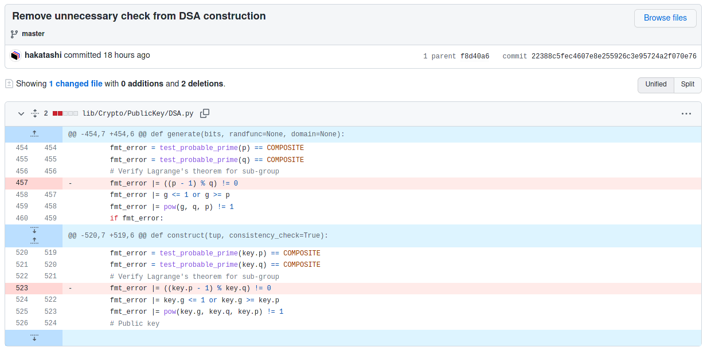

Fun crypto challenges :)

|Challenge|Tags|Solves|
|---|---|---|
|[Beginner's Crypto 2021](#beginners-crypto-2021)|`rsa` `funny`|126|
|[Minimalist's Private](#minimalists-private)|`rsa`|49|
|[This is DSA](#this-is-dsa)|`dsa` `implementation bug`|34|
|[Flag is Win](#flag-is-win)|`ecdsa` `bad nonce` `LLL`|10|
|[Baba is Flag](#baba-is-flag)|`ecdsa` `bad nonce` `LLL` `free`|9|


# Beginner's Crypto 2021 <a name="beginners-crypto-2021"></a>

> c1「うっす、よろしく。」
> 
> c2「がんばります、よろしく。」
> 
> c3「よっす、どうも。」

```py
from secret import e
from Crypto.Util.number import getStrongPrime, isPrime

p = getStrongPrime(1024)
q = getStrongPrime(1024)
N = p * q
phi = (p - 1) * (q - 1)

with open('flag.txt', 'rb') as f:
    flag = int.from_bytes(f.read(), 'big')

assert(isPrime(e))
assert(isPrime(e + 2))
assert(isPrime(e + 4))

e1 = pow(e, 0x10001, phi)
e2 = pow(e + 2, 0x10001, phi)
e3 = pow(e + 4, 0x10001, phi)

c1 = pow(flag, e1, N)
c2 = pow(flag, e2, N)
c3 = pow(flag, e3, N)

print(f'p = {p}')
print(f'q = {q}')
print(f'c1 = {c1}')
print(f'c2 = {c2}')
print(f'c3 = {c3}')
```

## Solution

[It turns out](https://math.stackexchange.com/questions/1653536/show-that-we-cannot-have-a-prime-triplet-of-the-form-p-p-2-p-4-for) that $p = 3$ is the only prime such that $p, p+2, p+4$ are all primes. So, we have $e = 3$. With this, we can easily compute $e_1$ and $e_2$ and we find that they are coprime. Since $\gcd(e_1, e_2) = 1$, there exists integers $k_1$ and $k_2$ such that $e_1 k_1 + e_2 k_2 = 1$. Therefore, we can recover the flag by computing

$$
\begin{aligned}
    c_1^{k_1} c_2^{k_2} &\equiv (m^{e_1})^{k_1} (m^{e_2})^{k_2} \pmod N \\
                        &\equiv m^{e_1 k_1 + e_2 k_2} \pmod N \\
                        &\equiv m \pmod N
\end{aligned}
$$

```py
from Crypto.Util.number import long_to_bytes

p = 167710954518007348037383082265231465648795974011761905177264545864288011527333715495850532989338171489309608848431113452814709692343039027970312735521415071265608660628968391884287240987858607818275329135585153511665148279408708087727501421558738163577629329044315775019460018956186674179846621352371150072281
q = 130354329753344570838569091064852072757046774566775609047544069941246798511317343102715733555464772099991834579660053860799207243561908291522943696711982657846373844514551117658179060004064010647453939332217996817580433587341521331941287365948919907797478197717562721233289937471168288241937022054501586986443
c1 = 2560344169447809042170685026483682125499025654554670516499742981486615082413150123244985585751880264831112089324011804397189638172356179296987581738515619297036118472798499254785110885662931526277474101787493114656242031264678448394380651657330967744585361662315313462698221954777506355498445242300193032704972074020068699180111637362566860530694807230108024167631423062629721393506643291591971626450262144814424411172618188943774725105690851574922374544865628890948773274109561622040022136970632948166009941425683576381155722191980954262373394704682297682490061906408535261437100820855976015526295573831744458528440
c2 = 9041231631916227099296501948589424780380702196870972231114747229225732542137483840187783630590878594711315671224997985975031038623195921968945234067183003568830416719957054703139219879265482072634572699299971785171441858501409377942183918216246312330291820452436486171483461790388518159980027140392750222843449604265528929311978655519463562520038992870162220913137870017065557254099767583925177889051326144499369420594398043223307161794788085369471538477803421726790780799629276012701406231535048423554314287152404245482928538931953627397633165453319078105028671410039195670727134471011040601278722143504641171853743
c3 = 3193069356811106774640161554961405075257002069448498144279061282023129342916422283816661697787316681475161942522570615456264481238277711114193792510286127129056376618422336477707825009085263623755329815306483253646072909132096678270667136193038337386976289222105363398033633185639402128949635525665502328717781718263894690234837016959581149138917064108193064639981137359869717065147934752707676203651598070046066514316196771853484143158367616177332902152347890310640338106015356361617700741042461419248117687350565094928451141103632305400493998164788411031832078388030194992306440474662871408938796429927990102583837

N = p*q
phi = (p-1)*(q-1)
e = 3

e1 = pow(e, 0x10001, phi)
e2 = pow(e+2, 0x10001, phi)
e3 = pow(e+4, 0x10001, phi)

k1 = pow(e1, -1, e2)
k2 = (1-k1*e1)//e2

assert k1*e1 + k2*e2 == 1

m = pow(c1, k1, N) * pow(c2, k2, N) % N
print(long_to_bytes(m))
```

Flag: `TSGCTF{You are intuitively understanding the distribution of prime numbers! Bonus: You can solve this challenge w/ N instead of p and q!}`


# Minimalist's Private <a name="minimalists-private"></a>

> The smaller is the better. I have removed all the unnecessary things in my private.

```py
from Crypto.Util.number import isPrime
from random import randrange
from secret import p, q, L, e, d

class RSA:
    def __init__(self, p, q, L, e, d):
        assert(isPrime(p) and isPrime(q))
        self.N = p * q
        self.L = L
        self.e = e
        self.d = d

        # these are the normal RSA conditions
        for _ in range(100):
            assert(pow(randrange(1, self.N), self.L, self.N) == 1)
        assert(self.e * self.d % self.L == 1)

        # minimal is the best
        assert(self.L * self.L <= 10000 * self.N)

    def gen_private_key(self):
        return (self.N, self.d)

    def gen_public_key(self):
        return (self.N, self.e)

    def encrypt(self, msg):
        return pow(msg, self.e, self.N)

    def decrypt(self, c):
        return pow(c, self.d, self.N)

flag = open('flag.txt', 'rb').read()
msg = int.from_bytes(flag, byteorder='big')
assert(msg < p * q)

rsa = RSA(p, q, L, e, d)
encrypted = rsa.encrypt(msg)
assert(rsa.decrypt(encrypted) == msg)

print(f'N, e = {rsa.gen_public_key()}')
print(f'c = {encrypted}')
```

## Solution

It is safe to assume, based on the assertions given in the code, that $L$ is given by $L = \lambda(N) = \mathrm{lcm}(p-1, q-1)$. The only thing of interest is the line:

```py
assert(self.L * self.L <= 10000 * self.N)
```

which tells us that $L \leq 100 \sqrt{N}$. Noting that $N$ is 1007 bits this assertion tells us that $L$ is less than 510 bits. Also noting that

$$
\mathrm{lcm}(p-1, q-1) = \frac{(p-1)(q-1)}{\gcd(p-1,q-1)}
$$

and that $(p-1)(q-1)$ is on the order of 1007 bits, we conclude that $\gcd(p-1, q-1)$ must be very large (around 500 bits). Therefore, we can write

$$
p = sa + 1 \qquad q = sb + 1
$$

where $s$ is the large gcd, and $a$ and $b$ are "small" (just a few bits). We can set up a quadratic equation in $s$, bruteforce $a$ and $b$, and recover the primes :)

$$
\begin{aligned}
    N &= pq \\
      &= (sa + 1)(sb + 1) \\
      &= abs^2 + (a+b)s + 1 \\
    \implies abs^2 + (a+b)s + 1 - N &= 0
\end{aligned}
$$

```py
from Crypto.Util.number import isPrime, long_to_bytes
from gmpy2 import iroot

N, e = (1108103848370322618250236235096737547381026108763302516499816051432801216813681568375319595638932562835292256776016949573972732881586209527824393027428125964599378845347154409633878436868422905300799413838645686430352484534761305185938956589612889463246508935994301443576781452904666072122465831585156151, 65537)
c = 254705401581808316199469430068831357413481187288921393400711004895837418302514065107811330660948313420965140464021505716810909691650540609799307500282957438243553742714371028405100267860418626513481187170770328765524251710154676478766892336610743824131087888798846367363259860051983889314134196889300426

def quadratic_solve(a,b,c):
    return (-b + iroot(b*b - 4*a*c, 2)[0])//(2*a)

for a in range(1, 2**15):
    for b in range(1, 2**15):
        s = quadratic_solve(a*b, a+b, 1 - N)
        p = s*a + 1
        q = s*b + 1
        if p*q == N and isPrime(p) and isPrime(q):
            print('p:', p)
            print('q:', q)
            phi = (p-1)*(q-1)
            d = pow(e, -1, phi)
            m = pow(c, d, N)
            print(long_to_bytes(m).decode())
            exit()
```

Flag: `TSGCTF{Roll_Safe:_You_c4n't_be_exploited_1f_you_are_a_minimali5t_enough_and_y0u_don't_have_any_s3crets_in_your_mind}`


# This is DSA <a name="this-is-dsa"></a>

> DSA is too hard for me. Could you help me build it?
>
> `nc 34.146.212.53 61234`

```py
# See also https://github.com/tsg-ut/pycryptodome
from Crypto.PublicKey import DSA
from Crypto.Signature import DSS
from Crypto.Hash import SHA256
from Crypto.Util.number import getPrime
from Crypto.Random.random import randrange
from base64 import b64decode
from signal import alarm
import os

alarm(15)

q = getPrime(256)
print(f'q = {q}')

p = int(input('p? '))
h = int(input('h? '))

g = pow(h, (p - 1) // q, p)
x = randrange(q)
y = pow(g, x, p)

print(f'g = {g}')
print(f'y = {y}')

dsa = DSA.construct((y, g, p, q, x))
dss = DSS.new(dsa, 'fips-186-3')

print('Thank you for helping me with DSA! Now give me the base64-encoded signature of sha256("flag")')
sign = b64decode(input('sign? '))

dss.verify(SHA256.new(b'flag'), sign)
print(f"Awesome! {os.environ.get('FLAG')}")
```

Diff from the commit added by the author [here](https://github.com/tsg-ut/pycryptodome/commit/22388c5fec4607e8e255926c3e95724a2f070e76) (for the purpose of this challenge):



## Solution

A random 256-bit prime $q$ is generated and from there we have regular DSA except we get to provide our own values for $p$ and $h$. The pycryptodome library by default performs some checks to prevent weak keys, but the server uses a patched version which omits an important check.

The check's purpose is to ensure that there exists an order $q$ subgroup of $(\mathbb{Z}/p\mathbb{Z})^\times$, and it does this via Langrange's theorem by ensuring $q$ divides $p-1$ (which is the order of $(\mathbb{Z}/p\mathbb{Z})^\times$).

However, there is another more dangerous bug in this library and it appears in the git diff above. At the time of this CTF, it was still a [bug in the pycryptodome library](https://github.com/Legrandin/pycryptodome/blob/87c1f985eebdab5c9053e468b7c7a2250142568b/lib/Crypto/PublicKey/DSA.py#L521). The bug is a missing `|`; on line 520, the primality check for `q` completely overwrites `fmt_error` instead of adding to it with `|=`. This makes the primality check for `p` useless, so we can in fact use a composite value for $p$, which we'll see how to exploit next.

The trick is to set $p = q^k$ with $k = 8$ and choose $h$ such that $g = 1 + q^{k-1} \pmod p$. This can be done by setting

$$
h = (1 + q^{k-1})^{s^{-1}} \pmod p
$$

where

$s = \lfloor \frac{p-1}{q} \rfloor$ and

$$
ss^{-1} \equiv 1 \quad \left ( \mathrm{mod} \  \frac{\varphi(p)}{g} \right )
$$

with $g = \gcd(\varphi(p), s)$ (which turns out to be $q-1$, noting that $\varphi(p) = q^{k-1}(q-1)$).

Note that we have $ss^{-1} = 1 + m \frac{\varphi(p)}{g}$ for some integer $m$.

This gives us the desired value of $g$ because:

$$
\begin{aligned}
    h^s &\equiv ((1 + q^{k-1})^{s^{-1}})^s \pmod p \\
        &\equiv (1+ q^{k-1})^{ss^{-1}} \pmod p \\
        &\equiv (1 + q^{k-1})^{1 + m\varphi(p)/g} \pmod p \\
        &\equiv (1+q^{k-1})(1+q^{k-1})^{m\varphi(p)/g} \pmod p \\
        &\equiv (1+q^{k-1})(1+q^{k-1})^{mq^{k-1}} \pmod p \\
        &\equiv 1+q^{k-1} \pmod p
\end{aligned}
$$

where the last line follows by looking at the binomial expansion of $(1 + q^{k-1})^{mq^{k-1}}$ and what happens to it after reduction modulo $p$.

Now, we have a $g$ that makes it easy to solve the discrete logarithm problem, in a similar style to the decryption algorithm in the [Paillier cryptosystem](https://en.wikipedia.org/wiki/Paillier_cryptosystem). Specifically, given $y = g^x \pmod p$, we can easily recover $x$ because:

$$
\begin{aligned}
    y &\equiv g^x \pmod p \\
      &\equiv (1+q^{k-1})^x \pmod p \\
      &\equiv 1 + xq^{k-1} + \binom{x}{2}(q^{k-1})^2 + \cdots \pmod p \\
      &\equiv 1 + xq^{k-1} \pmod p
\end{aligned}
$$

and so

$$
x = \left \lfloor \frac{y-1}{q^{k-1}} \right \rfloor
$$

```py
from pwn import *
from Crypto.PublicKey import DSA
from Crypto.Signature import DSS
from Crypto.Hash import SHA256
from base64 import b64encode
from math import gcd
from random import randint
from parse import parse

conn = remote('34.146.212.53', 61234)

q = parse('q = {:d}\n', conn.recvline().decode())[0]

k = 8
p = q**k
s = (p-1)//q
phi = q**(k-1)

assert gcd(phi, s) == 1

sinv = int(pow(s, -1, phi))
h = pow((1 + q**(k-1)), sinv, p)
print('h:', h)

g = pow(h, s, p)
print('g:', g)
assert g == 1 + q**(k-1)

print('p:', p, p.bit_length())
print('pow(g, q, p):', pow(g, q, p))

conn.sendlineafter('p? ', str(p))
conn.sendlineafter('h? ', str(h))

conn.recvline()
y = parse('y = {:d}\n', conn.recvline().decode())[0]
x = (y-1)//q**(k-1)

dsa = DSA.construct((y, g, p, q, x), consistency_check=False)
dss = DSS.new(dsa, 'fips-186-3')
sig = dss.sign(SHA256.new(b'flag'))
print('sig:', b64encode(sig))

conn.sendlineafter('sign? ', b64encode(sig))

print(conn.recvline().decode())
```

Flag: `TSGCTF{WOW_AMAZING_DSA_IS_TOTALLY_BROKEN}`


# Flag is Win <a name="flag-is-win"></a>

> BABA HAS FLAG. LEVEL IS HARD. YOU FACING LEVEL IS WEAK. YOU IS DEFEAT.
>
> `nc 34.146.212.53 35719`

```rb
require 'openssl'
require 'digest'

STDOUT.sync = true

class OpenSSL::PKey::EC::Point
  def xy
    n = to_bn(:uncompressed).to_i
    mask = (1 << group.degree) - 1
    return (n >> group.degree) & mask, n & mask
  end
  alias_method :+, :add
  alias_method :*, :mul
end

class ECDSA
  def initialize
    @curve = OpenSSL::PKey::EC::Group.new('secp256k1')
    @G = @curve.generator
    @n = @curve.order.to_i
    @d = OpenSSL::BN.rand(@curve.degree).to_i
    @Q = @G * @d
  end

  def inv(x)
    x.pow(@n - 2, @n)
  end

  def sign(msg)
    z = Digest::SHA256.hexdigest(msg).hex
    k = OpenSSL::BN.rand(@curve.degree / 3).to_s.unpack1('H*').hex
    x, y = (@G * k).xy

    # We should discourage every evil hacks
    s = (z + x * @d) * inv(k) % @n

    return x, s
  end

  def verify(msg, x, s)
    return false if x % @n == 0 || s % @n == 0
    z = Digest::SHA256.hexdigest(msg).hex

    # ditto
    x2, y2 = (@G * (z * inv(s)) + @Q * (x * inv(s))).xy

    return x == x2
  end
end

ecdsa = ECDSA.new

5.times do
  puts <<~EOS
    1. Sign
    2. Find rule
    3. Exit
  EOS

  print 'choice? '

  case gets.chomp
  when '1'
    x, s = ecdsa.sign('Baba')
    puts 'Baba is:'
    puts "x = #{x}"
    puts "s = #{s}"
  when '2'
    print 'Which rule do you want to know? '; msg = gets.chomp
    print 'x? '; x = gets.to_i
    print 's? '; s = gets.to_i

    if ecdsa.verify(msg, x, s)
      if msg == 'Baba'
        puts 'Baba is you'
      elsif msg == 'Flag'
        puts "Flag is #{ENV['FLAG']}"
      else
        puts 'Not Found :('
      end
    else
      puts 'Invalid :('
    end
  else
    exit
  end
end

puts 'You is defeat.'
```

## Solution

Upon first glance, the only thing that stands out as suspicious is the nonce generation:

```rb
    k = OpenSSL::BN.rand(@curve.degree / 3).to_s.unpack1('H*').hex
```

This generates a random `256/3 ~ 85` bit number, converts it to a string, writes each decimal digit as its ascii value in hex, and then takes that hex string and converts it to an integer to get `k`:

```rb
irb(main):003:0> OpenSSL::BN.rand(@curve.degree / 3)
=> #<OpenSSL::BN 25838945413577086799762524>
irb(main):004:0> _.to_s
=> "25838945413577086799762524"
irb(main):005:0> _.unpack1('H*')
=> "3235383338393435343133353737303836373939373632353234"
irb(main):006:0> _.hex
=> 80680966626794851324129071387509616930727795905366194323272244
```

It turns out that this resulting number is pretty much always 206 bits.

The key thing to note is that the decimal digits `0-9` have ascii values `0x30-0x39`. Therefore, with this nonce generation method, we know half of the bits; we know that the first 4 bits of every byte will be `0b0011 = 48` (since `0x30 = 0b00110000`). Therefore, we can write the nonce as follows:

$$
k = \sum_{i=0}^{25} (48 + r_i) 2^{8i}
$$

where $|r_i| < 10$ are the 4 unknown bits of each byte (but we know it's a decimal digit, so it's always less than 10).

Obviously, partial knowledge means it's time to think about lattices. Looking at the ECDSA equation, we have:

$$
\begin{aligned}
    s_i &= k_i^{-1} (z_i + x_i d) \\
    \implies s_i k_i &= z_i + x_i d \\
    \implies s_i \left (\sum_{i=0}^{25} (48 + r_{i,j})2^{8i} \right ) &= z_i + d
\end{aligned}
$$

We have access to up to 4 signatures before we need to send our forgery of the "Flag" message, but it turns out we'll only need to use two signatures.

Using two equations of the above form, we can eliminate the private key variable $d$ to obtain one equation in the 52 unknowns $r_{i, j}$ for $i \in {1, 2}$ and $0 \leq j < 26$. I won't write the equation because I didn't bother to compute it by hand, we can relax and let resultants do the work for us. All we need to care about is that we have an equation of the form

$$
c_0 r_{1, 0} + c_1 r_{1, 1} + \cdots + c_{25} r_{1, 25} + c_{26} r_{2, 0} + \cdots + c_{51} r_{2, 25} = 0
$$

where the $r_{i,j}$ are small.

This is exactly the setting for the modular knapsack problem and the lattice construction for solving it is very well known:

$$
\begin{bmatrix}
    c_0 & 1 & 0 & \cdots & & 0 \\
    c_1 & 0 & 1 & & & \\
    \vdots & & & \ddots & \\
    c_{51} & 0 & \cdots & & 1 \\
    n & 0 & \cdots & & & 0
\end{bmatrix}
$$

```py
from pwn import *
from Crypto.Util.number import bytes_to_long
from hashlib import sha256
from tqdm import tqdm
from parse import parse

from sage.matrix.matrix2 import Matrix
def resultant(f1, f2, var):
    return Matrix.determinant(f1.sylvester_matrix(f2, var))

p = 0xfffffffffffffffffffffffffffffffffffffffffffffffffffffffefffffc2f
a = 0
b = 7
G = (0x79be667ef9dcbbac55a06295ce870b07029bfcdb2dce28d959f2815b16f81798, 0x483ada7726a3c4655da4fbfc0e1108a8fd17b448a68554199c47d08ffb10d4b8)
n = 0xfffffffffffffffffffffffffffffffebaaedce6af48a03bbfd25e8cd0364141

E = EllipticCurve(GF(p), [a, b])
G = E(G)

def get_sig():
    conn.sendlineafter('choice? ', '1')
    conn.recvline()
    x = list(parse('x = {:d}\n', conn.recvline().decode()))[0]
    s = list(parse('s = {:d}\n', conn.recvline().decode()))[0]
    return int(x), int(s) 

def recover_d(x1, s1, x2, s2):
    l = 26
    ln = 2
    P = PolynomialRing(Zmod(n), [f'r{j}{i}' for j in range(ln) for i in range(l)] + ['d'])
    R, d = P.gens()[:l*ln], P.gens()[-1]
    k1 = sum(48*2^(8*i) for i in range(l)) + sum(R[i]*2^(8*i) for i in range(l))
    k2 = sum(48*2^(8*i) for i in range(l)) + sum(R[i+l]*2^(8*i) for i in range(l))
    f1 = s1*k1 - z - x1*d
    f2 = s2*k2 - z - x2*d
    f = resultant(f1, f2, d)
    M = matrix.column(ZZ, vector([int(c) for c,_ in f]))
    M = M.augment(matrix.identity(l*ln+1))
    M = M.stack(vector([n] + [0]*(l*ln+1)))
    M = M.dense_matrix()
    M = M.BKZ()
    r_subs = {R[i]: abs(M[0][i+1]) for i in range(l*ln)}
    k1 = k1.subs(r_subs)
    k2 = k2.subs(r_subs)

    print(hex(k1))
    print(hex(k2))

    d = (s1 * k1 - z) * inverse_mod(x1, n) % n
    return d

conn = remote('34.146.212.53', 35719)

z = bytes_to_long(sha256(b'Baba').digest())
x1, s1 = get_sig()
x2, s2 = get_sig()

d = recover_d(x1, s1, x2, s2)

print('recovered d:', d)

my_z = bytes_to_long(sha256(b'Flag').digest())
k = 1337
x, _ = (k*G).xy()
s = inverse_mod(k, n) * (my_z + int(x) * d) % n

conn.sendlineafter('choice? ', '2')
conn.sendlineafter('know? ', 'Flag')
conn.sendlineafter('x? ', str(x))
conn.sendlineafter('s? ', str(s))
print(conn.recvline().decode())
```

Flag: `TSGCTF{CRYPTO_IS_LOCK._KEY_IS_OPEN._CTF_IS_FUN!}`

# Baba is Flag <a name="baba-is-flag"></a>

Since this is an easier version of the Flag is You challenge, the solution for Flag is You works for Baba is Flag with just a few small changes :)

```diff
❯ diff baba-is-flag.sage flag-is-win.sage
46,47c46,47
<     f1 = s1*k1 - z - d
<     f2 = s2*k2 - z - d
---
>     f1 = s1*k1 - z - x1*d
>     f2 = s2*k2 - z - x2*d
61c61
<     d = (s1 * k1 - z) % n
---
>     d = (s1 * k1 - z) * inverse_mod(x1, n) % n
65c65
< conn = remote('34.146.212.53', 65434)
---
> conn = remote('34.146.212.53', 35719)
78c78
< s = inverse_mod(k, n) * (my_z + d) % n
---
> s = inverse_mod(k, n) * (my_z + int(x) * d) % n
```

Flag: `TSGCTF{HACKER_IS_YOU._POINT_IS_MOVE._POINT_ON_CURVE_IS_HACKED._YOU_IS_WIN.}`
