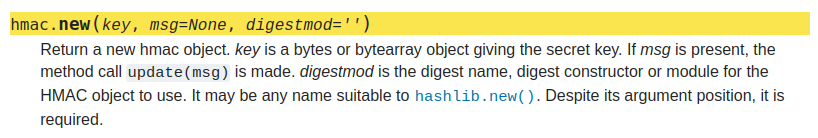
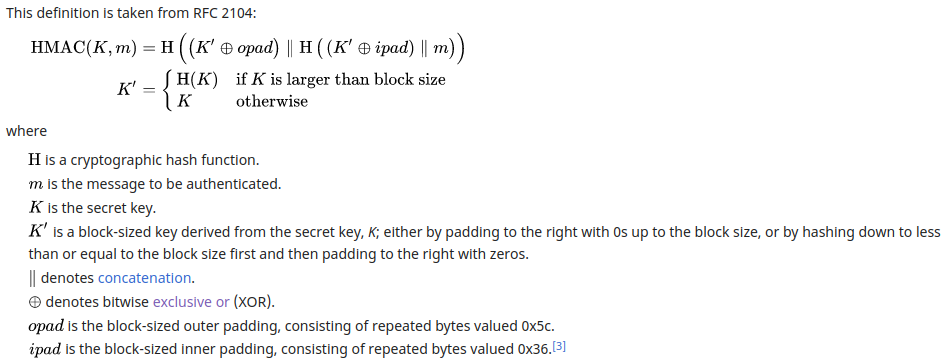
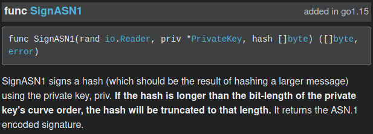
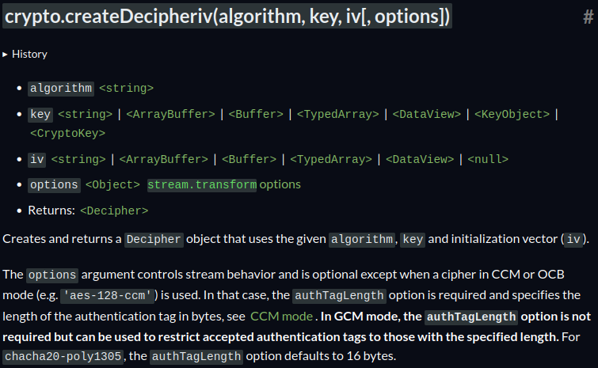

This was a fun crypto challenge from justCTF 2023 which involved subtle implementation bugs in the usage of crypto libraries in Python, Golang and NodeJS. I worked on this with a teammate and we got first blood :)

# Multi Auth

> Every crypto code may have bugs, so we have made a multi-authentication system diversifying across algorithms and languages.
>
> `nc multiauth.nc.jctf.pro 1337`
>
> Author: gros

`main.rs`:

```rust
extern crate core;

use tokio::io::{BufReader, AsyncBufReadExt, Lines};
use tokio::process::{Command, Child, ChildStdout, ChildStdin};
use tokio::io::AsyncWriteExt;
use std::process::Stdio;
use std::io::{self, BufRead, ErrorKind};
use serde::{Deserialize, Serialize};
use serde_with::base64::{Base64};
use serde_with::serde_as;
use std::io::{Error, Write};
use std::fs;


struct Authenticator {
    process: Child,
    stdin: ChildStdin,
    reader: Lines<BufReader<ChildStdout>>
}

impl Authenticator {
    async fn call(&mut self, rpc: &RPC) -> Result<Vec<u8>, Error> {
        self.stdin.write((serde_json::to_string(&rpc).unwrap() + "\n").as_ref()).await?;
        let resp_str = self.reader.next_line().await?.unwrap();

        let resp: RPCResp = serde_json::from_str(resp_str.as_str())?;
        if resp.success == false {
            return Err(Error::new(ErrorKind::Other, "unsuccessful"));
        }
        match resp.signature {
            Some(p) => Ok(p),
            None => Err(Error::new(ErrorKind::Other, "empty signature"))
        }
    }
}

async fn make_child(cmd: &str, args: &[&str], expected_hello: &str) -> Authenticator {
    let mut cmd = Command::new(cmd);
    cmd.stdout(Stdio::piped());
    cmd.stdin(Stdio::piped());

    let mut cmd_process = cmd.args(args).spawn().expect("failed to spawn command");
    let cmd_process_stdout = cmd_process.stdout.take().expect("child did not have a handle to stdout");
    let cmd_process_stdin = cmd_process.stdin.take().expect("child did not have a handle to stdin");

    let mut cmd_process_reader = BufReader::new(cmd_process_stdout).lines();
    let hello = cmd_process_reader.next_line().await.unwrap().unwrap();
    assert_eq!(hello, expected_hello);

    return Authenticator{process: cmd_process, stdin: cmd_process_stdin, reader: cmd_process_reader}
}

#[serde_as]
#[derive(Serialize, Deserialize)]
struct RPC {
    method: String,
    #[serde_as(as = "Base64")]
    message: Vec<u8>,
    signatures: Option<RPCSignature>,
}

#[serde_as]
#[derive(Serialize, Deserialize, Default)]
struct RPCSignature {
    #[serde_as(as = "Base64")]
    ecdsa: Vec<u8>,
    #[serde_as(as = "Base64")]
    hmac: Vec<u8>,
    #[serde_as(as = "Base64")]
    aes: Vec<u8>,
}

#[serde_as]
#[derive(Serialize, Deserialize)]
struct RPCResp {
    success: bool,
    #[serde_as(as = "Option<Base64>")]
    signature: Option<Vec<u8>>,
}

const FORBIDDEN: &str = "We the people, in order to get points, are kindly asking for flag";
const MAX_LEN: usize = 1337;
const POLYNOMIAL_BOUND: u16 = 512;
const NOPE: &str = "nope";
const OK: &str = "ok";

#[tokio::main]
async fn main() -> Result<(), Box<dyn std::error::Error>> {
    println!("Multi authenticator started");
    let cwd = "/jailed";
    let mut hmac_auth = make_child("python3", &[[cwd, "index.py"].join("/").as_str()], "HMAC authenticator started").await;
    let mut ecdsa_auth = make_child([cwd, "indexgo"].join("/").as_str(), &[], "ECDSA authenticator started").await;
    let mut aes_auth = make_child("node", &[[cwd, "index.js"].join("/").as_str()], "AES authenticator started").await;
    let flag = fs::read_to_string([cwd, "flag"].join("/").as_str()).expect("Can read flag");

    let mut counter: u16 = 0;
    let stdin = io::stdin();
    for line in stdin.lock().lines() {
        if counter >= POLYNOMIAL_BOUND {
            break;
        }
        counter += 1;

        let input = line.unwrap();
        let mut rpc: RPC = match serde_json::from_str(input.as_str()) {
            Ok(x) => x,
            Err(_) => {
                println!("{}", NOPE);
                continue
            }
        };

        if rpc.message.len() > MAX_LEN {
            println!("{}", NOPE);
            continue;
        }

        let mut is_forbidden = false;
        if rpc.message == FORBIDDEN.as_bytes() {
            is_forbidden = true;
        }

        if rpc.method == "backdoor" {
            rpc.method = "auth".to_string();
            let aes_signature = aes_auth.call(&rpc).await?;
            io::stdout().write(&aes_signature[..15])?;
            io::stdout().flush()?;

        } else if rpc.method == "auth" {
            if !rpc.signatures.is_none() {
                println!("{}", NOPE);
                continue;
            }

            if is_forbidden {
                println!("{}", NOPE);
                continue;
            }

            let mut signature: RPCSignature = RPCSignature {..Default::default()};

            let hmac_signature = hmac_auth.call(&rpc).await?;
            rpc.message.append(&mut hmac_signature.to_vec());
            signature.hmac = hmac_signature;

            let ecdsa_signature = ecdsa_auth.call(&rpc).await?;
            rpc.message.append(&mut ecdsa_signature.to_vec());
            signature.ecdsa = ecdsa_signature;

            let aes_signature = aes_auth.call(&rpc).await?;
            signature.aes = aes_signature;

            println!("{}", serde_json::to_string(&signature).unwrap());

        } else {
            rpc.method = "verify".to_string();
            let sigs = match &rpc.signatures {
                Some(sigs) => {
                    if sigs.ecdsa.len() == 0 || sigs.hmac.len() == 0 || sigs.aes.len() == 0 {
                        println!("{}", NOPE);
                        continue;
                    }
                    sigs
                }
                None => {
                    println!("{}", NOPE);
                    continue;
                }
            };

            let msg_copy = rpc.message;

            rpc.message = msg_copy.to_vec();
            rpc.message.append(&mut sigs.hmac.to_vec());
            rpc.message.append(&mut sigs.ecdsa.to_vec());
            if let Err(_) = aes_auth.call(&rpc).await {
                println!("{}", NOPE);
                continue;
            }

            rpc.message = msg_copy.to_vec();
            rpc.message.append(&mut sigs.hmac.to_vec());
            if let Err(_) = ecdsa_auth.call(&rpc).await {
                println!("{}", NOPE);
                continue;
            }

            rpc.message = msg_copy.to_vec();
            if let Err(_) = hmac_auth.call(&rpc).await {
                println!("{}", NOPE);
                continue;
            }

            if is_forbidden {
                println!("{}", flag);
                break;
            } else {
                println!("{}", OK);
            }
        }
    }

    drop(hmac_auth.stdin);
    drop(ecdsa_auth.stdin);
    drop(aes_auth.stdin);

    hmac_auth.process.wait().await?;
    ecdsa_auth.process.wait().await?;
    aes_auth.process.wait().await?;

    Ok(())
}
```

`index.py`:

```py
#!/usr/bin/env python
# -*- coding: utf-8 -*-

import sys
import os
import json
import hmac
from hashlib import sha256
from base64 import b64decode, b64encode
import binascii


FAILURE = {"success": False, "signature": ""}


def verify(key, msg, sig):
    return hmac.compare_digest(sig, auth(key, msg))


def auth(key, msg):
    return hmac.new(msg, key, sha256).digest()


def main():
    print("HMAC authenticator started", flush=True)

    key = os.urandom(32)
    for line in sys.stdin:
        try:
            rpc = json.loads(line)
            if not isinstance(rpc, dict) or "message" not in rpc or len(rpc["message"]) == 0:
                print(FAILURE, flush=True)
                continue

            msg = b64decode(rpc["message"])
            retval = None

            if rpc.get("method", "") == "auth":    
                signature = auth(key, msg)
                retval = {"success": True, "signature": b64encode(signature).decode()}

            else:
                sig = rpc.get("signatures", {}).get("hmac")
                if sig is None or len(sig) == 0:
                    print(FAILURE, flush=True)
                    continue
                retval = {"success": verify(key, msg, b64decode(sig)), "signature": ""}

            print(json.dumps(retval), flush=True)

        except Exception as e:
            print(FAILURE, flush=True)


if __name__ == "__main__":
    main()
```

`index.go`:

```go
package main

import (
    "bufio"
    "crypto/ecdsa"
    "crypto/elliptic"
    "crypto/rand"
    "encoding/json"
    "fmt"
    "io"
    "os"
)

type RPC struct {
    Method     string        `json:"method"`
    Message    []byte        `json:"message"`
    Signatures *RPCSignature `json:"signatures"`
}

type RPCSignature struct {
    Ecdsa []byte `json:"ecdsa"`
}

type RPCResp struct {
    Success   bool   `json:"success"`
    Signature []byte `json:"signature"`
}

const failure = `{"success": false, "signature": ""}`

func (r *RPC) Execute(privateKey *ecdsa.PrivateKey) []byte {
    if r.Method == "auth" {
        if signature, err := ecdsa.SignASN1(rand.Reader, privateKey, r.Message); err == nil {
            if resp, err := json.Marshal(RPCResp{
                Success:   true,
                Signature: signature,
            }); err == nil {
                return resp
            }
        }
    } else if r.Signatures != nil && len(r.Signatures.Ecdsa) > 0 {
        if ecdsa.VerifyASN1(&privateKey.PublicKey, r.Message, r.Signatures.Ecdsa) {
            if resp, err := json.Marshal(RPCResp{
                Success:   true,
                Signature: []byte(""),
            }); err == nil {
                return resp
            }
        }
    }
    return []byte(failure)
}

func main() {
    fmt.Println("ECDSA authenticator started")

    privateKey, err := ecdsa.GenerateKey(elliptic.P521(), rand.Reader)
    if err != nil {
        panic(err)
    }

    rdr := bufio.NewReader(os.Stdin)
    for {
        switch line, err := rdr.ReadString('\n'); err {
        case nil:
            var rpc RPC
            if err := json.Unmarshal([]byte(line), &rpc); err != nil {
                fmt.Println(failure)
                continue
            }
            if len(rpc.Message) == 0 {
                fmt.Println(failure)
                continue
            }

            fmt.Println(string(rpc.Execute(privateKey)))

        case io.EOF:
            os.Exit(0)
        default:
            os.Exit(1)
        }
    }
}
```

`index.js`:

```js
const crypto = require('crypto');
const readline = require('readline');


function auth(key, msg) {
    msg = Buffer.from(msg, 'base64');
    const nonce = crypto.randomBytes(12);

    const cipher = crypto.createCipheriv('aes-256-gcm', key, nonce);
    cipher.setAAD(msg);
    cipher.final();
    let tag = cipher.getAuthTag();
    return JSON.stringify({"success": true, "signature": Buffer.concat([nonce, tag]).toString('base64')});
}

function verify(key, msg, sig) {
    msg = Buffer.from(msg, 'base64');
    let ivtag = Buffer.from(sig, 'base64');
    let nonce = ivtag.slice(0, 12);
    let tag = ivtag.slice(12);

    const decipher = crypto.createDecipheriv('aes-256-gcm', key, nonce);
    decipher.setAAD(msg)
    decipher.setAuthTag(tag);
    decipher.final();
    return JSON.stringify({"success": true, "signature": ""});
}

function main() {
    console.log("AES authenticator started");

    const key = crypto.generateKeySync('aes', { length: 256 });
    const failure = JSON.stringify({"success": false, "signature": ""})
    const rl = readline.createInterface({
        input: process.stdin, 
        output: process.stdout,
    })

    rl.on('line', (line) => {
        try {
            let rpc = JSON.parse(line);
            if (rpc['message'] === undefined || rpc['message'].length === 0) {
                console.log(failure);
                return;
            }

            if (rpc['method'] === 'auth') {
                console.log(auth(key, rpc['message']));

            } else {
                if (rpc['signatures'] === undefined || rpc['signatures']['aes'] === undefined) {
                    console.log(failure);
                    return;
                }

                console.log(verify(key, rpc['message'], rpc['signatures']['aes']))
            }
        } catch {
            console.log(failure)
        }
    });
}

main();
```

# Solution

The challenge involves a Rust program (`main.rs`) which runs on the server. This program shells out to three other programs written in Python, Golang and NodeJS. Together, they implement some kind of auth system which you can interact with using the `"backdoor"`, `"auth"` and `"verify"` RPC methods. To get the flag, we must find bugs in each component of the auth system and forge valid signatures for a target message `FORBIDDEN`. The `"auth"` method allows us to get signatures for an arbitrary message other than the target message, and the `"verify"` method checks if the signatures are valid for a given message, and if the message is the target, gives us the flag. The `"backdoor"` method gives an oracle related to one of the authenticators (we'll get to this later).

The three different authenticators use crypto functions found in their standard libraries:

1. Python - `hmac`
2. Golang - `crypto/ecdsa` (`ecdsa.SignASN1`/`ecdsa.verifyASN1`)
3. NodeJS - `crypto` module with `aes-256-gcm` cipher

In the `"auth"` and `"verify"` method handlers, we can see that the AES authenticator depends on the ECDSA authenticator which depends on the HMAC authenticator. The message signed/verified by the HMAC authenticator is the raw message provided by us, the message signed/verified by the ECDSA authenticator is the raw message with the HMAC signature appended, and the message signed/verified by the AES authenticator is the raw message with both the HMAC and ECDSA signatures appended:

```rust
} else if rpc.method == "auth" {
    if !rpc.signatures.is_none() {
        println!("{}", NOPE);
        continue;
    }

    if is_forbidden {
        println!("{}", NOPE);
        continue;
    }

    let mut signature: RPCSignature = RPCSignature {..Default::default()};

    let hmac_signature = hmac_auth.call(&rpc).await?;
    rpc.message.append(&mut hmac_signature.to_vec()); // hmac signature appended
    signature.hmac = hmac_signature;

    let ecdsa_signature = ecdsa_auth.call(&rpc).await?;
    rpc.message.append(&mut ecdsa_signature.to_vec()); // ecdsa signature appended
    signature.ecdsa = ecdsa_signature;

    let aes_signature = aes_auth.call(&rpc).await?;
    signature.aes = aes_signature;

    println!("{}", serde_json::to_string(&signature).unwrap());
```

Each component has a bug in the way the library is used which allows for forgery of the target message with the oracles given to us. Let's take a look at them one by one.

## Python HMAC Authenticator

The bug in this component is subtle, it lies within the `auth` function which is only a single line!

```py
def auth(key, msg):
    return hmac.new(msg, key, sha256).digest()
```

Looking at the [documentation for `hmac.new`](https://docs.python.org/3/library/hmac.html#hmac.new) the bug becomes apparent:



The order of the `msg` and `key` arguments are swapped.

From the [definition of HMAC on Wikipedia](https://en.wikipedia.org/wiki/HMAC#Definition), we understand that if the key is larger than the block size of the hash function (in this case 64 bytes for SHA256), then the actual key used to generate the HMAC is the hash of the key:



What this means is we can simply ask the `"auth"` oracle for the HMAC of the message `SHA256(FORBIDDEN)` and this will be a valid HMAC for the message `FORBIDDEN`:

```py
import hmac, os
from hashlib import sha256

key = os.urandom(32)
FORBIDDEN = b'We the people, in order to get points, are kindly asking for flag'
h1 = hmac.new(FORBIDDEN, key, sha256).digest()
h2 = hmac.new(sha256(FORBIDDEN).digest(), key, sha256).digest()
print(h1 == h2) # True
```

## Golang ECDSA Authenticator

The bug in this component can be found by reading the [documentation](https://pkg.go.dev/crypto/ecdsa#SignASN1)/[source code](https://cs.opensource.google/go/go/+/refs/tags/go1.20.4:src/crypto/ecdsa/ecdsa.go;l=248) for the `ecdsa.SignASN1` function. The important part is the note about truncation of the `hash` argument (emphasis added):



So the `SignASN1` expects the third `hash` argument to have already been hashed by the user, but in the authenticator it uses the raw message we provide which can be of any length. The hash byte array is converted to a natural number smaller than the curve order by the [`hashToNat`](https://cs.opensource.google/go/go/+/refs/tags/go1.20.4:src/crypto/ecdsa/ecdsa.go;l=378) function. All this function does is truncate the bits/bytes of the `hash` so that it is less than the size of the curve order. The curve order is 521 bits, so anything beyond the 521st bit is ignored.

What this means is we can simply ask the `"auth"` oracle for the ECDSA signature of the message `FORBIDDEN + X` where `X` is any non-empty prefix of `HMAC(FORBIDDEN)`, and this will be a valid ECDSA signature for the message `FORBIDDEN + HMAC(FORBIDDEN)`:

```go
package main

import (
    "crypto/ecdsa"
    "crypto/elliptic"
    "crypto/rand"
    "fmt"
)

func main() {
    privateKey, err := ecdsa.GenerateKey(elliptic.P521(), rand.Reader)
    if err != nil {
        panic(err)
    }

    var msg = []byte("We the people, in order to get points, are kindly asking for flagXXX")
    signature, err := ecdsa.SignASN1(rand.Reader, privateKey, msg);
    if err != nil {
        panic(err)
    }
    var msg2 = []byte("We the people, in order to get points, are kindly asking for flagXYY")
    if ecdsa.VerifyASN1(&privateKey.PublicKey, msg2, signature) {
        fmt.Println("success!")
    }
}

# success!
```

## NodeJS AES Authenticator

The last step is the AES authenticator. Fortunately, we have a `"backdoor"` which gives us the first 15 bytes of output from a call to the authenticator with any input message. Since the first 12 bytes are for the nonce, this means we get the first 3 bytes of the 12 byte authentication tag. Reading the [documentation](https://nodejs.org/api/crypto.html#cryptocreatedecipherivalgorithm-key-iv-options) and [source](https://github.com/nodejs/node/blob/4bb06dbd0a87e5b2430780ddceec08015f8c496a/src/crypto/crypto_cipher.cc) for the used functions again helps to point out the bug in its usage (emphasis added):



Looking through the [source code](https://github.com/nodejs/node/blob/4bb06dbd0a87e5b2430780ddceec08015f8c496a/src/crypto/crypto_cipher.cc#L49-L51), we see that if the `authTagLength` option is not explicitly specified, then any valid auth tag length will work:

```js
bool IsValidGCMTagLength(unsigned int tag_len) {
  return tag_len == 4 || tag_len == 8 || (tag_len >= 12 && tag_len <= 16);
}
```

A tag length of 4 is valid, and we can get the first 3 bytes of the actual tag. So we can just bruteforce the last byte to get a valid tag.

```js
const crypto = require('crypto');

const key = Buffer.from([1,1,1,1,1,1,1,1,1,1,1,1,1,1,1,1,1,1,1,1,1,1,1,1,1,1,1,1,1,1,1,1])
const msg = Buffer.from([0,0,0,0,0,0,0,0,0,0,0,0,0,0,0,0])
const nonce = Buffer.from([1,1,1,1,1,1,1,1,1,1,1,1])

const cipher = crypto.createCipheriv('aes-256-gcm', key, nonce);
cipher.setAAD(msg);
cipher.final();
let tag = cipher.getAuthTag();

const decipher = crypto.createDecipheriv('aes-256-gcm', key, nonce)
decipher.setAAD(msg)
decipher.setAuthTag(tag.slice(0, 4))
decipher.final() // no error
```

# Solve Script

```py
from pwn import *
from hashlib import sha256
from base64 import b64encode, b64decode
import json, hmac

def rpc_auth(message):
    rpc = {'method': 'auth', 'message': b64encode(message).decode()}
    conn.sendline(json.dumps(rpc).encode())
    return json.loads(conn.recvline().decode())

def rpc_verify(message, signatures):
    rpc = {'method': 'verify', 'message': b64encode(message).decode(), 'signatures': signatures}
    conn.sendline(json.dumps(rpc).encode())
    return conn.recvline().decode()

def rpc_backdoor(message):
    rpc = {'method': 'backdoor', 'message': b64encode(message).decode()}
    conn.sendline(json.dumps(rpc).encode())
    return conn.recv(15)

FORBIDDEN = b'We the people, in order to get points, are kindly asking for flag'

conn = remote('multiauth.nc.jctf.pro', 1337)
print(conn.recvline().decode())

# solve hmac by just asking for auth of H(FORBIDDEN)
hmac_auth = rpc_auth(sha256(FORBIDDEN).digest())

# solve ecdsa with len >65 message suffixed with the hmac
ecdsa_auth = rpc_auth(FORBIDDEN + b64decode(hmac_auth['hmac'])[:1])

# solve aes with tag length of 4 and bruteforce last byte of tag
A = FORBIDDEN + b64decode(hmac_auth['hmac']) + b64decode(ecdsa_auth['ecdsa'])
aes_auth_base = rpc_backdoor(A)
for b in range(256):
    aes_auth = aes_auth_base + bytes([b])
    sigs = {'ecdsa': ecdsa_auth['ecdsa'], 'hmac': hmac_auth['hmac'], 'aes': b64encode(aes_auth).decode()}
    print(b, rpc_verify(FORBIDDEN, sigs))

# justCTF{br34k1ngAP1sLikeAPr0}
```
