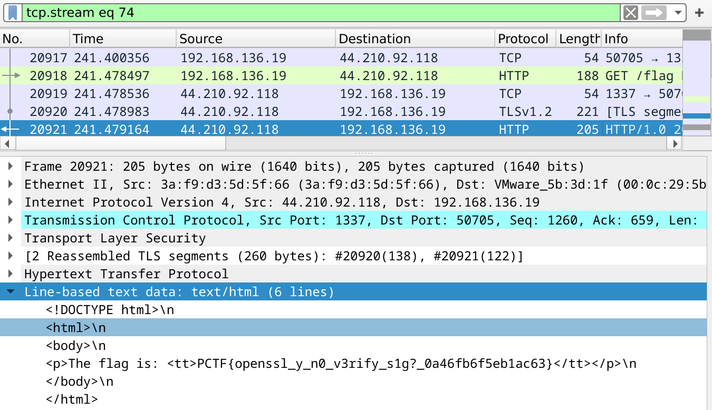

This is a writeup of Tales from the Crypt from Plaid CTF 2025. I solved it
alongside a few team mates from Blue Water, and we were the first of three
solvers of the challenge. We also won the CTF :) Thanks to PPP for hosting!

In my timezone(s), the CTF ran from Saturday 8AM until Monday 7AM. I started
looking at this challenge at around noon on Saturday and continued to work in
it (of course with breaks to eat and sleep as you should) until we got the flag
at around 2PM on the Sunday. It was a fairly involved challenge and _probably_
should have been tagged with "misc" as well as crypto. Notably, the challenge
did involve reading openssl source code, knowing some facts about TLS and using
Wireshark, but I think this is fair scope for a crypto challenge (after all,
openssl and TLS are probably the most ubiquitous crypto-like things in the real
world). Ultimately, it tasked players with exploiting a cryptographic
vulnerability - one that was "inserted" into the challenge and appeared as a
fairly trivially exploitable issue on its own - in a somewhat realistic setup
which with came details that ended up making exploitation not as trivial as it
may have seemed from a first glance.

This writeup will be more expository than detailing the exact implementation of
our solution. An overview of the challenge is included so you can still read
and understand everything without leaving the page. Assuming you played the
challenge or already know the setup, feel free to skip straight to the
[Solution](#solution).

# Challenge Overview

> Legends tell of an ancient cowpoke who once stole a secret and locked it up tight. Pry the secret from the spirit's grasp and set him free. Hint: The author solution takes approximately one hour on a laptop.
>
>
> Posted by Sheriff b2xiao
>
> With Deputy tjbecker

```Dockerfile
FROM ubuntu@sha256:aa772c98400ef833586d1d517d3e8de670f7e712bf581ce6053165081773259d

ENV DEBIAN_FRONTEND=noninteractive
RUN apt-get update && apt-get install -yq python3 python3-pip openssl && rm -rf /var/lib/apt/lists/*

# This next line creates a key, only for local testing
RUN openssl req -x509 -newkey rsa:2048 -keyout key.pem -out cert.pem -sha256 -days 3650 -nodes -subj "/C=US/ST=PA/L=Ashwood Hollow/CN=tales-from-the-crypt.chal.pwni.ng"

COPY ./requirements.txt /
RUN pip3 install -r requirements.txt

COPY ./server.py /
COPY ./util.py /
COPY ./key.pem /
COPY ./cert.pem /

EXPOSE 1337

CMD ["python3", "server.py"]
```

```py
# server.py

import time
from http.server import BaseHTTPRequestHandler, ThreadingHTTPServer

from util import make_ssl_connection


class MyHTTPSRequestHandler(BaseHTTPRequestHandler):
    def setup(self):
        self.request = make_ssl_connection(self.request)
        return super().setup()

    def do_GET(self):
        match self.path:
            case "/":
                status = 200
                content = """
<p>I think my server is haunted.</p>
<p><a href="/flag">Get flag</a></p>
<p><a href="/time">Get current server time</a></p>
"""
            case "/flag":
                status = 404
                content = """
<p>👻👻👻 My flag seems to have been stolen by ghosts...! 👻👻👻</p>
"""
            case "/time":
                status = 200
                content = f"""
<p>Current time: {time.ctime()}</p>
"""
            case _:
                status = 404
                content = """
<h1>404 Not Found</h1>
"""

        raw_content = f"""<!DOCTYPE html>
<html>
<body>{content}</body>
</html>""".encode(
            "utf-8"
        )
        self.send_response(status)
        self.send_header("Content-Type", "text/html; charset=utf8")
        self.send_header("Content-Length", str(len(raw_content)))
        self.end_headers()
        self.wfile.write(raw_content)


httpd = ThreadingHTTPServer(("", 1337), MyHTTPSRequestHandler)
httpd.serve_forever()
```

```py
# util.py

from socket import socket
from secrets import randbits
from select import select

from Crypto.PublicKey import RSA
from OpenSSL import SSL, crypto

# generated with `openssl req -x509 -newkey rsa:2048 -keyout key.pem -out cert.pem -sha256 -days 3650 -nodes`
key = RSA.import_key(open("key.pem", "rb").read())
p = [key.n, key.e, key.d, key.p, key.q, key.u]


def ctx_with_key(certpath: str, keyp: list[int]) -> SSL.Context:
    ctx = SSL.Context(SSL.SSLv23_METHOD)
    ctx.set_options(1<<8)
    ctx.use_certificate_file(certpath)
    key = RSA.construct(keyp, 0).exportKey(pkcs=8)
    ctx.use_privatekey(crypto.load_privatekey(crypto.FILETYPE_PEM, key))
    return ctx

default_ctx = ctx_with_key("cert.pem", p)

def get_ctx(sock) -> SSL.Context:
    if select([sock], [sock], [sock], 0.2)[-1]:
        [k] = sock.recv(1, 1)
        return ctx_with_key("cert.pem", [*p[:2], p[2] ^ (randbits(3) << 3 * k), *p[3:]])
    return default_ctx


def make_ssl_connection(sock: socket) -> SSL.Connection:
    conn = SSL.Connection(get_ctx(sock), sock)
    conn.set_accept_state()
    return conn


SSL.Connection.makefile = socket.makefile
```

We are given the above files, along with a `capture.pcap` file and a live
server to interact with. The server is a HTTPS server which has a `/flag` and a
`/time` endpoint, although the `/flag` endpoint doesn't actually give anything
that resembles a flag. Going based on the description of the challenge, the
`/flag` endpoint maybe previously did give the flag, but doesn't anymore. This
is likely where the packet capture file comes in - it could contain a capture
of a HTTP request to `/flag` and its response containing the actual flag. The
only issue is that the server uses TLS, so we can't just read it...

The way the server handles TLS connections is interesting - it uses openssl
through Python bindings to handle everything which is normal, but in `get_ctx`
we can see that it seems to conditionally perform some corruption on its
private key on an incoming connection. Ignoring all the context, this is a
fairly simple RSA vulnerability with simple exploitation, but if it really was
that simple, it probably wouldn't be the least solved challenge in a Plaid CTF
(zerodeo doesn't count). But at this point, at least the path to getting the
flag is clear: recover the server's RSA private key. So how do you do it?

# Solution <a name="solution"></a>

This is the high level summary of how we solved it:

1. A pcap file is given containing TLS traffic to the challenge server (`tcp.stream eq 72`/`tcp.stream eq 74`). Observing the TLS handshake, we can see that the client key exchange is performed with "RSA Encrypted PreMaster Secret", so having the server's RSA private key would allow the session traffic to be decrypted. Stream 74 is the one with a request to `/flag` and contains the flag in the response. Obviously, we don't know this at the start, but its a fairly reasonable assumption to make about the challenge (since we can see that its using the server's RSA key to encrypt the PreMaster Secret).
2. Sending the first byte (`k`) over the TCP connection with the `MSG_OOB` flag set can be used to trigger the private key bit flipping corruption "feature".
3. Suppose for simplicity, you sent `k = 0`, and the `randbits(3)` call returns `1`. The LSB of `d` will be flipped. Suppose the LSB of `d` is `1`, this means `d_faulty = d - 1` will be used in the TLS operations. If a message `m` is signed with this, and we know the message and the resulting signature `s = m^d_faulty (mod N)`, then we could distinguish that the LSB of `d` was indeed `1` by checking if `(s * m)^e == m (mod N)`. This generalises to all bits reachable by ranging `k` between `0` and `255`. This can theoretically be used to recover the bottom 768 bits of `d`.
4. Noting that the RSA key is 2048 bits, we can use the well-known technique described in ["Survey: Recovering cryptographic keys from partial information, by example"](https://cic.iacr.org/p/1/1/28/pdf) (section 4.2.9.) to find candidates for the lower 768 bits of `p` and then ultimately recover the RSA private key.
5. With the RSA private key, we can simply import it into Wireshark to decrypt the mentioned TLS traffic and read the flag in the HTTP response.

Now for the actual details, because I'm sure you already knew most of that:

## Steps 1 and 2

Step 1 and step 2 are fine as is, and apart from having to install/open
Wireshark and read a man page, it shouldn't be anything insurmountable for a
crypto player.

## Fixing Step 3

Step 3 works in theory, but requires a few things: firstly that you know the
message being signed by the server, and secondly that the server really does
just compute `s = m^d (mod N)`. The first one can be dealt with by using TLS
1.2 and PKCS#1 v1.5, instead of the "default" (depending on how you were
interacting with the server) TLS 1.3 with RSA-PSS (which includes randomness in
the value `m` that you don't get to know as the client).

Secondly, the server doesn't actually just compute `s = m^d (mod N)`. This is
where the openssl perusing part of the challenge comes. To condense a few hours
of reading source code, debugging openssl and pain into a few sentences:
[`rsa_ossl_private_encrypt`](https://github.com/openssl/openssl/blob/openssl-3.4/crypto/rsa/rsa_ossl.c#L304)
defines the function that is called when the server signs the message. Notably
it performs "blinding" on the message before performing the modular
exponentiation. The way it does this is by choosing a random blinding parameter
`A` and computing the blinded signature `blinded_s = (m A^e)^d (mod N)`.
*Obviously*, since `A^(ed) = 1 (mod N)`, this becomes `blinded_s = m^d A (mod
N)`. The blinding is then removed to obtain the actual signature `s = blinded_s
A^-1 (mod N) = m^d (mod N)`. Wait a sec, isn't this just `s = m^d (mod N)`?
Well yes, but actually no - I wasn't lying when I said the server doesn't
actually just compute `s = m^d (mod N)`. It doesn't. It computes `s = (m A^e)^d
A^-1 (mod N)`. When `ed = 1 (mod phi(N))`, then we do end up with `s = m^d (mod
N)`. But this isn't the case when `d` is corrupted and the aforementioned
relationship with `e` ceases to hold.

Of course, we didn't just decide to read the code for this particular function
and notice that the signatures were being blinded. I foolishly had started
implementing a solution (following the assumption exactly as in step 3) to
recover the bits, hacking together a patched version of
[`tlslite-ng`](https://github.com/tlsfuzzer/tlslite-ng) to introspect the TLS
messages being sent between us and the server. It wasn't until after realising
that something wasn't adding up did we decide to more properly understand what
was going on. Anyway, after going from not understanding why the attack isn't
working to realising it's because of the blinding, we were back to being stuck,
but at least it was progress.

So the signatures we were getting from the server were not `s = m^d_faulty (mod
N)` as we had originally thought and hoped for, they were `s = (m A^e)^d_faulty
A^-1 (mod N)`. Noting that `A` is a random blinding parameter (securely)
generated on the server and therefore an unknown value, our previous attack to
recover bits in `d` no longer applies. It's sad - I thought we were on to
something but it ended up making things harder! Then again, it was reaching
T+12h into the CTF and if it was that easy it probably would have been solved
by then. So can we adjust the attack to work with this unknown blinding factor?
I would guess probably not, so it was time to look for other ways to make
progress.

In the challenge (`util.py`), the server creates an `SSL.Context` with the
corrupted key (assuming an `MSG_OOB` byte was sent) on receiving an incoming
connection . This sets up the openssl objects including the RSA private key,
the lifetime of which spans the entire connection. This becomes relevant upon
noticing that the blinding parameters are created per RSA key and stored
alongside the key itself, as seen in
[`rsa_get_binding`](https://github.com/openssl/openssl/blob/openssl-3.4/crypto/rsa/rsa_ossl.c#L210-L262).
When the blinding is actually performed (in
[`BN_BLINDING_convert_ex`](https://github.com/openssl/openssl/blob/master/crypto/bn/bn_blind.c#L132-L158)),
it would conditionally update the blinding parameters through a call to
[`BN_BLINDING_update`](https://github.com/openssl/openssl/blob/master/crypto/bn/bn_blind.c#L91-L125).
This would essentially update the blinding factor `A` to be `A^2` instead.
This realisation begged the question: can we perform multiple handshakes in a
single connection? The answer was yes, thanks to TLS renegotiation, and it was
as easy to do as running

```
openssl s_client -connect tales-from-the-crypt.chal.pwni.ng:1337 -tls1_2 -msg -sigalgs rsa_pkcs1_sha256
```

and typing `R` and pressing enter.

At this point, adapting the attack as described in step 3 was possible! We
simply get two faulted signatures from performing the renegotiation (note that
they'll use the same faulted `d` and will have related blinding factors):

```
s1 = (m1 A^e)^d_faulty A^-1 (mod N)
s2 = (m2 A^(2e))^d_faulty A^-2 (mod N)
```

and from these, compute

```
m = m1^2 / m2 (mod N)
s = s1^2 / s2 (mod N)
```

to get rid of the unknown `A` value and apply the attack to the pair `(m, s)`
since now `s = m^d_faulty (mod N)` truly holds.

This was more or less it for fixing up step 3, modulo implementation details.

## Fixing Step 4

So, we've got the lower 768 bits of `d`, call it `d0`. We're out of the misc part of the
challenge - no more dealing with openssl shenanigans, and can treat it like a
normal crypto challenge. All we need to do now is follow section 4.2.9 of
["Survey: Recovering cryptographic keys from partial information, by
example"](https://cic.iacr.org/p/1/1/28/pdf) and we should recover the private
key fully. To summarise it, we use the LSB of `d` in the relation `ed = 1 (mod
phi(N))` to recover candidates for the bottom 768 bits of `p`. This works
because `ed = 1 + k(p-1)(q-1)` for an integer `k` smaller than `e = 0x10001`
which can be enumerated over, and so `ed0 = 1 + k(p-1)(q-1) (mod 2^768)`.
Combining this relation with `N = pq (mod 2^768)` gives two equations on `p`
and `q` which we can transform into a quadratic in `p` modulo `2^768`. Simply
solve this to recover the candidate for the lower bits of `p` and apply
Coppersmith's method to recover `p` fully. This attack has been seen before in
CTFs, so should be fairly straightforward.

Wait then why is the section heading called "fixing step 4"? Well, mostly
because we tried this, naively following the paper, and it failed. Though, it
only requires a small adaptation to fix.

The equations described in the paper assume that `ed = 1 (mod (p-1)(q-1))`,
checking this against the keys generated as in the challenge, we find that this
equation doesn't actually hold:

```py
sage: e * d % ((p - 1) * (q - 1)) == 1
False
```

Instead, we find that

```py
sage: e * d % lcm(p - 1, q - 1) == 1
True
```

which is not too surprising and usually doesn't matter. But in this case it
kind of does. Since `ed != 1 + k(p-1)(q-1)`, we can't necessarily write `ed0 =
1 + k(N - (p + q) + 1) (mod 2^768)` like in the paper. Instead, we must write
`ed0 = 1 + k(p-1)(q-1)/g (mod 2^768)` where `g = gcd(p - 1, q - 1)`. If it
turns out that `g` divides `k`, then the attack as described in the paper
should work as is. This isn't the case with the challenge parameters
unfortunately. Fortunately, our first try of `g = 2` worked on the challenge
parameters, and after running the solver for a few minutes, we had recovered
the primes of the server's RSA key.

## Step 5

</img>
